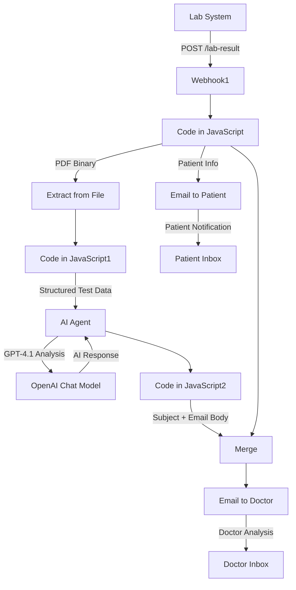
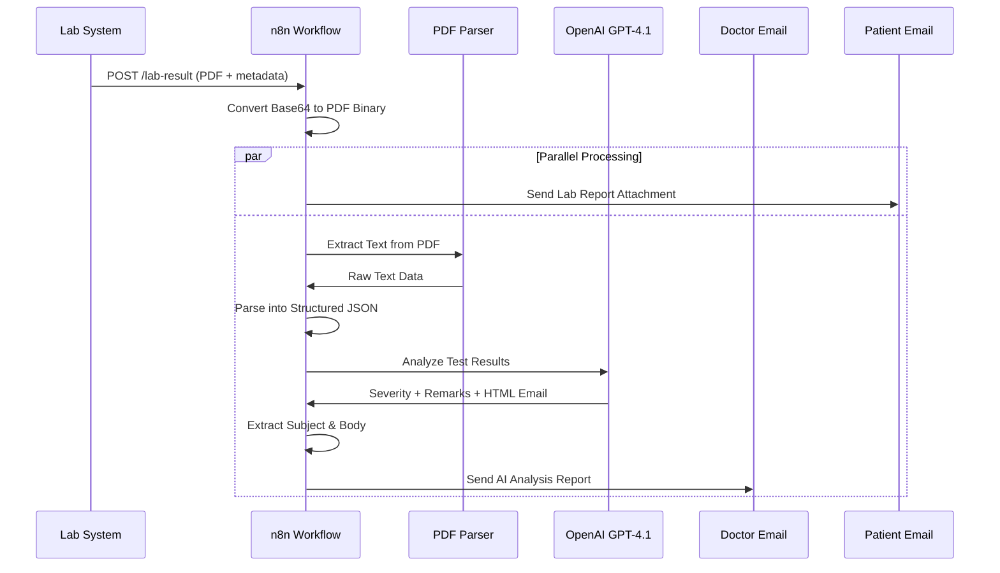

# Automated Lab Result Analysis & Email System

A fully automated, AI-powered medical lab result processing system built on **n8n**, **OpenAI GPT-4.1**, and **Gmail**.

This project consists of a **single n8n workflow** that automates:

- Lab result PDF ingestion via webhook
- AI-powered PDF extraction and parsing
- Structured data transformation
- AI-based medical report analysis and categorization
- Severity-based email generation (Normal/Borderline/Critical)
- Automated dual-email delivery (Doctor + Patient)
- Professional HTML email formatting with dynamic theming

This repository documents the complete architecture, AI logic, workflow structure, and technical details required for developers to understand, maintain, extend, or deploy the system.

---

## 📑 Table of Contents

1. [Introduction](#introduction)
2. [System Architecture](#system-architecture)
3. [Sequence Diagrams](#sequence-diagrams)
4. [Environment Variables](#environment-variables)
5. [API Endpoints](#api-endpoints)
6. [Folder Structure](#folder-structure)
7. [Workflow Overview](#workflow-overview)
8. [Node-Level Documentation](#node-level-documentation)
9. [Setup Instructions](#setup-instructions)
10. [Deployment Guide](#deployment-guide)
11. [Scalability & Limitations](#scalability--limitations)
12. [Future Improvements](#future-improvements)
13. [Cost Considerations](#-scalability--limitations)

---

## 🧩 Introduction

The **Automated Lab Result Analysis & Email System** is designed as a no-code/low-code AI automation pipeline that allows medical facilities to:

- Receive lab result PDFs via webhook endpoint
- Automatically extract and parse test data from PDF files
- Transform unstructured PDF text into structured JSON
- Analyze test results using AI to determine severity (Normal/Borderline/Critical)
- Generate professional, color-coded HTML email reports
- Send detailed analysis to doctors with AI-generated remarks
- Send patient-friendly reports with lab results attached
- Maintain HIPAA-compliant, automated communication workflow

The system runs without human intervention and leverages OpenAI's GPT-4.1 for intelligent medical report interpretation.

---

## 🗂️ System Architecture

### High-Level Architecture Diagram



---

## 📄 Workflow Interaction Diagram



---

## ⚙️ Environment Variables

Although n8n stores credentials separately, the following variables are required:

| Variable | Description |
|----------|-------------|
| `N8N_PORT` | n8n instance port (default: 5678) |
| `N8N_ENCRYPTION_KEY` | Required for credential encryption |
| `OPENAI_API_KEY` | OpenAI API access for GPT-4.1 |
| `GMAIL_CLIENT_ID` | Gmail OAuth credentials for sending |
| `GMAIL_CLIENT_SECRET` | Gmail OAuth credentials for sending |
| `N8N_WEBHOOK_URL` | Base URL for webhook endpoints |

---

## 🌐 API Endpoints

| Endpoint | Method | Workflow Node | Purpose |
|----------|--------|---------------|---------|
| `/lab-result` | POST | Webhook1 | Receive lab result PDF with patient metadata |

### Request Payload Schema

```json
{
  "file_url": "data:application/pdf;base64,<base64_encoded_pdf>",
  "file_name": "lab_report.pdf",
  "patient_name": "John Doe",
  "patient_email": "patient@example.com",
  "patient_id": "12345",
  "patient_doctor_email": "doctor@example.com"
}
```

---

## 📁 Folder Structure

```
root/
│  README.md
│
├── workflows/
│     └── automated-lab-result.json
│
└── examples/
      ├── sample-request.json
      └── sample-pdf.pdf
```

---

## 🧠 Workflow Overview

### Single Workflow: Automated Lab Result Processing

**Handles:**
- Webhook ingestion of lab result PDFs
- Base64 to binary PDF conversion
- PDF text extraction
- Structured data parsing from unstructured text
- AI-powered medical report analysis
- Severity categorization (Normal/Borderline/Critical)
- Dynamic HTML email generation with color theming
- Dual email delivery (Doctor analysis + Patient report)
- Parallel processing for efficiency

**Key Features:**
- AI-driven severity detection
- Professional medical email templates
- Color-coded visual themes per severity level
- Automatic attachment handling
- Patient privacy preservation
- Doctor-focused actionable insights

---

## 🧱 Node-Level Documentation

Below is a detailed breakdown of all nodes exactly as named in the workflow.

### 🔹 Webhook1

**Type:** `n8n-nodes-base.webhook`  
**Method:** POST  
**Path:** `/lab-result`

Receives lab result submissions from external lab systems. Expects:
- `file_url`: Base64-encoded PDF
- `file_name`: Original filename
- `patient_name`: Patient full name
- `patient_email`: Patient contact email
- `patient_id`: Unique patient identifier
- `patient_doctor_email`: Assigned doctor email

Returns:
```json
{
  "status": "received",
  "message": "Lab result uploaded successfully"
}
```

### 🔹 Code in JavaScript

**Purpose:** Convert Base64-encoded PDF to binary format

**Logic:**
1. Extracts `file_url` from webhook body
2. Splits Base64 data from data URI prefix
3. Converts Base64 string to Buffer
4. Creates binary attachment with proper MIME type
5. Preserves original filename

**Error Handling:** Returns error object if `file_url` is missing

### 🔹 Extract from File

**Type:** `n8n-nodes-base.extractFromFile`  
**Operation:** PDF extraction

Processes PDF binary data and extracts raw text content. Uses native PDF parsing capabilities to convert visual document into machine-readable text.

**Output:** Raw text string containing all PDF content

### 🔹 Code in JavaScript1

**Purpose:** Transform unstructured PDF text into structured JSON

**Parsing Logic:**
1. Splits text by newlines and trims whitespace
2. Extracts patient metadata:
   - Patient Name
   - Age/Sex
   - Test Date
   - Report ID
3. Identifies test results section (after "TEST RESULT REFERENCE RANGE")
4. Parses test data in groups:
   - Test name
   - Result value
   - Reference range
5. Returns array of structured test objects

**Output Schema:**
```json
{
  "tests": [
    {
      "test": "Hemoglobin",
      "result": "12.5 g/dL",
      "reference": "13.0-17.0 g/dL"
    }
  ]
}
```

### 🔹 AI Agent

**Type:** `@n8n/n8n-nodes-langchain.agent`  
**Model:** Connected to OpenAI Chat Model

**Purpose:** Analyze lab results and generate professional medical email

**Input:** Structured test data with results and reference ranges

**AI Instructions:**
- Categorize report as Normal/Borderline/Critical
- Generate full HTML email from template
- Apply theme colors based on severity:
  - **Critical:** Red theme (`#fdecea`, `#a94442`)
  - **Normal:** Green theme (`#e8f5e9`, `#2e7d32`)
  - **Borderline:** Orange theme (`#fff4e5`, `#ef6c00`)
- Include interpretive statement
- Generate bullet-point remarks
- Maintain professional medical tone
- Add AI disclaimer
- Preserve exact HTML structure

**Output:** Complete email with `Subject:` line followed by HTML body

### 🔹 OpenAI Chat Model

**Type:** `@n8n/n8n-nodes-langchain.lmChatOpenAi`  
**Model:** `gpt-4.1-mini`

Provides language model capabilities to AI Agent. Handles:
- Medical report interpretation
- Severity classification
- HTML email generation
- Clinical remark generation

**Temperature:** Default (balanced between creativity and accuracy)

### 🔹 Code in JavaScript2

**Purpose:** Extract subject and email body from AI output

**Logic:**
1. Receives raw AI output string
2. Uses regex to extract subject line after `Subject:`
3. Extracts HTML content between `<!DOCTYPE html>` and `</html>`
4. Returns structured object:
   ```json
   {
     "Subject": "Lab Report Analysis – Critical Abnormalities",
     "Email_Body": "<!DOCTYPE html>...</html>"
   }
   ```

### 🔹 Merge

**Type:** `n8n-nodes-base.merge`  
**Mode:** Combine by position

Merges two data streams:
1. Original webhook data (patient info, PDF binary)
2. AI-generated email content (subject, body)

Enables final email node to access both patient metadata and AI analysis.

### 🔹 Email to Doctor

**Type:** `n8n-nodes-base.gmail`  
**Operation:** Send email

**Configuration:**
- **To:** `{{ $('Webhook1').item.json.body.patient_doctor_email }}`
- **Subject:** `{{ $json.Subject }}` (AI-generated)
- **Message:** `{{ $json.Email_Body }}` (AI-generated HTML)
- **Attachment:** Original PDF lab report

Sends comprehensive AI analysis with:
- Severity-based color theme
- Clinical remarks
- Actionable recommendations
- Original lab report attached

### 🔹 Email to Patient

**Type:** `n8n-nodes-base.gmail`  
**Operation:** Send email

**Configuration:**
- **To:** `{{ $('Webhook1').item.json.body.patient_email }}`
- **Subject:** "Your Lab Report"
- **Message:** Static patient-friendly HTML template
- **Attachment:** Original PDF lab report

Sends simple, reassuring message with:
- Patient name personalization
- Patient ID reference
- Instruction to review results
- Direction to contact doctor for questions
- Signed by Lab Incharge

**Processing:** Runs in parallel with doctor email for efficiency

---

## 🛠️ Setup Instructions

### 1. Install n8n

**Option A: Docker (Recommended)**
```bash
docker pull n8nio/n8n
docker run -it --rm \
  -p 5678:5678 \
  -v ~/.n8n:/home/node/.n8n \
  n8nio/n8n
```

**Option B: npm**
```bash
npm install n8n -g
n8n start
```

**Option C: Desktop App**
Download from [n8n.io](https://n8n.io/download)

### 2. Configure Credentials

Inside n8n UI, add credentials for:

**Gmail OAuth2:**
1. Go to Google Cloud Console
2. Create OAuth 2.0 credentials
3. Enable Gmail API
4. Add authorized redirect URI: `http://localhost:5678/rest/oauth2-credential/callback`
5. In n8n: Settings → Credentials → Add Credential → Gmail OAuth2
6. Enter Client ID and Client Secret
7. Complete OAuth flow

**OpenAI API:**
1. Get API key from [platform.openai.com](https://platform.openai.com)
2. In n8n: Settings → Credentials → Add Credential → OpenAI
3. Enter API key
4. Ensure sufficient credits for GPT-4.1

### 3. Import Workflow

1. Download `automated-lab-result.json`
2. In n8n: Workflows → Import from File
3. Select JSON file
4. Update credential references to your configured credentials

### 4. Configure Webhook URL

1. Activate workflow
2. Copy webhook URL from Webhook1 node
3. Update lab system integration to POST to this URL

### 5. Test Integration

**Sample Request:**
```bash
curl -X POST http://localhost:5678/webhook/lab-result \
  -H "Content-Type: application/json" \
  -d '{
    "file_url": "data:application/pdf;base64,<BASE64_DATA>",
    "file_name": "test_report.pdf",
    "patient_name": "John Doe",
    "patient_email": "john@example.com",
    "patient_id": "P12345",
    "patient_doctor_email": "dr.smith@example.com"
  }'
```

---

## 🚀 Deployment Guide

### Option 1: n8n Cloud

**Simplest production deployment:**
1. Sign up at [n8n.cloud](https://n8n.cloud)
2. Import workflow
3. Configure credentials
4. Use provided webhook URL
5. Scale automatically with usage

**Benefits:**
- Automatic updates
- Built-in monitoring
- High availability
- No infrastructure management

### Option 2: Docker Deployment

**Production Docker Compose:**
```yaml
version: '3.8'

services:
  n8n:
    image: n8nio/n8n
    restart: always
    ports:
      - "5678:5678"
    environment:
      - N8N_ENCRYPTION_KEY=${N8N_ENCRYPTION_KEY}
      - N8N_PROTOCOL=https
      - N8N_HOST=${N8N_HOST}
      - WEBHOOK_URL=https://${N8N_HOST}/
    volumes:
      - n8n_data:/home/node/.n8n

volumes:
  n8n_data:
```

### Option 3: Self-Hosted Server

**Recommended Stack:**
- **Process Manager:** PM2 or systemd
- **Reverse Proxy:** Nginx or Caddy
- **SSL:** Let's Encrypt via Certbot
- **Monitoring:** Prometheus + Grafana

**Nginx Configuration:**
```nginx
server {
    listen 443 ssl;
    server_name your-domain.com;

    ssl_certificate /etc/letsencrypt/live/your-domain.com/fullchain.pem;
    ssl_certificate_key /etc/letsencrypt/live/your-domain.com/privkey.pem;

    location / {
        proxy_pass http://localhost:5678;
        proxy_http_version 1.1;
        proxy_set_header Upgrade $http_upgrade;
        proxy_set_header Connection 'upgrade';
        proxy_set_header Host $host;
        proxy_cache_bypass $http_upgrade;
    }
}
```

### Option 4: Kubernetes

For high-scale deployments:
- Use official n8n Helm chart
- Configure persistent volumes
- Set up horizontal pod autoscaling
- Implement health checks

---

## 📈 Scalability & Limitations

### Strengths

- **Modular Architecture:** Single workflow with clear processing stages
- **Parallel Processing:** Patient and doctor emails sent simultaneously
- **AI-Powered Intelligence:** Automatic severity detection without rule engines
- **Professional Output:** Medical-grade HTML emails with visual theming
- **Extensible Design:** Easy to add new email recipients or analysis types
- **Error Resilient:** Binary conversion and parsing include error handling
- **Stateless Processing:** Each request independent, no database required

### Limitations

- **OpenAI API Dependency:** Requires active API key and sufficient credits
- **PDF Format Assumptions:** Parsing logic expects specific text structure
- **Gmail Sending Limits:** 
  - Free: 100-500 emails/day
  - Workspace: 2,000 emails/day
- **No Persistent Storage:** Results not logged for historical analysis
- **Single Language Support:** AI prompts optimized for English
- **No Manual Override:** AI categorization cannot be manually adjusted
- **Concurrent Processing:** No queuing system for high-volume scenarios

### Cost Considerations

**OpenAI API Costs (GPT-4.1-mini):**
- Input: ~$0.15 per 1M tokens
- Output: ~$0.60 per 1M tokens
- Estimated: $0.01-0.05 per report

**Gmail:**
- Free for low volume (<100/day)
- Google Workspace required for higher volumes

**n8n:**
- Self-hosted: Free (infrastructure costs only)
- n8n Cloud: Starting at $20/month

# Automated Lab Result System - Cost Analysis

## Core Cost Components

### 1) n8n Cloud
* **Starter**: $20/month → 2,500 executions
* **Pro**: $50/month → 10,000 executions
* **Overage**: Starter $0.008/execution, Pro $0.005/execution

### 2) OpenAI (GPT-4.1-mini)
* Avg usage per report: ~1,400 tokens
* Cost per analysis: ≈ $0.0005

### 3) Email (Gmail)
* 2 emails per report
* Free within limits
* Optional Google Workspace: $6/user/month

### 4) PDF Processing
* Included in n8n execution
* No extra cost

## Per-Execution Cost
* **Executions**: 1
* **AI cost**: ~$0.0005
* **Emails**: Free
* **PDF handling**: Included

## Monthly Cost Scenarios

### 100 Lab Reports
* Executions: 100
* Total cost: $20.05
* Cost per report: $0.20

### 500 Lab Reports
* Executions: 500
* Total cost: $20.24
* Cost per report: $0.04

### 1,000 Lab Reports
* Executions: 1,000
* Total cost: $20.48 – $26.48
* Cost per report: $0.020 – $0.026

### 2,000 Lab Reports
* Executions: 2,000
* Total cost: $20.96 – $26.96
* Cost per report: $0.010 – $0.013

### 5,000 Lab Reports
* Executions: 5,000
* n8n overage: $20
* Total cost: $48.40
* Cost per report: $0.0097

## Scaling Snapshot

| Reports/Month | Executions | Emails  | Monthly Cost    | Plan            |
|---------------|------------|---------|-----------------|-----------------|
| 100           | 100        | 200     | $20.05          | Starter         |
| 500           | 500        | 1,000   | $20.24          | Starter         |
| 1,000         | 1,000      | 2,000   | $20.48–26.48    | Starter         |
| 2,000         | 2,000      | 4,000   | $20.96–26.96    | Starter         |
| 5,000         | 5,000      | 10,000  | $48.40          | Starter + overage |
| 10,000        | 10,000     | 20,000  | ~$52.40         | Pro             |
| 20,000+       | 20,000+    | 40,000+ | ~$100+          | Pro + overage   |

## ROI Summary

* **Manual cost**: $5–7 per lab report
* **Automation**: $0.01–0.20 per report
* **Savings**: 96–99%
* **Processing time**: < 10 seconds
* **Payback**: Immediate

## Recommended Setup

* **n8n Starter**: $20/month
* **OpenAI**: Pay-as-you-go
* **Gmail**: Free (Workspace optional)
* **Starting cost**: ~$20–21/month

### Upgrade Triggers

* **n8n Pro** → >2,500 reports/month
* **Google Workspace** → >1,000 reports/month
* **OpenAI discounts** → >1M tokens/month

## Bottom Line

At scale, the Automated Lab Result System costs **under 1 cent per report**, delivers instant AI-based severity classification, notifies doctors and patients simultaneously, and reduces manual lab workload by up to 96% while operating 24/7.
---

## 🚀 Future Improvements

### Short-Term Enhancements

- **Database Integration:** Log all results to PostgreSQL for audit trail
- **Multi-Language Support:** Add language detection and translated templates
- **Custom Email Templates:** Allow labs to upload branded templates
- **PDF Generation:** Create AI summary PDF for patient records
- **SMS Notifications:** Alert patients via Twilio when results ready
- **Manual Review Queue:** Flag uncertain cases for human review

### Medium-Term Features

- **Dashboard Analytics:** Real-time reporting on lab result processing
- **Historical Trends:** Patient test history comparison
- **Multiple Lab Formats:** Support diverse PDF structures with AI parsing
- **Priority Routing:** Critical results trigger immediate phone notifications
- **Integration Hub:** Connect to EHR systems (Epic, Cerner)
- **Batch Processing:** Handle multiple PDFs in single request

### Long-Term Vision

- **Machine Learning:** Train custom models on lab-specific data
- **Predictive Analytics:** Forecast health trends from historical data
- **Multi-Modal AI:** Analyze lab images, not just text reports
- **Blockchain Audit:** Immutable record of result handling
- **Federated Learning:** Privacy-preserving model improvements
- **FHIR Compliance:** Full interoperability with health systems

### Technical Improvements

- **Queue System:** Redis-based job queue for high concurrency
- **Caching Layer:** Cache parsed PDFs to reduce OpenAI costs
- **Retry Logic:** Exponential backoff for failed API calls
- **Load Balancing:** Horizontal scaling across multiple n8n instances
- **Monitoring:** Sentry for error tracking, DataDog for metrics
- **Testing:** Automated unit tests for parsing logic
- **CI/CD:** GitHub Actions for workflow deployment

---

## 📋 Appendix

### Sample Lab Report Format

The system expects PDFs with the following structure:

```
Patient Name: John Doe
Age/Sex: 45/M
Test Date: 2024-01-15
Report ID: LAB123456

TEST RESULT REFERENCE RANGE
Hemoglobin 12.5 g/dL 13.0-17.0 g/dL
WBC Count 8000 /μL 4000-11000 /μL
Platelet Count 250000 /μL 150000-450000 /μL
```

### Email Theme Examples

**Critical (Red):**
- Background: `#fdecea`
- Text: `#a94442`
- Used for: Life-threatening abnormalities

**Borderline (Orange):**
- Background: `#fff4e5`
- Text: `#ef6c00`
- Used for: Values requiring monitoring

**Normal (Green):**
- Background: `#e8f5e9`
- Text: `#2e7d32`
- Used for: All values within range

---

## 📄 License

MIT License - See LICENSE file for details

---

## 🤝 Contributing

Contributions welcome! Please:
1. Fork the repository
2. Create feature branch
3. Test thoroughly with sample PDFs
4. Submit pull request with detailed description

---

## 📞 Support

For issues or questions:
- GitHub Issues: [Repository Issues Page]
- n8n Community: [community.n8n.io](https://community.n8n.io)
- OpenAI Support: [help.openai.com](https://help.openai.com)

---

**Built with ❤️ for healthcare automation**
