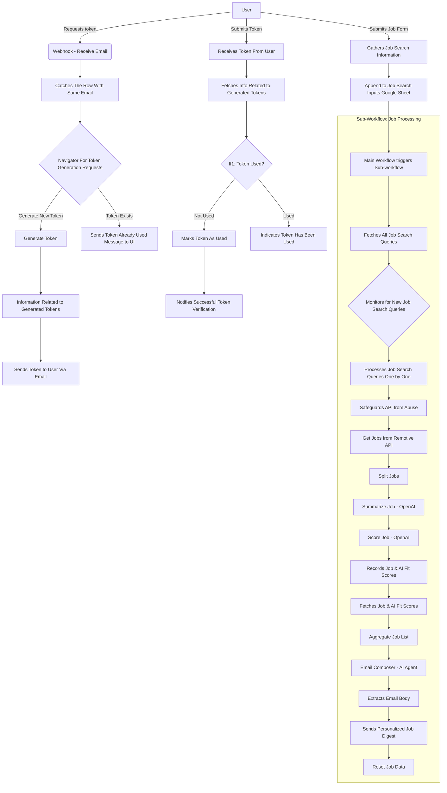
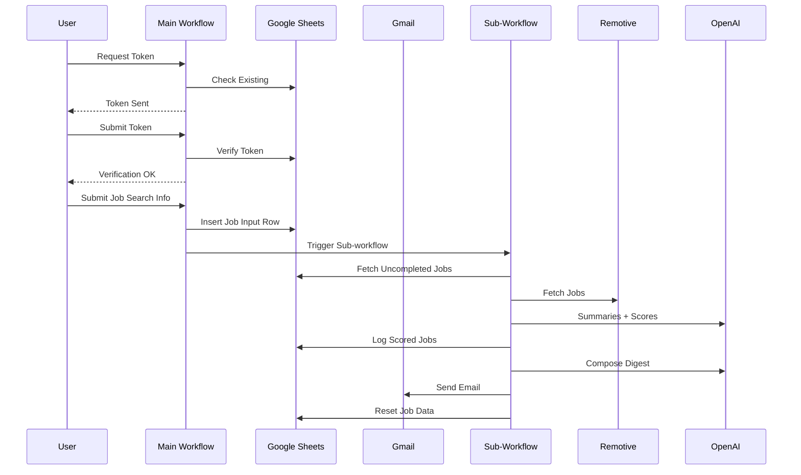

# AI-Powered Job Finder

A fully automated, end-to-end job-matching system built on **n8n**, **OpenAI**, **Google Sheets**, **Gmail**, and the **Remotive Jobs API**.

This project consists of **two interconnected n8n workflows** that automate:

- Secure token-based authentication
- User job-search intake
- API-based job fetching
- AI-powered job summarization
- AI job-fit scoring (1-5)
- Automated HTML email digest generation
- Automated delivery of personalized job recommendations
- Automatic cleanup & reset of job execution data

This repository documents the complete architecture, API usage, workflow logic, and technical details required for developers to understand, maintain, extend, or deploy the system.

---

## 📑 Table of Contents

1. [Introduction](#introduction)
2. [System Architecture](#system-architecture)
3. [Sequence Diagrams](#sequence-diagrams)
4. [Environment Variables](#environment-variables)
5. [API Endpoints](#api-endpoints)
6. [Folder Structure](#folder-structure)
7. [Workflow Overview](#workflow-overview)
8. [Node-Level Documentation](#node-level-documentation)
9. [Setup Instructions](#setup-instructions)
10. [Deployment Guide](#deployment-guide)
11. [Scalability & Limitations](#scalability--limitations)
12. [Future Improvements](#future-improvements)

---

## 🧩 Introduction

The **AI-Powered Job Finder** is designed as a no-code/low-code AI automation pipeline that allows users to:

- Request access securely via email
- Receive a one-time token
- Submit job-search details through a UI
- Automatically fetch job listings from Remotive
- Summarize job descriptions using OpenAI
- Score job-candidate fit (1 to 5) using AI
- Generate a personalized HTML job digest
- Receive results directly in their inbox

The system runs without human intervention and uses Google Sheets as a lightweight database.

---

## 🗂️ System Architecture

### High-Level Architecture Diagram



---

## 🔄 Workflow Interaction Diagram



---

## ⚙️ Environment Variables

Although n8n stores credentials separately, the repo should define which variables are required.

| Variable | Description |
|----------|-------------|
| `N8N_PORT` | n8n instance port |
| `N8N_ENCRYPTION_KEY` | Required for main encryption |
| `OPENAI_API_KEY` | OpenAI access |
| `GMAIL_CLIENT_ID` | OAuth Credentials |
| `GMAIL_CLIENT_SECRET` | OAuth Credentials |
| `GOOGLE_SHEETS_OAUTH_CLIENT_ID` | Sheets integration |
| `GOOGLE_SHEETS_OAUTH_CLIENT_SECRET` | Sheets integration |

---

## 🌐 API Endpoints

| Endpoint | Method | Workflow Node | Purpose |
|----------|--------|---------------|---------|
| `/generate-token` | POST | Webhook - Receive Email | Request access token |
| `/tokenVerification` | POST | Receives Token From User | Validate one-time token |
| `/d7e74325-b7d6-436b-95ab-7130bc829a5c` | POST | Gathers Job Search Information | Submit job-search request |

---

## 📁 Folder Structure

```
root/
│  README.md
│
├── workflows/
│     ├── main-workflow.json     
│     └── sub-workflow.json      
│

```

---

## 🧠 Workflow Overview

### 1. Main Workflow (Token & Job Intake)

**Handles:**
- Email capture
- Token creation
- Token logging
- Token verification
- Job search form submission
- Forwarding job entry to Sub-workflow

### 2. Sub-Workflow (Job Processing & Email Delivery)

**Handles:**
- Fetching job requests
- Rate-limited job API fetching
- AI-based job summarization
- AI-based similarity scoring
- Writing jobs to sheets
- Aggregating results
- AI-generated HTML email digest
- Email sending
- Database cleanup

---

## 🧱 Node-Level Documentation

Below is a detailed breakdown of major nodes exactly as named in your workflow.

### 🔹 Webhook - Receive Email

Handles `/generate-token` requests. Captures user email.

### 🔹 Catches The Row With Same Email (if any)

Google Sheets lookup for existing token/log.

### 🔹 Navigator For Token Generation Requests

IF node determining whether to generate new token or reject.

### 🔹 Generate Token

Creates 32-character random alphanumeric token.

### 🔹 Information Related to Generated Tokens

Writes token metadata:
- email
- IP
- token
- used
- timestamp

### 🔹 Sends Token to User Via Email

Delivers HTML email with the generated token.

### 🔹 Receives Token From User

Webhook for `/tokenVerification`.

### 🔹 Fetches Info Related to Generated Tokens

Find token row by token value.

### 🔹 If1

Checks if token has already been used.

### 🔹 Marks Token As "Used" After Verification

Updates Google Sheet row.

### 🔹 Notifies Successful Token Verification

Responds `{"valid": true}`.

### 🔹 Indicates Token Has Been Used

Responds `{"valid": false}`.

### 🔹 Gathers Job Search Information

Third webhook receiving user job-input form.

### 🔹 Append to Job Search Inputs

Adds user form record to "Job Search Inputs" Google Sheet.

### 🔹 Call 'Sub-Workflow For Job Search (Final)'

Triggers sub-workflow synchronously.

---

## Sub-Workflow: Node Details

### 🔹 Fetches All Job Search Queries

Reads entire "Job Search Inputs" sheet.

### 🔹 Monitors for New Job Search Queries

IF node to filter rows where "Completed?" != YES.

### 🔹 Processes Job Search Queries One by One

LIMIT node — only processes the first matching record.

### 🔹 Safeguards API from Abuse

WAIT 35 seconds to ensure API rate limits respected.

### 🔹 Get Jobs from Remotive.com

HTTP Request to:
```
https://remotive.com/api/remote-jobs?search={{JobTitle}}&limit=5
```

### 🔹 Split Jobs1

Splits array of jobs into individual items.

### 🔹 Summarize Job1

OpenAI (GPT-4.1) summary of job description.

### 🔹 Score Job

OpenAI (GPT-4.1) job-candidate fit score 1-5.

### 🔹 Records Job & AI Fit Scores (1-5) in Sheet

Writes results to "Job Search" Google Sheet.

### 🔹 Fetches Job & AI Fit Scores (1-5)

Reads same Sheet for aggregation.

### 🔹 Aggregate Job List

Merges job rows into a single array.

### 🔹 Email Composer

AI Agent generating full HTML digest.

### 🔹 Extracts Email Body

Parses AI output returning clean HTML.

### 🔹 Sends Personalized Job Digest

Gmail node sending final email.

### 🔹 Reset Job Data for Reprocessing

Deletes 100 rows to prevent accumulation.

---

## 🛠️ Setup Instructions

### 1. Install n8n

Use Docker / npm / desktop:

```bash
npm install n8n -g
n8n start
```

### 2. Configure Credentials

Inside n8n:
- Add Google Sheets OAuth credentials
- Add Gmail OAuth (Send Mail)
- Add OpenAI API credentials

### 3. Create Required Google Sheets

You need:
- Job Search Token Storage
- Job Search Inputs
- Job Search (AI scores)

### 4. Import Workflows

From n8n UI:
- Import Main Workflow
- Import Sub-Workflow

### 5. Update Webhook URLs

Replace n8n cloud/local URLs in your UI frontend.

---

## 🚀 Deployment Guide

### Option 1: n8n Cloud

Simplest: deploy workflows & use built-in webhooks.

### Option 2: Docker Deployment

```bash
docker run -it --rm \
  -p 5678:5678 \
  -v ~/.n8n:/home/node/.n8n \
  --env N8N_ENCRYPTION_KEY="YOUR_KEY" \
  n8nio/n8n
```

### Option 3: Self-hosted Server

Recommended stack:
- PM2 / docker-compose
- HTTPS via Caddy or Nginx
- Reverse proxy to webhooks

---

## 📈 Scalability & Limitations

### Strengths

- Modular workflow architecture
- Rate-limited external API usage
- AI scoring & summarization fully automated
- Stateless job processing
- Google Sheets = easy, low-maintenance DB

### Limitations

- Google Sheets is not ideal for large datasets
- API rate-limits require waiting nodes
- Gmail sending limits may apply
- OpenAI cost scales with volume

---

## 🚀 Future Improvements

- Replace Google Sheets with PostgreSQL
- Add caching for API responses
- Add parallel job evaluation
- Replace Remotive with multi-source job ingestion
- Convert HTML email into responsive template
- Add dashboard for job analytics
- Add retry queue for API failures
