```mermaid
sequenceDiagram
    participant Admin as Admin/Scheduler
    participant WH as Webhook
    participant GS as Google Sheets
    participant Proc as Processing Engine
    participant AI as OpenAI GPT-4
    participant Dash as Dashboard Generator

    Admin->>WH: Trigger Inventory Check
    WH->>GS: Fetch Medicine Data
    GS-->>Proc: Return All Medicine Rows
    
    Proc->>Proc: Split Into Individual Items
    
    par Stock Check
        Proc->>Proc: Check Stock Threshold
        Proc->>Proc: Format Low Stock Alerts
        Proc->>Proc: Aggregate Alerts
        Proc->>AI: Generate Telegram Message
        AI-->>Proc: Formatted Low Stock Text
    and Expiry Check
        Proc->>Proc: Check Expiry Date (≤30 days)
        Proc->>Proc: Format Expiry Alerts
        Proc->>Proc: Aggregate Alerts
        Proc->>AI: Generate Telegram Message
        AI-->>Proc: Formatted Expiry Text
    end
    
    Proc->>Dash: Merge Both Alert Types
    Dash->>AI: Generate HTML Dashboard
    AI-->>Dash: Complete HTML Block
    Dash->>WH: Return JSON Response
    WH-->>Admin: Status + HTML Summary
```

# Automated Lab Result Analysis & Email System

A fully automated, AI-powered medical lab result processing system built on **n8n**, **OpenAI GPT-4.1**, and **Gmail**.

This project consists of a **single n8n workflow** that automates:

- Lab result PDF ingestion via webhook
- AI-powered PDF extraction and parsing
- Structured data transformation
- AI-based medical report analysis and categorization
- Severity-based email generation (Normal/Borderline/Critical)
- Automated dual-email delivery (Doctor + Patient)
- Professional HTML email formatting with dynamic theming

This repository documents the complete architecture, AI logic, workflow structure, and technical details required for developers to understand, maintain, extend, or deploy the system.

---

## 📑 Table of Contents

1. [Introduction](#-introduction)
2. [System Architecture](#️-system-architecture)
3. [Sequence Diagrams](#-workflow-interaction-diagram)
4. [Environment Variables](#️-environment-variables)
5. [API Endpoints](#-api-endpoints)
6. [Folder Structure](#-folder-structure)
7. [Workflow Overview](#-workflow-overview)
8. [Node-Level Documentation](#-node-level-documentation)
9. [Setup Instructions](#️-setup-instructions)
10. [Deployment Guide](#-deployment-guide)
11. [Scalability & Limitations](#-scalability--limitations)
12. [Future Improvements](#-future-improvements)

---

## 🧩 Introduction

The **Automated Lab Result Analysis & Email System** is designed as a no-code/low-code AI automation pipeline that allows medical facilities to:

- Receive lab result PDFs via webhook endpoint
- Automatically extract and parse test data from PDF files
- Transform unstructured PDF text into structured JSON
- Analyze test results using AI to determine severity (Normal/Borderline/Critical)
- Generate professional, color-coded HTML email reports
- Send detailed analysis to doctors with AI-generated remarks
- Send patient-friendly reports with lab results attached
- Maintain HIPAA-compliant, automated communication workflow

The system runs without human intervention and leverages OpenAI's GPT-4.1 for intelligent medical report interpretation.

---

## 🗂️ System Architecture

### High-Level Architecture Diagram


---

## 📄 Workflow Interaction Diagram


---

## ⚙️ Environment Variables

Although n8n stores credentials separately, the following variables are required:

| Variable | Description |
|----------|-------------|
| `N8N_PORT` | n8n instance port (default: 5678) |
| `N8N_ENCRYPTION_KEY` | Required for credential encryption |
| `OPENAI_API_KEY` | OpenAI API access for GPT-4.1 |
| `GMAIL_CLIENT_ID` | Gmail OAuth credentials for sending |
| `GMAIL_CLIENT_SECRET` | Gmail OAuth credentials for sending |
| `N8N_WEBHOOK_URL` | Base URL for webhook endpoints |

---

## 🌐 API Endpoints

| Endpoint | Method | Workflow Node | Purpose |
|----------|--------|---------------|---------|
| `/lab-result` | POST | Webhook1 | Receive lab result PDF with patient metadata |

### Request Payload Schema

```json
{
  "file_url": "data:application/pdf;base64,<base64_encoded_pdf>",
  "file_name": "lab_report.pdf",
  "patient_name": "John Doe",
  "patient_email": "patient@example.com",
  "patient_id": "12345",
  "patient_doctor_email": "doctor@example.com"
}
```

---

## 📁 Folder Structure

```
root/
│  README.md
│
├── workflows/
│     └── automated-lab-result.json
│
└── examples/
      ├── sample-request.json
      └── sample-pdf.pdf
```

---

## 🧠 Workflow Overview

### Single Workflow: Automated Lab Result Processing

**Handles:**
- Webhook ingestion of lab result PDFs
- Base64 to binary PDF conversion
- PDF text extraction
- Structured data parsing from unstructured text
- AI-powered medical report analysis
- Severity categorization (Normal/Borderline/Critical)
- Dynamic HTML email generation with color theming
- Dual email delivery (Doctor analysis + Patient report)
- Parallel processing for efficiency

**Key Features:**
- AI-driven severity detection
- Professional medical email templates
- Color-coded visual themes per severity level
- Automatic attachment handling
- Patient privacy preservation
- Doctor-focused actionable insights

---

## 🧱 Node-Level Documentation

Below is a detailed breakdown of all nodes exactly as named in the workflow.

### 🔹 Webhook1

**Type:** `n8n-nodes-base.webhook`  
**Method:** POST  
**Path:** `/lab-result`

Receives lab result submissions from external lab systems. Expects:
- `file_url`: Base64-encoded PDF
- `file_name`: Original filename
- `patient_name`: Patient full name
- `patient_email`: Patient contact email
- `patient_id`: Unique patient identifier
- `patient_doctor_email`: Assigned doctor email

Returns:
```json
{
  "status": "received",
  "message": "Lab result uploaded successfully"
}
```

### 🔹 Code in JavaScript

**Purpose:** Convert Base64-encoded PDF to binary format

**Logic:**
1. Extracts `file_url` from webhook body
2. Splits Base64 data from data URI prefix
3. Converts Base64 string to Buffer
4. Creates binary attachment with proper MIME type
5. Preserves original filename

**Error Handling:** Returns error object if `file_url` is missing

### 🔹 Extract from File

**Type:** `n8n-nodes-base.extractFromFile`  
**Operation:** PDF extraction

Processes PDF binary data and extracts raw text content. Uses native PDF parsing capabilities to convert visual document into machine-readable text.

**Output:** Raw text string containing all PDF content

### 🔹 Code in JavaScript1

**Purpose:** Transform unstructured PDF text into structured JSON

**Parsing Logic:**
1. Splits text by newlines and trims whitespace
2. Extracts patient metadata:
   - Patient Name
   - Age/Sex
   - Test Date
   - Report ID
3. Identifies test results section (after "TEST RESULT REFERENCE RANGE")
4. Parses test data in groups:
   - Test name
   - Result value
   - Reference range
5. Returns array of structured test objects

**Output Schema:**
```json
{
  "tests": [
    {
      "test": "Hemoglobin",
      "result": "12.5 g/dL",
      "reference": "13.0-17.0 g/dL"
    }
  ]
}
```

### 🔹 AI Agent

**Type:** `@n8n/n8n-nodes-langchain.agent`  
**Model:** Connected to OpenAI Chat Model

**Purpose:** Analyze lab results and generate professional medical email

**Input:** Structured test data with results and reference ranges

**AI Instructions:**
- Categorize report as Normal/Borderline/Critical
- Generate full HTML email from template
- Apply theme colors based on severity:
  - **Critical:** Red theme (`#fdecea`, `#a94442`)
  - **Normal:** Green theme (`#e8f5e9`, `#2e7d32`)
  - **Borderline:** Orange theme (`#fff4e5`, `#ef6c00`)
- Include interpretive statement
- Generate bullet-point remarks
- Maintain professional medical tone
- Add AI disclaimer
- Preserve exact HTML structure

**Output:** Complete email with `Subject:` line followed by HTML body

### 🔹 OpenAI Chat Model

**Type:** `@n8n/n8n-nodes-langchain.lmChatOpenAi`  
**Model:** `gpt-4.1-mini`

Provides language model capabilities to AI Agent. Handles:
- Medical report interpretation
- Severity classification
- HTML email generation
- Clinical remark generation

**Temperature:** Default (balanced between creativity and accuracy)

### 🔹 Code in JavaScript2

**Purpose:** Extract subject and email body from AI output

**Logic:**
1. Receives raw AI output string
2. Uses regex to extract subject line after `Subject:`
3. Extracts HTML content between `<!DOCTYPE html>` and `</html>`
4. Returns structured object:
   ```json
   {
     "Subject": "Lab Report Analysis – Critical Abnormalities",
     "Email_Body": "<!DOCTYPE html>...</html>"
   }
   ```

### 🔹 Merge

**Type:** `n8n-nodes-base.merge`  
**Mode:** Combine by position

Merges two data streams:
1. Original webhook data (patient info, PDF binary)
2. AI-generated email content (subject, body)

Enables final email node to access both patient metadata and AI analysis.

### 🔹 Email to Doctor

**Type:** `n8n-nodes-base.gmail`  
**Operation:** Send email

**Configuration:**
- **To:** `{{ $('Webhook1').item.json.body.patient_doctor_email }}`
- **Subject:** `{{ $json.Subject }}` (AI-generated)
- **Message:** `{{ $json.Email_Body }}` (AI-generated HTML)
- **Attachment:** Original PDF lab report

Sends comprehensive AI analysis with:
- Severity-based color theme
- Clinical remarks
- Actionable recommendations
- Original lab report attached

### 🔹 Email to Patient

**Type:** `n8n-nodes-base.gmail`  
**Operation:** Send email

**Configuration:**
- **To:** `{{ $('Webhook1').item.json.body.patient_email }}`
- **Subject:** "Your Lab Report"
- **Message:** Static patient-friendly HTML template
- **Attachment:** Original PDF lab report

Sends simple, reassuring message with:
- Patient name personalization
- Patient ID reference
- Instruction to review results
- Direction to contact doctor for questions
- Signed by Lab Incharge

**Processing:** Runs in parallel with doctor email for efficiency

---

## 🛠️ Setup Instructions

### 1. Install n8n

**Option A: Docker (Recommended)**
```bash
docker pull n8nio/n8n
docker run -it --rm \
  -p 5678:5678 \
  -v ~/.n8n:/home/node/.n8n \
  n8nio/n8n
```

**Option B: npm**
```bash
npm install n8n -g
n8n start
```

**Option C: Desktop App**
Download from [n8n.io](https://n8n.io/download)

### 2. Configure Credentials

Inside n8n UI, add credentials for:

**Gmail OAuth2:**
1. Go to Google Cloud Console
2. Create OAuth 2.0 credentials
3. Enable Gmail API
4. Add authorized redirect URI: `http://localhost:5678/rest/oauth2-credential/callback`
5. In n8n: Settings → Credentials → Add Credential → Gmail OAuth2
6. Enter Client ID and Client Secret
7. Complete OAuth flow

**OpenAI API:**
1. Get API key from [platform.openai.com](https://platform.openai.com)
2. In n8n: Settings → Credentials → Add Credential → OpenAI
3. Enter API key
4. Ensure sufficient credits for GPT-4.1

### 3. Import Workflow

1. Download `automated-lab-result.json`
2. In n8n: Workflows → Import from File
3. Select JSON file
4. Update credential references to your configured credentials

### 4. Configure Webhook URL

1. Activate workflow
2. Copy webhook URL from Webhook1 node
3. Update lab system integration to POST to this URL

### 5. Test Integration

**Sample Request:**
```bash
curl -X POST http://localhost:5678/webhook/lab-result \
  -H "Content-Type: application/json" \
  -d '{
    "file_url": "data:application/pdf;base64,<BASE64_DATA>",
    "file_name": "test_report.pdf",
    "patient_name": "John Doe",
    "patient_email": "john@example.com",
    "patient_id": "P12345",
    "patient_doctor_email": "dr.smith@example.com"
  }'
```

---

## 🚀 Deployment Guide

### Option 1: n8n Cloud

**Simplest production deployment:**
1. Sign up at [n8n.cloud](https://n8n.cloud)
2. Import workflow
3. Configure credentials
4. Use provided webhook URL
5. Scale automatically with usage

**Benefits:**
- Automatic updates
- Built-in monitoring
- High availability
- No infrastructure management

### Option 2: Docker Deployment

**Production Docker Compose:**
```yaml
version: '3.8'

services:
  n8n:
    image: n8nio/n8n
    restart: always
    ports:
      - "5678:5678"
    environment:
      - N8N_ENCRYPTION_KEY=${N8N_ENCRYPTION_KEY}
      - N8N_PROTOCOL=https
      - N8N_HOST=${N8N_HOST}
      - WEBHOOK_URL=https://${N8N_HOST}/
    volumes:
      - n8n_data:/home/node/.n8n

volumes:
  n8n_data:
```

### Option 3: Self-Hosted Server

**Recommended Stack:**
- **Process Manager:** PM2 or systemd
- **Reverse Proxy:** Nginx or Caddy
- **SSL:** Let's Encrypt via Certbot
- **Monitoring:** Prometheus + Grafana

**Nginx Configuration:**
```nginx
server {
    listen 443 ssl;
    server_name your-domain.com;

    ssl_certificate /etc/letsencrypt/live/your-domain.com/fullchain.pem;
    ssl_certificate_key /etc/letsencrypt/live/your-domain.com/privkey.pem;

    location / {
        proxy_pass http://localhost:5678;
        proxy_http_version 1.1;
        proxy_set_header Upgrade $http_upgrade;
        proxy_set_header Connection 'upgrade';
        proxy_set_header Host $host;
        proxy_cache_bypass $http_upgrade;
    }
}
```

### Option 4: Kubernetes

For high-scale deployments:
- Use official n8n Helm chart
- Configure persistent volumes
- Set up horizontal pod autoscaling
- Implement health checks

---

## 📈 Scalability & Limitations

### Strengths

- **Modular Architecture:** Single workflow with clear processing stages
- **Parallel Processing:** Patient and doctor emails sent simultaneously
- **AI-Powered Intelligence:** Automatic severity detection without rule engines
- **Professional Output:** Medical-grade HTML emails with visual theming
- **Extensible Design:** Easy to add new email recipients or analysis types
- **Error Resilient:** Binary conversion and parsing include error handling
- **Stateless Processing:** Each request independent, no database required

### Limitations

- **OpenAI API Dependency:** Requires active API key and sufficient credits
- **PDF Format Assumptions:** Parsing logic expects specific text structure
- **Gmail Sending Limits:** 
  - Free: 100-500 emails/day
  - Workspace: 2,000 emails/day
- **No Persistent Storage:** Results not logged for historical analysis
- **Single Language Support:** AI prompts optimized for English
- **No Manual Override:** AI categorization cannot be manually adjusted
- **Concurrent Processing:** No queuing system for high-volume scenarios

### Cost Considerations

**OpenAI API Costs (GPT-4.1-mini):**
- Input: ~$0.15 per 1M tokens
- Output: ~$0.60 per 1M tokens
- Estimated: $0.01-0.05 per report

**Gmail:**
- Free for low volume (<100/day)
- Google Workspace required for higher volumes

**n8n:**
- Self-hosted: Free (infrastructure costs only)
- n8n Cloud: Starting at $20/month

---

## 🚀 Future Improvements

### Short-Term Enhancements

- **Database Integration:** Log all results to PostgreSQL for audit trail
- **Multi-Language Support:** Add language detection and translated templates
- **Custom Email Templates:** Allow labs to upload branded templates
- **PDF Generation:** Create AI summary PDF for patient records
- **SMS Notifications:** Alert patients via Twilio when results ready
- **Manual Review Queue:** Flag uncertain cases for human review

### Medium-Term Features

- **Dashboard Analytics:** Real-time reporting on lab result processing
- **Historical Trends:** Patient test history comparison
- **Multiple Lab Formats:** Support diverse PDF structures with AI parsing
- **Priority Routing:** Critical results trigger immediate phone notifications
- **Integration Hub:** Connect to EHR systems (Epic, Cerner)
- **Batch Processing:** Handle multiple PDFs in single request

### Long-Term Vision

- **Machine Learning:** Train custom models on lab-specific data
- **Predictive Analytics:** Forecast health trends from historical data
- **Multi-Modal AI:** Analyze lab images, not just text reports
- **Blockchain Audit:** Immutable record of result handling
- **Federated Learning:** Privacy-preserving model improvements
- **FHIR Compliance:** Full interoperability with health systems

### Technical Improvements

- **Queue System:** Redis-based job queue for high concurrency
- **Caching Layer:** Cache parsed PDFs to reduce OpenAI costs
- **Retry Logic:** Exponential backoff for failed API calls
- **Load Balancing:** Horizontal scaling across multiple n8n instances
- **Monitoring:** Sentry for error tracking, DataDog for metrics
- **Testing:** Automated unit tests for parsing logic
- **CI/CD:** GitHub Actions for workflow deployment

---

## 📋 Appendix

### Sample Lab Report Format

The system expects PDFs with the following structure:

```
Patient Name: John Doe
Age/Sex: 45/M
Test Date: 2024-01-15
Report ID: LAB123456

TEST RESULT REFERENCE RANGE
Hemoglobin 12.5 g/dL 13.0-17.0 g/dL
WBC Count 8000 /μL 4000-11000 /μL
Platelet Count 250000 /μL 150000-450000 /μL
```

### Email Theme Examples

**Critical (Red):**
- Background: `#fdecea`
- Text: `#a94442`
- Used for: Life-threatening abnormalities

**Borderline (Orange):**
- Background: `#fff4e5`
- Text: `#ef6c00`
- Used for: Values requiring monitoring

**Normal (Green):**
- Background: `#e8f5e9`
- Text: `#2e7d32`
- Used for: All values within range

---

## 📄 License

MIT License - See LICENSE file for details

---

## 🤝 Contributing

Contributions welcome! Please:
1. Fork the repository
2. Create feature branch
3. Test thoroughly with sample PDFs
4. Submit pull request with detailed description

---

## 📞 Support

For issues or questions:
- GitHub Issues: [Repository Issues Page]
- n8n Community: [community.n8n.io](https://community.n8n.io)
- OpenAI Support: [help.openai.com](https://help.openai.com)

---


# Hospital Appointment Booking System with Automated Reminders

A fully automated, end-to-end hospital appointment management system built on **n8n**, **Supabase**, and **Gmail**.

This project consists of a **single comprehensive n8n workflow** that automates:

- Real-time appointment availability checking
- Doctor schedule management
- Conflict-free slot calculation
- Appointment booking and confirmation
- Database-driven appointment tracking
- Time-based automated email reminders (24h and 2h before appointments)
- Professional HTML email notifications
- Multi-stage patient communication workflow

This repository documents the complete architecture, database schema, workflow logic, and technical details required for developers to understand, maintain, extend, or deploy the system.

---

## 📑 Table of Contents

1. [Introduction](#-introduction)
2. [System Architecture](#️-system-architecture)
3. [Sequence Diagrams](#-workflow-interaction-diagram)
4. [Environment Variables](#️-environment-variables)
5. [API Endpoints](#-api-endpoints)
6. [Database Schema](#️-database-schema)
7. [Folder Structure](#-folder-structure)
8. [Workflow Overview](#-workflow-overview)
9. [Node-Level Documentation](#-node-level-documentation)
10. [Setup Instructions](#️-setup-instructions)
11. [Deployment Guide](#-deployment-guide)
12. [Scalability & Limitations](#-scalability--limitations)
13. [Future Improvements](#-future-improvements)

---

## 🧩 Introduction

The **Hospital Appointment Booking System with Automated Reminders** is designed as a no-code/low-code automation pipeline that allows healthcare facilities to:

- Provide real-time appointment availability to patients
- Check doctor schedules and prevent double-booking
- Calculate available time slots based on existing appointments
- Book appointments with instant confirmation
- Send professional HTML confirmation emails
- Automatically remind patients 24 hours before appointments
- Send final reminders 2 hours before appointments
- Maintain appointment status tracking in Supabase database
- Handle patient-doctor-appointment relationships

The system runs without human intervention and uses Supabase as a robust, scalable database backend with Gmail for HIPAA-compliant email communications.

---

## 🗂️ System Architecture

### High-Level Architecture Diagram


---

## 📄 Workflow Interaction Diagram


---

## ⚙️ Environment Variables

Although n8n stores credentials separately, the following variables are required:

| Variable | Description |
|----------|-------------|
| `N8N_PORT` | n8n instance port (default: 5678) |
| `N8N_ENCRYPTION_KEY` | Required for credential encryption |
| `SUPABASE_URL` | Supabase project URL |
| `SUPABASE_API_KEY` | Supabase service role key |
| `GMAIL_CLIENT_ID` | Gmail OAuth credentials for sending |
| `GMAIL_CLIENT_SECRET` | Gmail OAuth credentials for sending |
| `N8N_WEBHOOK_URL` | Base URL for webhook endpoints |

---

## 🌐 API Endpoints

| Endpoint | Method | Workflow Node | Purpose |
|----------|--------|---------------|---------|
| `/request-appointments` | POST | Webhook - Request Appointment1 | Get available appointment slots for a doctor on a specific date |
| `/confirm-appointment` | POST | Webhook - Confirm Appointment | Book an appointment and trigger confirmation emails |

### Request Appointments Payload

```json
{
  "doctor_id": 1,
  "date": "2025-12-16"
}
```

**Response (Success):**
```json
{
  "status": "success",
  "total_slots": 8,
  "available_slots": [
    {
      "doctor_id": 1,
      "doctor_name": "Dr. Sarah Ahmed",
      "specialty": "Cardiology",
      "day_of_week": "Monday",
      "start_time": "09:00",
      "end_time": "09:30",
      "date": "2025-12-16"
    }
  ]
}
```

**Response (No Availability):**
```json
{
  "status": "no_availability",
  "message": "No available slots."
}
```

### Confirm Appointment Payload

```json
{
  "patient_name": "John Doe",
  "email": "patient@example.com",
  "phone": "1234567890",
  "doctor": "Dr. Sarah Ahmed",
  "doctor_id": 1,
  "date": "2025-12-16",
  "appointment_time": "09:00 - 09:30"
}
```

**Response:**
```json
{
  "status": "confirmed",
  "appointment_id": 42,
  "message": "Appointment confirmed successfully"
}
```

---

## 🗄️ Database Schema

### Tables

#### **appointments**
| Column | Type | Description |
|--------|------|-------------|
| `id` | integer | Primary key (auto-increment) |
| `patient_name` | varchar | Patient full name |
| `phone` | varchar | Patient contact number |
| `doctor_id` | integer | Foreign key to doctors table |
| `date` | date | Appointment date |
| `appointment_time` | varchar | Time slot (e.g., "09:00 - 09:30") |
| `status` | varchar | Status: "Confirmed", "Cancelled", "Completed" |
| `created_at` | timestamp | Record creation timestamp |
| `day_of_week` | varchar | Day name (e.g., "Monday") |

#### **doctors**
| Column | Type | Description |
|--------|------|-------------|
| `id` | integer | Primary key |
| `name` | varchar | Doctor full name |
| `specialty` | varchar | Medical specialty |
| `email` | varchar | Doctor email |
| `phone` | varchar | Doctor contact |

#### **doctor_schedules**
| Column | Type | Description |
|--------|------|-------------|
| `id` | integer | Primary key |
| `doctor_id` | integer | Foreign key to doctors table |
| `date` | date | Schedule date |
| `day_of_week` | varchar | Day name |
| `start_time` | time | Shift start time |
| `end_time` | time | Shift end time |

---

## 📁 Folder Structure

```
root/
│  README.md
│
├── workflows/
│     └── hospital-appointment-system.json
│
├── database/
│     ├── schema.sql
│     └── seed-data.sql
│
└── examples/
      ├── request-slots-example.json
      └── confirm-appointment-example.json
```

---

## 🧠 Workflow Overview

### Single Workflow: Complete Appointment Management System

**Handles:**

**Appointment Availability Flow:**
- Receives slot availability requests via webhook
- Fetches doctor information by ID
- Retrieves doctor schedules for requested date
- Validates schedule existence
- Fetches all confirmed appointments
- Calculates available slots with conflict detection
- Returns formatted availability response

**Appointment Booking Flow:**
- Receives appointment confirmation requests
- Inserts appointment record into Supabase
- Fetches doctor details for personalization
- Sends HTML confirmation email
- Calculates reminder trigger times
- Schedules time-based wait nodes
- Sends 24-hour reminder email
- Sends 2-hour final alert email

**Key Features:**
- **Conflict-Free Scheduling:** Prevents double-booking through intelligent slot calculation
- **Time-Based Automation:** Uses n8n Wait nodes for scheduled reminders
- **Professional Communications:** HTML email templates with gradient designs
- **Data Persistence:** Supabase database for reliable appointment tracking
- **Real-Time Validation:** Checks schedules and availability before booking
- **Multi-Stage Reminders:** 24h and 2h notification system

---

## 🧱 Node-Level Documentation

Below is a detailed breakdown of all nodes exactly as named in the workflow.

### 🔹 Webhook - Request Appointment1

**Type:** `n8n-nodes-base.webhook`  
**Method:** POST  
**Path:** `/request-appointments`

Receives slot availability requests from patients or frontend systems. Expects:
- `doctor_id`: Integer ID of the doctor
- `date`: Date in YYYY-MM-DD format

Triggers the availability checking flow.

### 🔹 Workflow Configuration

**Type:** `n8n-nodes-base.set`  
**Purpose:** Global workflow configuration

Sets placeholder configuration variables:
- `supabaseUrl`: Supabase project URL
- `messagingApiUrl`: SMS/WhatsApp API endpoint (placeholder for future integration)

**Note:** These are placeholder values and should be configured during deployment.

### 🔹 Get Doctors by Specialty

**Type:** `n8n-nodes-base.supabase`  
**Operation:** Get All  
**Table:** `doctors`

Fetches doctor record by ID from the webhook request. Uses filter:
```
id = {{ $json.body.doctor_id }}
```

Returns doctor information including name, specialty, and contact details.

### 🔹 Get Doctor Schedules

**Type:** `n8n-nodes-base.supabase`  
**Operation:** Get All  
**Table:** `doctor_schedules`

Retrieves doctor's schedule for the requested date. Uses two filters:
1. `doctor_id = {{ $json.id }}`
2. `date = {{ $('Webhook - Request Appointment1').item.json.body.date }}`

Returns schedule with `start_time`, `end_time`, and `day_of_week`.

### 🔹 If

**Type:** `n8n-nodes-base.if`  
**Condition:** Check if schedule exists

Validates whether the doctor has a schedule for the requested date:
```
$('Get Doctor Schedules').all().length == 0
```

- **True path:** Returns "No Availability"
- **False path:** Continues to slot calculation

### 🔹 Get Existing Appointments

**Type:** `n8n-nodes-base.supabase`  
**Operation:** Get All  
**Table:** `appointments`

Fetches all confirmed appointments to check for conflicts. Uses filter:
```
status = "Confirmed"
```

Returns all existing appointments for slot conflict detection.

### 🔹 Calculate Available Slots

**Type:** `n8n-nodes-base.code`  
**Language:** JavaScript

**Purpose:** Core scheduling algorithm that calculates available time slots

**Logic:**
1. Retrieves doctors, schedules, and existing appointments
2. Defines slot duration (30 minutes)
3. Converts time strings to numeric minutes for calculation
4. For each schedule:
   - Iterates through time range in 30-minute increments
   - Filters confirmed bookings for the same doctor/date
   - Parses existing appointment time slots
   - Checks for conflicts with existing bookings
   - Adds non-conflicting slots to available list
5. Returns formatted available slots with doctor details

**Key Functions:**
- `parseSlotRange()`: Converts "09:00 - 09:30" to numeric range
- `timeToMinutes()`: Converts "09:00" to 540 minutes
- `minutesToTime()`: Converts 540 to "09:00"

**Output:**
```json
{
  "availableSlots": [...],
  "totalSlots": 8
}
```

### 🔹 Check Availability

**Type:** `n8n-nodes-base.if`  
**Condition:** Slots available?

Checks if any slots were found:
```
$json.availableSlots.length > 0
```

Routes to appropriate response based on availability.

### 🔹 Data clean

**Type:** `n8n-nodes-base.code`  
**Purpose:** Format successful response

Transforms data into clean API response:
```json
{
  "status": "success",
  "total_slots": 8,
  "available_slots": [...]
}
```

### 🔹 Code in JavaScript1

**Type:** `n8n-nodes-base.code`  
**Purpose:** Format no-availability response

Returns standardized error response:
```json
{
  "status": "no_availability",
  "message": "No available slots."
}
```

### 🔹 Return Webhook / Return No Availability

**Type:** `n8n-nodes-base.respondToWebhook`  

Returns formatted JSON response to the webhook caller. Closes the webhook request-response cycle.

---

### 🔹 Webhook - Confirm Appointment

**Type:** `n8n-nodes-base.webhook`  
**Method:** POST  
**Path:** `/confirm-appointment`

Receives appointment booking requests. Expects:
- `patient_name`: Full name
- `email`: Patient email
- `phone`: Contact number
- `doctor`: Doctor name
- `doctor_id`: Doctor ID
- `date`: Appointment date
- `appointment_time`: Time slot (e.g., "09:00 - 09:30")

### 🔹 Insert Appointment

**Type:** `n8n-nodes-base.supabase`  
**Operation:** Create  
**Table:** `appointments`

Inserts new appointment record with:
- All patient and doctor information from webhook
- `status`: "Confirmed"
- `created_at`: Current timestamp
- `day_of_week`: Calculated from date

Returns the created appointment with auto-generated ID.

### 🔹 Get Doctor Details

**Type:** `n8n-nodes-base.supabase`  
**Operation:** Get  
**Table:** `doctors`

Fetches complete doctor information for email personalization:
```
id = {{ $('Insert Appointment').item.json.doctor_id }}
```

### 🔹 Send Confirmation

**Type:** `n8n-nodes-base.gmail`  
**Operation:** Send email

Sends professional HTML confirmation email with:
- Blue gradient theme
- Appointment details (doctor, date, time, status)
- Instructions to arrive early
- SmartCare Hospital branding

**Subject:** "Appointment Book"

### 🔹 Return Confirmation

**Type:** `n8n-nodes-base.respondToWebhook`

Returns success response to webhook:
```json
{
  "status": "confirmed",
  "appointment_id": 42,
  "message": "Appointment confirmed successfully"
}
```

### 🔹 Code in JavaScript

**Type:** `n8n-nodes-base.code`  
**Purpose:** Calculate reminder trigger times

**Logic:**
1. Extracts appointment date and time
2. Parses appointment datetime
3. Calculates two wait times:
   - `waitUntil24h`: 24 hours before appointment
   - `waitUntil2h`: 2 hours before appointment
4. Returns ISO timestamp strings for Wait nodes

**Error Handling:** Throws error if date/time missing

### 🔹 Wait 24h Before Appointment

**Type:** `n8n-nodes-base.wait`  
**Mode:** Specific Time  
**Resume At:** `{{ $json.waitUntil24h }}`

Pauses workflow execution until 24 hours before appointment. This is a persistent wait that survives n8n restarts.

### 🔹 Wait 2h Before Appointment

**Type:** `n8n-nodes-base.wait`  
**Mode:** Specific Time  
**Resume At:** `{{ $json.waitUntil2h }}`

Pauses workflow execution until 2 hours before appointment. Runs in parallel with 24h wait.

### 🔹 Reminder 24hr before

**Type:** `n8n-nodes-base.gmail`  
**Operation:** Send email

Sends HTML reminder email with:
- Orange gradient theme
- "24-Hour Appointment Reminder" heading
- Appointment details
- Instruction to arrive early

**Triggered:** After Wait 24h node completes

### 🔹 Alert 2hr before

**Type:** `n8n-nodes-base.gmail`  
**Operation:** Send email

Sends final HTML alert email with:
- Green gradient theme
- "2-Hour Final Reminder" heading
- Abbreviated appointment details
- "We look forward to seeing you soon" message

**Triggered:** After Wait 2h node completes

---

## 🛠️ Setup Instructions

### 1. Install n8n

**Option A: Docker (Recommended)**
```bash
docker pull n8nio/n8n
docker run -it --rm \
  -p 5678:5678 \
  -v ~/.n8n:/home/node/.n8n \
  n8nio/n8n
```

**Option B: npm**
```bash
npm install n8n -g
n8n start
```

**Option C: n8n Cloud**
Sign up at [n8n.cloud](https://n8n.cloud)

### 2. Set Up Supabase Database

**Create New Project:**
1. Go to [supabase.com](https://supabase.com)
2. Create new project
3. Note your project URL and API key

**Create Database Schema:**

```sql
-- Doctors Table
CREATE TABLE doctors (
  id SERIAL PRIMARY KEY,
  name VARCHAR(255) NOT NULL,
  specialty VARCHAR(100),
  email VARCHAR(255),
  phone VARCHAR(50)
);

-- Doctor Schedules Table
CREATE TABLE doctor_schedules (
  id SERIAL PRIMARY KEY,
  doctor_id INTEGER REFERENCES doctors(id),
  date DATE NOT NULL,
  day_of_week VARCHAR(20),
  start_time TIME NOT NULL,
  end_time TIME NOT NULL
);

-- Appointments Table
CREATE TABLE appointments (
  id SERIAL PRIMARY KEY,
  patient_name VARCHAR(255) NOT NULL,
  phone VARCHAR(50),
  doctor_id INTEGER REFERENCES doctors(id),
  date DATE NOT NULL,
  appointment_time VARCHAR(50),
  status VARCHAR(50) DEFAULT 'Confirmed',
  created_at TIMESTAMP DEFAULT NOW(),
  day_of_week VARCHAR(20)
);
```

**Seed Sample Data:**

```sql
-- Insert sample doctors
INSERT INTO doctors (name, specialty, email, phone) VALUES
('Dr. Sarah Ahmed', 'Cardiology', 'sarah@hospital.com', '1234567890'),
('Dr. Michael Chen', 'Pediatrics', 'michael@hospital.com', '0987654321'),
('Dr. Noor Ali', 'Orthopedics', 'noor@hospital.com', '5555555555');

-- Insert sample schedules
INSERT INTO doctor_schedules (doctor_id, date, day_of_week, start_time, end_time) VALUES
(1, '2025-12-16', 'Monday', '09:00:00', '17:00:00'),
(2, '2025-12-16', 'Monday', '10:00:00', '16:00:00'),
(3, '2025-12-16', 'Monday', '08:00:00', '14:00:00');
```

### 3. Configure n8n Credentials

**Supabase Credentials:**
1. In n8n: Settings → Credentials → Add Credential
2. Select "Supabase"
3. Enter:
   - Host: Your Supabase URL
   - Service Role Secret: Your API key

**Gmail OAuth2:**
1. Create OAuth credentials in Google Cloud Console
2. Enable Gmail API
3. Add redirect URI: `http://localhost:5678/rest/oauth2-credential/callback`
4. In n8n: Add Gmail OAuth2 credential
5. Complete OAuth flow

### 4. Import Workflow

1. Download `hospital-appointment-system.json`
2. In n8n: Workflows → Import from File
3. Update credential references
4. Activate workflow

### 5. Update Configuration

In "Workflow Configuration" node:
- Replace `<__PLACEHOLDER_VALUE__Supabase Project URL__>` with actual Supabase URL
- Replace `<__PLACEHOLDER_VALUE__SMS/WhatsApp API Endpoint__>` if using SMS

### 6. Test the System

**Test Availability Request:**
```bash
curl -X POST http://localhost:5678/webhook/request-appointments \
  -H "Content-Type: application/json" \
  -d '{
    "doctor_id": 1,
    "date": "2025-12-16"
  }'
```

**Test Appointment Booking:**
```bash
curl -X POST http://localhost:5678/webhook/confirm-appointment \
  -H "Content-Type: application/json" \
  -d '{
    "patient_name": "John Doe",
    "email": "john@example.com",
    "phone": "1234567890",
    "doctor": "Dr. Sarah Ahmed",
    "doctor_id": 1,
    "date": "2025-12-16",
    "appointment_time": "09:00 - 09:30"
  }'
```

---

## 🚀 Deployment Guide

### Option 1: n8n Cloud

**Recommended for production:**
1. Sign up at [n8n.cloud](https://n8n.cloud)
2. Import workflow
3. Configure Supabase and Gmail credentials
4. Use production webhook URLs
5. Enable automatic backups

**Benefits:**
- Persistent wait nodes across restarts
- Automatic scaling
- Built-in monitoring
- HTTPS by default

### Option 2: Docker Production Deployment

**docker-compose.yml:**
```yaml
version: '3.8'

services:
  n8n:
    image: n8nio/n8n:latest
    restart: always
    ports:
      - "5678:5678"
    environment:
      - N8N_ENCRYPTION_KEY=${N8N_ENCRYPTION_KEY}
      - N8N_PROTOCOL=https
      - N8N_HOST=${N8N_HOST}
      - WEBHOOK_URL=https://${N8N_HOST}/
      - EXECUTIONS_DATA_PRUNE=true
      - EXECUTIONS_DATA_MAX_AGE=168
    volumes:
      - n8n_data:/home/node/.n8n
    depends_on:
      - postgres

  postgres:
    image: postgres:15
    restart: always
    environment:
      - POSTGRES_DB=n8n
      - POSTGRES_USER=n8n
      - POSTGRES_PASSWORD=${POSTGRES_PASSWORD}
    volumes:
      - postgres_data:/var/lib/postgresql/data

volumes:
  n8n_data:
  postgres_data:
```

### Option 3: Self-Hosted with Nginx

**Nginx Configuration:**
```nginx
server {
    listen 443 ssl http2;
    server_name appointments.yourhospital.com;

    ssl_certificate /etc/letsencrypt/live/appointments.yourhospital.com/fullchain.pem;
    ssl_certificate_key /etc/letsencrypt/live/appointments.yourhospital.com/privkey.pem;

    location / {
        proxy_pass http://localhost:5678;
        proxy_http_version 1.1;
        proxy_set_header Upgrade $http_upgrade;
        proxy_set_header Connection 'upgrade';
        proxy_set_header Host $host;
        proxy_set_header X-Real-IP $remote_addr;
        proxy_set_header X-Forwarded-For $proxy_add_x_forwarded_for;
        proxy_set_header X-Forwarded-Proto $scheme;
        proxy_cache_bypass $http_upgrade;
    }
}
```

### Option 4: Kubernetes Deployment

For high-scale hospital networks:
- Use n8n Helm chart
- Configure persistent volumes for wait nodes
- Set up Redis for queue management
- Implement horizontal pod autoscaling
- Use cloud-managed Postgres (AWS RDS, Google Cloud SQL)

---

## 📈 Scalability & Limitations

### Strengths

- **Database-Backed Persistence:** Supabase ensures data reliability
- **Intelligent Scheduling:** Conflict-free slot calculation algorithm
- **Time-Based Automation:** Wait nodes enable precise reminder timing
- **Parallel Processing:** 24h and 2h reminders scheduled simultaneously
- **Professional Communication:** Medical-grade HTML email templates
- **Extensible Architecture:** Easy to add SMS, push notifications
- **Real-Time Validation:** Prevents double-booking at reservation time
- **Stateful Wait Nodes:** Reminders persist across n8n restarts

### Limitations

- **Gmail Sending Limits:**
  - Free Gmail: 100-500 emails/day
  - Google Workspace: 2,000 emails/day
  - Solution: Integrate SendGrid or AWS SES for volume
- **Wait Node Persistence:** Requires database-backed n8n deployment
- **Timezone Handling:** Assumes all times in server timezone
- **No Cancellation Flow:** Patients cannot cancel appointments via API
- **Single Slot Duration:** Fixed at 30 minutes (requires code change)
- **No Overbooking:** Cannot handle walk-in or emergency slots
- **Email-Only Notifications:** No SMS/WhatsApp integration active

### Cost Considerations

**Supabase:**
- Free tier: Up to 500MB database
- Pro: $25/month for 8GB

**Gmail:**
- Free for low volume
- Google Workspace: $6-18/user/month

**n8n:**
- Self-hosted: Free (infrastructure only)
- n8n Cloud: Starting at $20/month

**Estimated Monthly Cost:**
- Small clinic (50 appointments/day): $25-45
- Medium hospital (200 appointments/day): $70-120

---

## 🚀 Future Improvements

### Short-Term Enhancements

- **SMS Integration:** Add Twilio for text message reminders
- **WhatsApp Notifications:** Integrate WhatsApp Business API
- **Cancellation Flow:** Allow patients to cancel appointments
- **Rescheduling:** Enable appointment time changes
- **Multi-Language Support:** Translate emails based on patient preference
- **Patient Portal:** Web dashboard for appointment management
- **Doctor Dashboard:** View daily appointments and availability

### Medium-Term Features

- **Waitlist System:** Automatically fill cancelled slots
- **Recurring Appointments:** Support for weekly/monthly bookings
- **Insurance Verification:** Integrate insurance API checks
- **Virtual Appointments:** Add telemedicine support
- **Payment Integration:** Collect appointment fees via Stripe
- **Analytics Dashboard:** Track booking rates, no-shows, utilization
- **Custom Slot Durations:** Allow different appointment lengths per specialty

### Long-Term Vision

- **AI-Powered Scheduling:** Optimize doctor schedules using ML
- **Predictive No-Show Detection:** Send additional reminders to high-risk patients
- **Multi-Location Support:** Manage appointments across hospital branches
- **EHR Integration:** Sync with Epic, Cerner, or other systems
- **Mobile App:** Native iOS/Android appointment booking
- **Voice Booking:** Integrate with Alexa/Google Assistant
- **FHIR Compliance:** Full interoperability standard support

### Technical Improvements

- **Timezone Support:** Handle multiple timezones for international hospitals
- **Queue System:** Bull or BullMQ for high-volume processing
- **Caching Layer:** Redis caching for schedule lookups
- **Rate Limiting:** Protect webhooks from abuse
- **Audit Logging:** Track all appointment changes
- **Backup Notifications:** Send SMS if email fails
- **Load Testing:** Validate performance at 1000+ appointments/day
- **Monitoring:** Datadog/New Relic integration
- **Error Alerts:** Slack notifications for failed workflows

---

## 📋 Appendix

### Sample Email Templates

**Confirmation Email (Blue Theme):**
- Header: Blue gradient (#0b69ff to #4da3ff)
- Background: Light blue (#f0f6ff)
- Purpose: Immediate booking confirmation

**24-Hour Reminder (Orange Theme):**
- Header: Orange gradient (#ff9f43 to #ff6f3c)
- Background: Light orange (#fff5e6)
- Purpose: Advance notice for preparation

**2-Hour Alert (Green Theme):**
- Header: Green gradient (#28c76f to #20a95d)
- Background: Light green (#e8fff2)
- Purpose: Final reminder before departure

### Slot Calculation Algorithm

**Pseudocode:**
```
FOR each doctor_schedule:
  start = schedule.start_time (in minutes)
  end = schedule.end_time (in minutes)
  slot_duration = 30 minutes
  
  booked_slots = GET confirmed appointments for (doctor, date)
  
  FOR time = start TO end STEP slot_duration:
    slot_start = time
    slot_end = time + slot_duration
    
    has_conflict = CHECK if slot overlaps with any booked_slot
    
    IF NOT has_conflict:
      ADD slot to available_slots
    END IF
  END FOR
END FOR

RETURN available_slots
```

### Database Indexes (Performance Optimization)

```sql
-- Speed up appointment lookups
CREATE INDEX idx_appointments_doctor_date 
ON appointments(doctor_id, date, status);

-- Speed up schedule queries
CREATE INDEX idx_schedules_doctor_date 
ON doctor_schedules(doctor_id, date);

-- Speed up doctor lookups
CREATE INDEX idx_doctors_specialty 
ON doctors(specialty);
```

---

## 📄 License

MIT License - See LICENSE file for details

---

## 🤝 Contributing

Contributions welcome! Please:
1. Fork the repository
2. Create feature branch
3. Test with sample hospital data
4. Ensure email templates render correctly
5. Submit pull request with clear description

---

## 📞 Support

For issues or questions:
- GitHub Issues: [Repository Issues Page]
- n8n Community: [community.n8n.io](https://community.n8n.io)
- Supabase Docs: [supabase.com/docs](https://supabase.com/docs)

---


# Pharmacy Inventory Management & Expiry Alerts System

A fully automated, end-to-end pharmacy inventory monitoring system built on **n8n**, **OpenAI GPT-4**, **Google Sheets**, and **Telegram**.

This project consists of a **single integrated n8n workflow** that automates:

- Real-time inventory monitoring via webhook triggers
- Automatic low-stock detection and alerting
- Medicine expiry tracking with 30-day warnings
- AI-powered alert message generation
- Dual-channel notifications (Telegram + Admin Dashboard)
- HTML dashboard generation for web-based monitoring
- Intelligent restocking recommendations

This repository documents the complete architecture, API usage, workflow logic, and technical details required for developers to understand, maintain, extend, or deploy the system.

---

## 📋 Table of Contents

1. [Introduction](#-introduction)
2. [System Architecture](#️-system-architecture)
3. [Sequence Diagrams](#-workflow-interaction-diagram)
4. [Environment Variables](#️-environment-variables)
5. [API Endpoints](#-api-endpoints)
6. [Folder Structure](#-folder-structure)
7. [Workflow Overview](#-workflow-overview)
8. [Node-Level Documentation](#-node-level-documentation)
9. [Setup Instructions](#️-setup-instructions)
10. [Deployment Guide](#-deployment-guide)
11. [Scalability](#-scalability)
12. [Future Improvements](#-future-improvements)

---

## 🧩 Introduction

The **Pharmacy Inventory Management & Expiry Alerts System** is designed as a low-code AI automation pipeline that allows pharmacy administrators to:

- Monitor medicine inventory levels in real-time
- Receive automatic alerts when stock falls below threshold
- Track medicine expiration dates with 30-day advance warnings
- Get AI-generated restocking recommendations
- View comprehensive inventory status via HTML dashboard
- Receive formatted notifications via Telegram
- Access inventory data through Google Sheets integration

The system runs without human intervention, continuously monitoring inventory and generating alerts when critical conditions are detected.

---

## 🗂️ System Architecture

### High-Level Architecture Diagram


---

## 📄 Workflow Interaction Diagram



---

## ⚙️ Environment Variables

Although n8n stores credentials separately, the following variables are required for deployment:

| Variable | Description |
|----------|-------------|
| `N8N_PORT` | n8n instance port (default: 5678) |
| `N8N_ENCRYPTION_KEY` | Required for credential encryption |
| `OPENAI_API_KEY` | OpenAI API key for GPT-4.1-mini access |
| `GOOGLE_SHEETS_CLIENT_ID` | OAuth 2.0 Client ID for Google Sheets |
| `GOOGLE_SHEETS_CLIENT_SECRET` | OAuth 2.0 Client Secret for Google Sheets |
| `TELEGRAM_BOT_TOKEN` | Telegram Bot API token (if Telegram integration added) |
| `WEBHOOK_URL` | Public-facing webhook URL for inventory checks |

---

## 🌐 API Endpoints

| Endpoint | Method | Workflow Node | Purpose |
|----------|--------|---------------|---------|
| `/inventroy-management` | POST | Webhook | Trigger inventory analysis and alert generation |

### Request Format

```json
{
  // Empty body - workflow automatically fetches data from Google Sheets
}
```

### Response Format

```json
{
  "status": "ok",
  "summary": "<html>...Complete HTML dashboard...</html>"
}
```

---

## 📁 Folder Structure

```
root/
│  README.md
│  
├── workflows/
│     └── pharmacy-inventory-management.json     
│
├── docs/
│     ├── api-documentation.md
│     ├── google-sheets-setup.md
│     └── telegram-integration.md
│
├── templates/
│     ├── telegram-alert-templates.md
│     └── html-dashboard-template.html
│
└── data/
      └── sample-medicine-data.csv
```

---

## 🧠 Workflow Overview

### Main Workflow (Pharmacy Inventory Management)

**Handles:**
- Webhook endpoint for manual/scheduled inventory checks
- Google Sheets data retrieval
- Medicine-by-medicine processing with dual-condition checks
- Low stock detection (current stock < threshold)
- Expiry warning generation (≤ 30 days until expiry)
- AI-powered Telegram message formatting
- HTML dashboard generation combining all alerts
- JSON response with embedded HTML summary

**Flow Summary:**
1. Admin triggers workflow via webhook or scheduler
2. System fetches all medicine data from Google Sheets
3. Each medicine is evaluated for two conditions:
   - Stock level vs minimum threshold
   - Days until expiry (warning if ≤ 30 days)
4. Matching items are formatted into structured alerts
5. AI generates user-friendly Telegram notifications
6. Second AI agent combines alerts into HTML dashboard
7. Dashboard HTML is returned via webhook response

---

## 🧱 Node-Level Documentation

Below is a detailed breakdown of all nodes in the workflow, listed in logical execution order.

### 🔹 Webhook

**Type:** `n8n-nodes-base.webhook`  
**Version:** 2.1  
**Method:** POST  
**Path:** `/inventroy-management`

**Purpose:**  
Entry point for the workflow. Accepts manual triggers from admin dashboard or scheduled automation.

**Configuration:**
- HTTP Method: POST
- Response Mode: Response Node (waits for complete workflow execution)
- Allowed Origins: `*` (configurable for security)
- Webhook ID: `42602d04-34e7-4424-a6a3-62e876004b72`

**Expected Input:**
```json
{
  // Empty body accepted - no parameters required
}
```

**Output:**  
Triggers downstream nodes and passes execution context.

---

### 🔹 Medicines Data

**Type:** `n8n-nodes-base.googleSheets`  
**Version:** 4.7  
**Operation:** Read

**Purpose:**  
Fetches complete medicine inventory data from Google Sheets spreadsheet.

**Configuration:**
- Document ID: `1cZAQ8Dz7gwQ70u6cUhrzZnV6mDbu2UUHke9Uir_-hQY`
- Sheet Name: `Sales` (gid=0)
- Operation: Get Many (All rows)

**Credentials:**
- Google Sheets OAuth2: `BJIgFLim9RfSKthg` (Google Sheets account)

**Expected Sheet Structure:**
| Medicines | Current Stock | Threshold | Expiry | Days Until Expiry | Stock Needed? |
|-----------|---------------|-----------|--------|-------------------|---------------|
| Paracetamol | 50 | 100 | 2025-01-15 | 32 | YES |
| Ibuprofen | 150 | 100 | 2025-02-20 | 68 | NO |
| Aspirin | 30 | 50 | 2024-12-20 | 6 | YES |

**Output:**  
Array of medicine objects with all columns from the spreadsheet.

---

### 🔹 Formatting Medicines

**Type:** `n8n-nodes-base.code`  
**Version:** 2

**Purpose:**  
Wraps the array of medicine rows into a single object with a `medicines` key for proper splitting.

**Logic:**
```javascript
const input = items.map(i => i.json);

// Wrap all rows inside ONE array with key "medicines"
return [
  {
    json: {
      medicines: input
    }
  }
];
```

**Key Features:**
- Transforms N items into 1 item with nested array
- Prepares data structure for Split Out node
- Maintains all original field data

**Output Format:**
```json
{
  "medicines": [
    { "Medicines": "Paracetamol", "Current Stock": 50, ... },
    { "Medicines": "Ibuprofen", "Current Stock": 150, ... }
  ]
}
```

---

### 🔹 Split Medicines Into Items

**Type:** `n8n-nodes-base.splitOut`  
**Version:** 1

**Purpose:**  
Converts the single medicines array back into individual items for parallel condition checking.

**Configuration:**
- Field to Split Out: `medicines`
- Options: Default

**Behavior:**
- Input: 1 item with array of N medicines
- Output: N items (one per medicine)
- Each downstream node receives medicine data individually

---

### 🔹 Check Stock Needed or Not

**Type:** `n8n-nodes-base.if`  
**Version:** 2.2

**Purpose:**  
Evaluates whether each medicine requires restocking based on the "Stock Needed?" column.

**Condition:**
```javascript
$json['Stock Needed?'] === 'YES'
```

**Configuration:**
- Condition Type: String equals
- Case Sensitive: True
- Type Validation: Strict

**Logic:**
- If `Stock Needed?` field equals "YES" → Route to Format Low Stock Alert
- Otherwise → No action (item is filtered out)

**Use Case:**  
Google Sheets formula calculates `Stock Needed?` based on:
```
=IF(B2 < C2, "YES", "NO")
```
Where B2 = Current Stock, C2 = Threshold

---

### 🔹 Format Low Stock Alert

**Type:** `n8n-nodes-base.set`  
**Version:** 3.4

**Purpose:**  
Creates structured low stock alert data with calculated restocking recommendations.

**Assignments:**
1. **alertType:** "Low Stock Alert"
2. **alertMessage:** 
```
🚨 LOW STOCK ALERT  

Medicine: {{ $json.Medicines }} 
Current Stock: {{ $json['Current Stock'] }} 
Minimum Threshold: {{ $json.Threshold }} 
Recommended Restock Quantity: {{ $json.Threshold - $json['Current Stock'] + 50 }}
```
3. **recommendedRestock:** `{{ $json.Threshold - $json['Current Stock'] + 50 }}`

**Configuration:**
- Include Other Fields: True (preserves original medicine data)

**Calculation Logic:**
```
Recommended Restock = (Threshold - Current Stock) + 50
```
Example: Threshold = 100, Current Stock = 30  
→ Recommended Restock = 120 units

**Output:**  
Original medicine data + alert fields

---

### 🔹 Check Medicine is Expired or Not

**Type:** `n8n-nodes-base.if`  
**Version:** 2.2

**Purpose:**  
Evaluates whether each medicine is approaching expiration (≤ 30 days).

**Condition:**
```javascript
$json['Days Until Expiry'] <= 30
```

**Configuration:**
- Condition Type: Number less than or equal
- Type Validation: Strict

**Logic:**
- If `Days Until Expiry` ≤ 30 → Route to Format Expiry Alert
- Otherwise → No action (item is filtered out)

**Note:**  
Negative values indicate already-expired medicines, which also pass this condition.

---

### 🔹 Format Expiry Alert

**Type:** `n8n-nodes-base.set`  
**Version:** 3.4

**Purpose:**  
Creates structured expiry warning data for medicines nearing or past expiration.

**Assignments:**
1. **alertType:** "Expiry Warning"
2. **alertMessage:**
```
🚨 EXPIRY WARNING 

Medicine: {{ $json.Medicines }} 
Expiry Date: {{ $json.Expiry }} 
Days Until Expiry: {{ $json['Days Until Expiry'] }}
Current Stock: {{ $json['Current Stock'] }}
```

**Configuration:**
- Include Other Fields: False (only alert data needed)

**Output:**  
Medicine data + expiry alert fields

---

### 🔹 Combining Low Stock Alerts

**Type:** `n8n-nodes-base.aggregate`  
**Version:** 1

**Purpose:**  
Aggregates all individual low stock alert items into a single item with nested array.

**Configuration:**
- Aggregate: Aggregate All Item Data
- Options: Default

**Behavior:**
- Input: N items (one per low-stock medicine)
- Output: 1 item with `data` array containing all alerts

**Output Format:**
```json
{
  "data": [
    { "Medicines": "Paracetamol", "alertType": "Low Stock Alert", ... },
    { "Medicines": "Aspirin", "alertType": "Low Stock Alert", ... }
  ]
}
```

---

### 🔹 Formatting Low Stock Alerts

**Type:** `n8n-nodes-base.code`  
**Version:** 2

**Purpose:**  
Extracts only the `alertMessage` field from each medicine for AI processing.

**Logic:**
```javascript
const medicines = items[0].json.data;

// Extract all alertMessage values and combine into a single array
const combinedAlerts = medicines.map(m => m.alertMessage);

return [
  {
    json: {
      alertMessages: combinedAlerts
    }
  }
];
```

**Key Features:**
- Simplifies data structure for AI agent
- Creates array of human-readable alert strings
- Removes unnecessary technical fields

**Output Format:**
```json
{
  "alertMessages": [
    "🚨 LOW STOCK ALERT\n\nMedicine: Paracetamol\nCurrent Stock: 50\n...",
    "🚨 LOW STOCK ALERT\n\nMedicine: Aspirin\nCurrent Stock: 30\n..."
  ]
}
```

---

### 🔹 Writing (Low Stock) Telegram

**Type:** `@n8n/n8n-nodes-langchain.agent`  
**Version:** 3  
**Model:** OpenAI Chat Model1 (GPT-4.1-mini)

**Purpose:**  
Generates Telegram-friendly plain text digest of all low stock alerts using AI.

**Prompt:**
```
Here is your input: {{ $json.alertMessages }}
```

**System Message (Abbreviated):**
```
You are generating a Telegram-friendly text digest wrapped inside a JSON response.

Your task is to read and interpret the "alertMessages" array provided in the input JSON.
Each item in this array is one complete alert message for a medicine.

Output Format:
[
  {
    "output": "FINAL_TEXT_HERE"
  }
]

Where output contains:
- Heading: LOW STOCK ALERTS
- Bullet paragraphs (one per medicine):
  • Medicine Name: Paracetamol
  Current Stock: 50
  Minimum Threshold: 100
  Recommended Restock: 100
  
- Final recommendation: "Immediate restocking of the above medicines is recommended to prevent shortages."

Rules:
- NO HTML, NO markdown tables, NO code blocks
- Plain text only with bullet points (•)
- Process ALL alerts in the array
- Never skip or reorder
```

**Output Example:**
```
LOW STOCK ALERTS

• Medicine Name: Paracetamol
Current Stock: 50
Minimum Threshold: 100
Recommended Restock: 100

• Medicine Name: Aspirin
Current Stock: 30
Minimum Threshold: 50
Recommended Restock: 70

Immediate restocking of the above medicines is recommended to prevent shortages.
```

---

### 🔹 OpenAI Chat Model1

**Type:** `@n8n/n8n-nodes-langchain.lmChatOpenAi`  
**Version:** 1.3  
**Model:** `gpt-4.1-mini`

**Purpose:**  
Provides the language model connection for the Writing (Low Stock) Telegram agent.

**Configuration:**
- Model: gpt-4.1-mini (cost-effective GPT-4 variant)
- Built-in Tools: None
- Temperature: Default

**Credentials:**
- OpenAI API: `jTywaPAPNBFR9V7Y` (OpenAi account)

---

### 🔹 Combining Expiry Alerts

**Type:** `n8n-nodes-base.aggregate`  
**Version:** 1

**Purpose:**  
Aggregates all individual expiry alert items into a single item with nested array.

**Configuration:**
- Aggregate: Aggregate All Item Data
- Options: Default

**Behavior:**  
Same as "Combining Low Stock Alerts" but for expiry warnings.

---

### 🔹 Formatting Expiry Alerts

**Type:** `n8n-nodes-base.code`  
**Version:** 2

**Purpose:**  
Extracts only the `alertMessage` field from each expiry alert for AI processing.

**Logic:**  
Identical to "Formatting Low Stock Alerts" but operates on expiry data.

---

### 🔹 Writing (Expiry) Alert Telegram

**Type:** `@n8n/n8n-nodes-langchain.agent`  
**Version:** 3  
**Model:** OpenAI Chat Model3 (GPT-4.1-mini)

**Purpose:**  
Generates Telegram-friendly plain text digest of all expiry warnings using AI.

**Prompt:**
```
Here is your input: {{ $json.alertMessages }}
```

**System Message (Key Rules):**
```
You create a Telegram-friendly plain-text digest inside a single JSON response.

Special Rule for Negative Days Until Expiry:
If Days Until Expiry < 0, convert to positive and output:
"Days Until Expiry: X days past the expiry"

Output Format:
EXPIRY WARNING

Medicine: NAME_HERE
Expiry Date: DATE_HERE
Days Until Expiry: VALUE_HERE
Current Stock: NUMBER_HERE

[blank line]

Medicine: NAME_HERE
Expiry Date: DATE_HERE
Days Until Expiry: VALUE_HERE
Current Stock: NUMBER_HERE

PLEASE REVIEW AND TAKE ACTION!

Rules:
- Exactly one blank line between medicine blocks
- NO HTML, NO markdown, NO symbols except newlines
- Process ALL medicines in order
```

**Output Example:**
```
EXPIRY WARNING

Medicine: Aspirin
Expiry Date: 2024-12-20
Days Until Expiry: 6
Current Stock: 30

Medicine: Amoxicillin
Expiry Date: 2024-12-10
Days Until Expiry: 4 days past the expiry
Current Stock: 25

PLEASE REVIEW AND TAKE ACTION!
```

---

### 🔹 OpenAI Chat Model3

**Type:** `@n8n/n8n-nodes-langchain.lmChatOpenAi`  
**Version:** 1.3  
**Model:** `gpt-4.1-mini`

**Purpose:**  
Provides the language model connection for the Writing (Expiry) Alert Telegram agent.

**Configuration:**  
Same as OpenAI Chat Model1.

---

### 🔹 Formatting Telegram Message Body

**Type:** `n8n-nodes-base.code`  
**Version:** 2

**Purpose:**  
Parses the AI-generated JSON response to extract the final plain text output.

**Logic:**
```javascript
// Get the outer output string
const outer = $json["output"];

// Parse the inner JSON string
const parsed = JSON.parse(outer);

// Extract the final output text
const finalOutput = parsed[0].output;

// Return it as the node's output
return [
  {
    json: {
      output: finalOutput
    }
  }
];
```

**Key Features:**
- Handles nested JSON response from AI agent
- Extracts clean text from array wrapper
- Error-free parsing of AI-generated format

**Input:**
```json
{
  "output": "[{\"output\":\"LOW STOCK ALERTS\\n\\n• Medicine Name: Paracetamol...\"}]"
}
```

**Output:**
```json
{
  "output": "LOW STOCK ALERTS\n\n• Medicine Name: Paracetamol..."
}
```

---

### 🔹 Formatting Telegram Message Body2

**Type:** `n8n-nodes-base.code`  
**Version:** 2

**Purpose:**  
Identical to "Formatting Telegram Message Body" but processes expiry alerts.

**Logic:**  
Same parsing logic as the low stock variant.

---

### 🔹 Merge

**Type:** `n8n-nodes-base.merge`  
**Version:** 3.2  
**Mode:** combine  
**Combine By:** combineByPosition

**Purpose:**  
Merges the two formatted Telegram outputs (low stock + expiry) into a single item for dashboard generation.

**Configuration:**
- Mode: Combine inputs
- Method: By position (first item from each input)
- Clash Handling: Add suffix to duplicate keys

**Input 1 (from Formatting Telegram Message Body):**
```json
{
  "output": "LOW STOCK ALERTS\n\n..."
}
```

**Input 2 (from Formatting Telegram Message Body2):**
```json
{
  "output": "EXPIRY WARNING\n\n..."
}
```

**Output:**
```json
{
  "output_1": "LOW STOCK ALERTS\n\n...",
  "output_2": "EXPIRY WARNING\n\n..."
}
```

**Note:**  
Keys are automatically suffixed (_1, _2) due to clash handling configuration.

---

### 🔹 AI Agent

**Type:** `@n8n/n8n-nodes-langchain.agent`  
**Version:** 3  
**Model:** OpenAI Chat Model (GPT-4.1-mini)

**Purpose:**  
Combines both alert types into a single, visually appealing HTML dashboard for the admin interface.

**Prompt:**
```
Here are your inputs:
1. LOW STOCK ALERT INFO: {{ $json.output_1 }}
2. EXPIRY ALERT INFO: {{ $json.output_2 }}
```

**System Message:**
```
You are an AI agent designed to help the hospital admin by combining two sets of input information. The first input will contain details about medicines that are low in stock, and the second input will contain details about medicines that are close to their expiration date.

Your task is to merge these two inputs into a single, well-structured HTML block. This HTML block should be visually appealing and easy to read. It should clearly present the low-stock medicines and the medicines nearing expiration, highlighting key details such as medicine name, quantity, and expiry date.

Once the HTML block is generated, it will be sent via a webhook to the admin's page.

Ensure that the final output is clean, organized, and informative, making it easy for the admin to understand the current status of the pharmacy inventory.
```

**Output:**  
Complete HTML dashboard with:
- Styled headers and sections
- Low stock alerts in one section
- Expiry warnings in another section
- Color-coded urgency indicators
- Responsive design elements
- Professional medical theme

**Example Output:**
```html
<!DOCTYPE html>
<html>
<head>
  <style>
    .alert-box { border: 2px solid #ff6b6b; padding: 15px; margin: 10px 0; }
    .low-stock { background-color: #fff3cd; }
    .expiry { background-color: #f8d7da; }
    h2 { color: #d32f2f; }
  </style>
</head>
<body>
  <h1>Pharmacy Inventory Alert Dashboard</h1>
  
  <div class="alert-box low-stock">
    <h2>🚨 Low Stock Alerts</h2>
    <ul>
      <li><strong>Paracetamol</strong> - Stock: 50/100 - Restock: 100 units</li>
      <li><strong>Aspirin</strong> - Stock: 30/50 - Restock: 70 units</li>
    </ul>
  </div>
  
  <div class="alert-box expiry">
    <h2>⚠️ Expiry Warnings</h2>
    <ul>
      <li><strong>Aspirin</strong> - Expires: 2024-12-20 (6 days)</li>
      <li><strong>Amoxicillin</strong> - Expired: 4 days ago</li>
    </ul>
  </div>
</body>
</html>
```

---

### 🔹 OpenAI Chat Model

**Type:** `@n8n/n8n-nodes-langchain.lmChatOpenAi`  
**Version:** 1.3  
**Model:** `gpt-4.1-mini`

**Purpose:**  
Provides the language model connection for the AI Agent (HTML Dashboard Generator).

**Configuration:**  
Same as other OpenAI models in the workflow.

---

### 🔹 Code in JavaScript

**Type:** `n8n-nodes-base.code`  
**Version:** 2

**Purpose:**  
Removes markdown code fences (```html) from the AI-generated HTML output.

**Logic:**
```javascript
const raw = items[0].json.output;

// Remove ```html and ``` fencing
let clean = raw
  .replace(/```html/gi, "")    // remove starting fence
  .replace(/```/g, "")         // remove closing fence
  .trim();                      // cleanup spacing

return [
  {
    json: {
      output: clean
    }
  }
];
```

**Key Features:**
- Handles GPT-4's tendency to wrap HTML in markdown code blocks
- Case-insensitive removal
- Preserves all HTML content
- Trims whitespace

---

### 🔹 Code in JavaScript1

**Type:** `n8n-nodes-base.code`  
**Version:** 2

**Purpose:**  
Transforms the workflow output into the expected frontend API response format.

**Logic:**
```javascript
const inputData = items[0].json;

// Transform to frontend expected format
return [
  {
    json: {
      status: "ok",
      summary: inputData.output
    }
  }
];
```

**Key Features:**
- Wraps HTML in status + summary structure
- Provides consistent API response format
- Enables frontend to parse response easily

**Output Format:**
```json
{
  "status": "ok",
  "summary": "<html>...complete dashboard HTML...</html>"
}
```

---

### 🔹 Respond to Webhook

**Type:** `n8n-nodes-base.respondToWebhook`  
**Version:** 1.4

**Purpose:**  
Sends the final JSON response back to the webhook caller.

**Configuration:**
- Options: Default (automatic JSON response)

**Behavior:**
- Receives data from Code in JavaScript1
- Formats as HTTP response
- Returns to webhook caller
- Completes workflow execution

---

## 🛠️ Setup Instructions

### 1. Install n8n

**Option A: Using npm**
```bash
npm install n8n -g
n8n start
```

**Option B: Using Docker**
```bash
docker run -it --rm \
  --name n8n \
  -p 5678:5678 \
  -v ~/.n8n:/home/node/.n8n \
  n8nio/n8n
```

**Option C: Using desktop app**
Download from [n8n.io](https://n8n.io/download)

### 2. Configure Credentials

Navigate to n8n UI → Credentials

**A. Google Sheets OAuth2**
1. Go to Google Cloud Console
2. Create OAuth 2.0 credentials
3. Enable Google Sheets API
4. Add credentials in n8n:
   - Client ID
   - Client Secret
   - Authorize and grant Sheets read permissions

**B. OpenAI API**
1. Get API key from OpenAI platform
2. Add OpenAI credentials in n8n:
   - API Key
   - Organization ID (optional)

### 3. Set Up Google Sheets

Create a Google Sheet with the following structure:

**Sheet Name:** Sales (or any name, update node accordingly)

**Required Columns:**
| Medicines | Current Stock | Threshold | Expiry | Days Until Expiry | Stock Needed? |
|-----------|---------------|-----------|--------|-------------------|---------------|

**Column Formulas:**

**Days Until Expiry (Column E):**
```
=DAYS(D2, TODAY())
```

**Stock Needed? (Column F):**
```
=IF(B2 < C2, "YES", "NO")
```

**Sample Data:**
```
Medicines       | Current Stock | Threshold | Expiry      | Days Until Expiry | Stock Needed?
Paracetamol     | 50            | 100       | 2025-01-15  | 32                | YES
Ibuprofen       | 150           | 100       | 2025-02-20  | 68                | NO
Aspirin         | 30            | 50        | 2024-12-20  | 6                 | YES
Amoxicillin     | 25            | 40        | 2024-12-10  | -4                | YES
```

### 4. Import Workflow

1. Download `pharmacy-inventory-management.json`
2. In n8n UI, go to Workflows
3. Click "Import from File"
4. Select the JSON file
5. Workflow will be imported with all nodes

### 5. Update Google Sheets Connection

1. Open "Medicines Data" node
2. Click "Select a document"
3. Choose your Google Sheet
4. Select the correct sheet name
5. Test the connection

### 6. Configure Webhook URL

1. Open Webhook node
2. Note the webhook URL (e.g., `https://your-instance.app.n8n.cloud/webhook/inventroy-management`)
3. Configure your admin dashboard or scheduler to POST to this URL

### 7. Test the Workflow

**Manual Test:**
1. Click "Execute Workflow" button in n8n
2. Or send POST request:

```bash
curl -X POST https://your-instance.app.n8n.cloud/webhook/inventroy-management \
  -H "Content-Type: application/json"
```

**Expected Response:**
```json
{
  "status": "ok",
  "summary": "<html>...dashboard HTML...</html>"
}
```

### 8. Activate Workflow

1. Click the "Active" toggle in the workflow editor
2. Webhook is now live and ready to process inventory checks

---

## 🚀 Deployment Guide

### Option 1: n8n Cloud (Recommended for Production)

**Advantages:**
- Managed infrastructure
- Automatic updates
- Built-in SSL/TLS
- 24/7 uptime
- Easy webhook management

**Steps:**
1. Sign up at [n8n.io](https://n8n.io)
2. Import workflow JSON
3. Configure credentials
4. Set up Google Sheets integration
5. Activate workflow
6. Use provided webhook URLs

**Pricing:**  
Starts at $20/month for 2,500 workflow executions

---

### Option 2: Docker Deployment (Self-Hosted)

**Advantages:**
- Full control
- Custom domain
- No execution limits
- Cost-effective for high volume

**Docker Compose Setup:**
```yaml
version: '3.7'

services:
  n8n:
    image: n8nio/n8n
    restart: always
    ports:
      - "5678:5678"
    environment:
      - N8N_BASIC_AUTH_ACTIVE=true
      - N8N_BASIC_AUTH_USER=admin
      - N8N_BASIC_AUTH_PASSWORD=securepassword
      - N8N_HOST=pharmacy.yourdomain.com
      - N8N_PROTOCOL=https
      - NODE_ENV=production
      - WEBHOOK_URL=https://pharmacy.yourdomain.com/
      - N8N_ENCRYPTION_KEY=your-encryption-key
    volumes:
      - ~/.n8n:/home/node/.n8n
```

**Deploy:**
```bash
docker-compose up -d
```

---

### Option 3: Self-Hosted Server (Advanced)

**Stack:**
- Ubuntu 20.04 LTS
- Node.js 18+
- PM2 process manager
- Nginx reverse proxy
- Let's Encrypt SSL

**Installation Steps:**

```bash
# Install Node.js
curl -fsSL https://deb.nodesource.com/setup_18.x | sudo -E bash -
sudo apt-get install -y nodejs

# Install n8n globally
sudo npm install n8n -g

# Install PM2
sudo npm install pm2 -g

# Create n8n service
pm2 start n8n --name "n8n-pharmacy-system"
pm2 save
pm2 startup

# Install Nginx
sudo apt install nginx

# Configure Nginx reverse proxy
sudo nano /etc/nginx/sites-available/n8n
```

**Nginx Configuration:**
```nginx
server {
    listen 80;
    server_name pharmacy.yourdomain.com;
    
    location / {
        proxy_pass http://localhost:5678;
        proxy_http_version 1.1;
        proxy_set_header Upgrade $http_upgrade;
        proxy_set_header Connection 'upgrade';
        proxy_set_header Host $host;
        proxy_cache_bypass $http_upgrade;
    }
}
```

**SSL Setup:**
```bash
sudo apt install certbot python3-certbot-nginx
sudo certbot --nginx -d pharmacy.yourdomain.com
```

---

### Scheduled Automation

**Option A: Cron Job (Linux/Mac)**
```bash
# Run inventory check every day at 9 AM
0 9 * * * curl -X POST https://your-webhook-url/inventroy-management
```

**Option B: n8n Schedule Trigger**
1. Add "Schedule Trigger" node before Webhook
2. Set cron expression: `0 9 * * *`
3. Connects to Google Sheets node
4. Remove Webhook node dependency

**Option C: External Scheduler**
- Use tools like Zapier, Make.com, or GitHub Actions
- Configure to POST to webhook URL on schedule

---

### Security Considerations

1. **Webhook Authentication**
   - Add basic auth to webhook endpoint
   - Implement API key validation
   - Use IP whitelisting for production

2. **Google Sheets Security**
   - Use service account with limited permissions
   - Read-only access (no write needed)
   - Restrict sheet sharing

3. **Data Privacy**
   - Medicine inventory is sensitive business data
   - Use HTTPS for all communications
   - Implement audit logging

4. **API Rate Limits**
   - OpenAI: Monitor token usage
   - Google Sheets: 60 requests/minute per user
   - Design for batch processing, not real-time

---

## 📈 Scalability

### Strengths

✅ **Automation**
- Zero manual inventory tracking
- Instant alert generation
- Scheduled or on-demand execution

✅ **AI-Powered Intelligence**
- Human-readable alert formatting
- Professional HTML dashboard generation
- Context-aware recommendations

✅ **Dual Alert System**
- Separate tracking for stock levels and expiry
- Parallel processing for efficiency
- Combined dashboard view

✅ **Google Sheets Integration**
- Easy data entry and management
- No database infrastructure needed
- Familiar interface for pharmacy staff

✅ **Flexibility**
- Customizable alert thresholds
- Configurable AI prompts
- Extensible for SMS/Telegram delivery

---

### Performance Considerations

**Current Setup:**
- ~10 medicines: 5-10 seconds
- ~50 medicines: 15-30 seconds
- ~100 medicines: 30-60 seconds

**Bottlenecks:**
1. Google Sheets API latency
2. AI processing time (3 separate calls)
3. Sequential item processing

**Optimization Recommendations:**
1. Implement caching for unchanged data
2. Batch AI processing where possible
3. Use sub-workflows for parallel processing
4. Consider database migration for large inventories

---

## 🚀 Future Improvements

### Short-Term Enhancements

1. **Actual Notification Delivery**
   - Add Telegram Bot integration
   - Implement SMS notifications via Twilio
   - Email alerts to pharmacy manager

2. **Enhanced Error Handling**
   - Retry logic for API failures
   - Graceful degradation if AI unavailable
   - Error notification system

3. **Dashboard Improvements**
   - Mobile-responsive HTML design
   - Interactive charts and graphs
   - Export to PDF functionality

4. **Data Validation**
   - Input validation on Google Sheets
   - Automatic data cleaning
   - Duplicate detection

---

### Medium-Term Enhancements

5. **Historical Tracking**
   - Store alert history in database
   - Generate weekly/monthly reports
   - Trend analysis for stock patterns

6. **Predictive Analytics**
   - Machine learning for usage forecasting
   - Automatic threshold adjustments
   - Seasonal demand prediction

7. **Inventory Management Integration**
   - Connect to POS system
   - Automatic stock deduction on sales
   - Real-time inventory updates

8. **Multi-Location Support**
   - Track inventory across multiple pharmacies
   - Location-specific alerts
   - Centralized dashboard

---

### Long-Term Enhancements

9. **Advanced AI Features**
   - Natural language queries ("Show me all antibiotics expiring this month")
   - Intelligent restocking suggestions based on trends
   - Supplier recommendation engine

10. **Compliance & Audit**
    - Regulatory compliance tracking
    - Audit trail for all inventory changes
    - Automated compliance reports

11. **Supplier Integration**
    - Automatic purchase order generation
    - Supplier API integration
    - Price comparison and optimization

12. **Mobile App**
    - Dedicated mobile app for pharmacy staff
    - Barcode scanning for stock updates
    - Push notifications for critical alerts

13. **Database Migration**
    - Move from Google Sheets to PostgreSQL
    - Real-time inventory tracking
    - High-volume transaction support
    - Advanced querying capabilities

14. **Advanced Reporting**
    - Custom report builder
    - Business intelligence dashboard
    - Profit margin analysis
    - Waste reduction metrics

---

## 📊 Cost Analysis

### Monthly Operating Costs (Estimated)

**n8n Cloud:**
- Starter Plan: $20/month (2,500 executions)
- Pro Plan: $50/month (10,000 executions)

**OpenAI API:**
- Daily execution: ~$0.03 × 30 = $0.90/month
- Hourly execution: ~$0.03 × 24 × 30 = $21.60/month

**Google Sheets API:**
- Free (within rate limits)

**Total Monthly Cost:**
- Daily checks: ~$21-$51/month
- Hourly checks: ~$42-$72/month

**Cost Optimization:**
- Use GPT-3.5-turbo instead of GPT-4.1-mini: 90% cost reduction
- Implement caching: 50-70% execution reduction
- Self-host n8n: Eliminate $20-50/month subscription

---

## 🔧 Troubleshooting

### Common Issues

**Issue 1: Google Sheets Connection Failed**
- **Solution:** Reauthorize OAuth2 credentials in n8n
- Check sheet sharing permissions
- Verify sheet ID and sheet name

**Issue 2: AI Agent Returns Empty Response**
- **Solution:** Check OpenAI API key validity
- Verify API credits/quota
- Review system prompt for errors

**Issue 3: Workflow Timeout**
- **Solution:** Reduce number of medicines processed
- Split into batches using sub-workflow
- Increase n8n execution timeout settings

**Issue 4: HTML Dashboard Not Rendering**
- **Solution:** Check for markdown fences in output
- Verify Code in JavaScript node is removing ```html
- Test HTML validity in validator

**Issue 5: Incorrect Stock Needed Calculation**
- **Solution:** Verify Google Sheets formula: `=IF(B2<C2,"YES","NO")`
- Check data types (numbers vs text)
- Ensure no empty cells in calculations

---

## 📞 Support & Contact

For technical issues or questions:
- Create an issue in the repository
- Email: support@pharmacysystem.com
- Documentation: [docs.pharmacysystem.com](https://docs.pharmacysystem.com)

---

## 📄 License

This project is licensed under the MIT License - see the LICENSE file for details.

---

## 🙏 Acknowledgments

- **n8n** - Workflow automation platform
- **OpenAI** - AI analysis and text generation
- **Google Sheets** - Data storage and management
- **Pharmacy Community** - Domain expertise and requirements

---

## 📚 Additional Resources

- [n8n Documentation](https://docs.n8n.io)
- [OpenAI API Reference](https://platform.openai.com/docs)
- [Google Sheets API Guide](https://developers.google.com/sheets/api)
- [Pharmacy Inventory Best Practices](https://pharmacypractice.com)

---


# AI-Powered Symptoms Checker & Medical Information Assistant

A fully automated, end-to-end medical symptoms analysis system built on **n8n**, **OpenAI GPT-4**, **Supabase**, and **RESTful APIs**.

This project consists of a **single integrated n8n workflow** that automates:

- Patient symptom intake via webhook API
- AI-powered medical symptom analysis
- Natural language health assessments
- Automatic data logging to Supabase database
- HIPAA-compliant data handling
- Real-time JSON API responses
- Comprehensive patient history tracking

This repository documents the complete architecture, API usage, workflow logic, and technical details required for developers to understand, maintain, extend, or deploy the system.

---

## 📋 Table of Contents

1. [Introduction](#-introduction)
2. [System Architecture](#️-system-architecture)
3. [Sequence Diagrams](#high-level-architecture-diagram)
4. [Environment Variables](#️-environment-variables)
5. [API Endpoints](#-api-endpoints)
6. [Folder Structure](#-folder-structure)
7. [Workflow Overview](#-workflow-overview)
8. [Node-Level Documentation](#-node-level-documentation)
9. [Setup Instructions](#️-setup-instructions)
10. [Deployment Guide](#-deployment-guide)
11. [Scalability & Limitations](#-scalability--limitations)
12. [Future Improvements](#-future-improvements)

---

## 🧩 Introduction

The **AI-Powered Symptoms Checker** is designed as a low-code AI automation pipeline that allows healthcare providers and patients to:

- Submit symptoms through a simple API endpoint
- Receive AI-generated medical assessments in natural language
- Get safety-conscious health information without alarming language
- Store all consultations in a secure database for future reference
- Access patient history for longitudinal health tracking
- Provide 24/7 preliminary medical information

The system runs without human intervention, processing symptom submissions from intake to assessment in 2-5 seconds, while maintaining careful medical ethics and safety guidelines.

---

## 🗂️ System Architecture

### High-Level Architecture Diagram


---

## 📄 Workflow Interaction Diagram


---

## ⚙️ Environment Variables

Although n8n stores credentials separately, the following variables are required for deployment:

| Variable | Description |
|----------|-------------|
| `N8N_PORT` | n8n instance port (default: 5678) |
| `N8N_ENCRYPTION_KEY` | Required for credential encryption |
| `OPENAI_API_KEY` | OpenAI API key for GPT-4.1-mini access |
| `SUPABASE_URL` | Supabase project URL |
| `SUPABASE_SERVICE_KEY` | Supabase service role key for database access |
| `WEBHOOK_URL` | Public-facing webhook URL for symptom submissions |

---

## 🌐 API Endpoints

| Endpoint | Method | Workflow Node | Purpose |
|----------|--------|---------------|---------|
| `/symptoms-checker` | POST | Webhook | Receive patient symptom submissions and return AI analysis |

### Request Format

```json
{
  "name": "John Doe",
  "email": "john.doe@example.com",
  "age": 35,
  "gender": "Male",
  "symptoms": "Persistent headache, mild fever, fatigue",
  "duration": "3 days",
  "existing_medicines": "Paracetamol 500mg twice daily"
}
```

### Response Format

```json
{
  "status": "success",
  "result": "According to the symptoms you mentioned, it seems that you may be experiencing a mild viral infection, which commonly presents with headache, fever, and fatigue.\n\nThese symptoms typically resolve with adequate rest and hydration over a few days.\n\nHowever, if your symptoms worsen or persist beyond a week, it would be advisable to consult a healthcare professional for further evaluation.\n\nThis is an AI-generated assessment. For an accurate and 100% reliable diagnosis, please consult a medical professional."
}
```

### Error Response Format

```json
{
  "status": "error",
  "message": "Missing required fields: name, symptoms"
}
```

---

## 📁 Folder Structure

```
root/
│  README.md
│  
├── workflows/
│     └── symptoms-checker.json     
│
├── docs/
│     ├── api-documentation.md
│     ├── supabase-schema.sql
│     ├── medical-safety-guidelines.md
│     └── integration-guide.md
│
├── templates/
│     ├── frontend-form-example.html
│     └── api-client-examples/
│           ├── javascript-fetch.js
│           ├── python-requests.py
│           └── curl-examples.sh
│
└── database/
      ├── supabase-setup.sql
      └── sample-queries.sql
```

---

## 🧠 Workflow Overview

### Main Workflow (Symptoms Checker)

**Handles:**
- RESTful API endpoint for symptom submissions
- Patient data extraction and validation
- AI-powered medical symptom analysis
- Natural language assessment generation
- Database logging with timestamps
- Real-time JSON API responses

**Flow Summary:**
1. Patient submits symptoms via POST request
2. Webhook receives and validates data
3. JavaScript node extracts and structures patient information
4. AI Agent analyzes symptoms using GPT-4.1-mini
5. Medical assessment generated in natural, human-like language
6. Current timestamp added to record
7. Complete consultation saved to Supabase database
8. Clean response formatted and returned to patient
9. Frontend receives instant medical assessment

**Key Features:**
- **Safety-First Design:** AI trained to avoid alarming language
- **No Diagnosis Claims:** Always presents possibilities, never certainties
- **Mandatory Disclaimer:** Every response includes professional consultation reminder
- **Database Persistence:** All consultations logged for future reference
- **Real-Time Processing:** 2-5 second response time
- **Structured Logging:** Searchable patient history

---

## 🧱 Node-Level Documentation

Below is a detailed breakdown of all nodes in the workflow, listed in execution order.

### 🔹 Webhook

**Type:** `n8n-nodes-base.webhook`  
**Version:** 2.1  
**Method:** POST  
**Path:** `/symptoms-checker`

**Purpose:**  
Primary entry point for the workflow. Receives patient symptom data from frontend applications, mobile apps, or API clients.

**Configuration:**
- HTTP Method: POST
- Response Mode: Response Node (waits for complete workflow execution)
- Path: `/symptoms-checker`
- Webhook ID: `1b4a57ae-66d6-4691-ae2d-6d08dc5d02f1`

**Expected Input:**
```json
{
  "name": "Patient Name",
  "email": "patient@example.com",
  "age": 35,
  "gender": "Male/Female/Other",
  "symptoms": "Detailed symptom description",
  "duration": "How long symptoms have persisted",
  "existing_medicines": "Current medications being taken"
}
```

**Validation Requirements:**
- All fields are required except `existing_medicines` (optional)
- `age` must be a number
- `email` should be valid email format
- `symptoms` should be descriptive (minimum 10 characters recommended)

**Output:**  
Forwards complete webhook body to downstream nodes.

---

### 🔹 Code in JavaScript

**Type:** `n8n-nodes-base.code`  
**Version:** 2

**Purpose:**  
Extracts and restructures patient data from the webhook body into a clean, standardized format for AI processing.

**Logic:**
```javascript
return [
  {
    json: {
      name: $json.body.name,
      email: $json.body.email,
      symptoms: $json.body.symptoms,
      duration: $json.body.duration,
      existing_medicines: $json.body.existing_medicines,
      age: $json.body.age,
      gender: $json.body.gender
    }
  }
];
```

**Key Features:**
- Extracts data from nested `body` object
- Flattens structure for easier downstream processing
- Preserves all patient information fields
- No data transformation or validation (pure extraction)

**Input:**
```json
{
  "body": {
    "name": "John Doe",
    "email": "john@example.com",
    "age": 35,
    ...
  }
}
```

**Output:**
```json
{
  "name": "John Doe",
  "email": "john@example.com",
  "age": 35,
  "gender": "Male",
  "symptoms": "Headache, fever, fatigue",
  "duration": "3 days",
  "existing_medicines": "Paracetamol 500mg"
}
```

---

### 🔹 AI Agent

**Type:** `@n8n/n8n-nodes-langchain.agent`  
**Version:** 3  
**Model:** OpenAI Chat Model (GPT-4.1-mini)

**Purpose:**  
Core intelligence node that analyzes patient symptoms and generates human-like, safety-conscious medical assessments.

**Prompt Configuration:**

**Input Prompt:**
```
Patient Symptoms Checker Input:
Name: {{$json.name}}
Age: {{$json.age}}
Gender: {{$json.gender}}
Symptoms: {{$json.symptoms}}
Duration: {{$json.duration}}
Current Medicines: {{$json.existing_medicines}}

Provide a structured analysis in bullet points.
```

**System Message (Critical Guidelines):**

```
You are a professional, calm, and supportive medical-information assistant. Your job is to read the user's symptoms and provide a natural, human-like medical explanation in the form of a short paragraph.

RESPONSE FORMAT RULES (EXTREMELY IMPORTANT)

Your final response must always be smooth, human-like paragraph of 3–4 lines maximum, written in clear and friendly English.

No bullet points. No lists. No headings. No enumeration. No repeating symptoms separately.
The explanation must feel like it is written by a caring healthcare professional, not an AI.

IMPORTANT: YOU MUST ADD PROPER LINE SPACING BETWEEN TWO LINES.

The paragraph must:
- Start with a natural sentence like: "According to the symptoms you mentioned, it seems that…"
- Combine all symptoms into a single general explanation (NO individual symptom listing).
- Use proper grammar and put a full stop at the end of every sentence.
- Maintain proper spacing between each line to create comfortable spacing.
- Keep the entire explanation within 3–4 lines (sentences) before the disclaimer.

TONE & SAFETY RULES

- Always be calm, positive, polite, and reassuring.
- Never use alarming or frightening words.
- Never make absolute claims like "you definitely have…".
- Use safe phrases like "these symptoms may be related to…".
- Never dismiss serious symptoms.
- Do not mention medicine names, doses, or treatment plans.
- Do not ask for personal identification.

LOGIC RULES

- Mild symptoms: Give a gentle explanation and suggest simple rest, hydration, or dietary care.
- Borderline symptoms: Suggest monitoring and gently recommend a doctor if symptoms continue.
- Serious symptoms: Kindly advise immediate medical attention, without causing fear.
- Never guarantee a diagnosis – only provide possibilities.

MANDATORY FINAL LINE

After the paragraph and proper line spacing, add this exact line:
"This is an AI-generated assessment. For an accurate and 100% reliable diagnosis, please consult a medical professional."
```

**Key Safety Features:**
1. **No Definitive Diagnoses:** Uses phrases like "may be related to" instead of "you have"
2. **Calm Language:** Avoids alarming terminology that could cause panic
3. **Professional Disclaimer:** Always includes AI-generated warning
4. **Severity-Appropriate Responses:** 
   - Mild: Rest and hydration suggestions
   - Moderate: Monitoring and potential doctor visit
   - Severe: Immediate medical attention recommendation
5. **No Treatment Plans:** Never suggests specific medications or dosages
6. **Privacy Conscious:** Doesn't request additional personal information

**Output Example:**

**For Mild Symptoms:**
```
According to the symptoms you mentioned, it seems that you may be experiencing a mild viral infection, which commonly presents with headache, fever, and fatigue.

These symptoms typically resolve with adequate rest, hydration, and proper nutrition over a few days.

However, if your symptoms worsen or persist beyond a week, it would be advisable to consult a healthcare professional for further evaluation.

This is an AI-generated assessment. For an accurate and 100% reliable diagnosis, please consult a medical professional.
```

**For Serious Symptoms:**
```
According to the symptoms you mentioned, it appears that you may be experiencing a condition that requires prompt medical evaluation.

The combination of severe chest pain, shortness of breath, and dizziness warrants immediate attention from a healthcare provider.

I kindly recommend visiting an emergency department or contacting your doctor right away for a thorough assessment.

This is an AI-generated assessment. For an accurate and 100% reliable diagnosis, please consult a medical professional.
```

---

### 🔹 OpenAI Chat Model

**Type:** `@n8n/n8n-nodes-langchain.lmChatOpenAi`  
**Version:** 1.3  
**Model:** `gpt-4.1-mini`

**Purpose:**  
Provides the language model connection for the AI Agent node, enabling advanced medical text understanding and generation.

**Configuration:**
- Model: gpt-4.1-mini (cost-effective, medically-trained GPT-4 variant)
- Built-in Tools: None
- Temperature: Default (balanced creativity and consistency)
- Max Tokens: Default (sufficient for 3-4 sentence responses)

**Credentials:**
- OpenAI API: `jTywaPAPNBFR9V7Y` (OpenAi account)

**Model Selection Rationale:**
- **GPT-4.1-mini chosen over GPT-3.5:** Better medical knowledge, more nuanced responses
- **Mini variant:** 90% cost reduction compared to full GPT-4
- **Medically appropriate:** Can distinguish severity levels accurately
- **Natural language:** Produces human-like, empathetic responses

---

### 🔹 Date & Time

**Type:** `n8n-nodes-base.dateTime`  
**Version:** 2

**Purpose:**  
Generates the current timestamp for logging the consultation in the database.

**Configuration:**
- Operation: Get Current Date & Time
- Options: Default (ISO 8601 format)

**Output:**
```json
{
  "currentDate": "2024-12-14T15:30:45.123Z"
}
```

**Key Features:**
- Automatic timezone handling (UTC)
- ISO 8601 standard format
- Millisecond precision
- Compatible with Supabase timestamp fields

**Use Case:**  
Enables chronological tracking of patient consultations, allowing:
- Historical symptom analysis
- Trend identification
- Patient timeline reconstruction
- Audit trail compliance

---

### 🔹 Create a row

**Type:** `n8n-nodes-base.supabase`  
**Version:** 1  
**Operation:** Create row

**Purpose:**  
Stores the complete patient consultation record in Supabase database for future reference and analysis.

**Configuration:**
- Table ID: `symptoms_reports`
- Operation: Insert single row

**Field Mappings:**
| Database Column | Source Expression | Example Value |
|----------------|-------------------|---------------|
| `patient_name` | `{{ $('Code in JavaScript').item.json.name }}` | "John Doe" |
| `patient_email` | `{{ $('Code in JavaScript').item.json.email }}` | "john@example.com" |
| `age` | `{{ $('Code in JavaScript').item.json.age }}` | 35 |
| `gender` | `{{ $('Code in JavaScript').item.json.gender }}` | "Male" |
| `symptoms` | `{{ $('Code in JavaScript').item.json.symptoms }}` | "Headache, fever, fatigue" |
| `duration` | `{{ $('Code in JavaScript').item.json.duration }}` | "3 days" |
| `existing_medicines` | `{{ $('Code in JavaScript').item.json.existing_medicines }}` | "Paracetamol 500mg" |
| `ai_response` | `{{ $node["AI Agent"].json.output }}` | "According to the symptoms..." |
| `created_at` | `{{ $json.currentDate }}` | "2024-12-14T15:30:45.123Z" |

**Credentials:**
- Supabase API: `KLleYiBBBvAiyiI5` (Supabase Farooq)

**Database Schema:**
```sql
CREATE TABLE symptoms_reports (
  id UUID PRIMARY KEY DEFAULT uuid_generate_v4(),
  patient_name TEXT NOT NULL,
  patient_email TEXT NOT NULL,
  age INTEGER NOT NULL,
  gender TEXT NOT NULL,
  symptoms TEXT NOT NULL,
  duration TEXT NOT NULL,
  existing_medicines TEXT,
  ai_response TEXT NOT NULL,
  created_at TIMESTAMPTZ NOT NULL DEFAULT NOW()
);

-- Add index for email lookups
CREATE INDEX idx_symptoms_reports_email ON symptoms_reports(patient_email);

-- Add index for date range queries
CREATE INDEX idx_symptoms_reports_created_at ON symptoms_reports(created_at DESC);
```

**Output:**
```json
{
  "id": "a1b2c3d4-e5f6-7890-abcd-ef1234567890",
  "patient_name": "John Doe",
  "patient_email": "john@example.com",
  "age": 35,
  "gender": "Male",
  "symptoms": "Headache, fever, fatigue",
  "duration": "3 days",
  "existing_medicines": "Paracetamol 500mg",
  "ai_response": "According to the symptoms you mentioned...",
  "created_at": "2024-12-14T15:30:45.123Z"
}
```

**Key Features:**
- Automatic UUID generation for unique records
- Timestamped entries for chronological tracking
- Full patient context preservation
- Searchable by email for patient history
- HIPAA-compliant data storage (when Supabase configured properly)

---

### 🔹 Code in JavaScript1

**Type:** `n8n-nodes-base.code`  
**Version:** 2

**Purpose:**  
Extracts the AI-generated medical assessment from the Supabase response and cleans any markdown artifacts.

**Logic:**
```javascript
// INPUT: AI agent output inside items[0].json.output
// OUTPUT: Clean HTML block

const raw = items[0].json.ai_response;

// Remove ```html and ``` fencing
let clean = raw
  .replace(/```html/gi, "")    // remove starting fence
  .replace(/```/g, "")         // remove closing fence
  .trim();                      // cleanup spacing

return [
  {
    json: {
      output: clean
    }
  }
];
```

**Key Features:**
- Removes markdown code fences (```html, ```)
- Case-insensitive replacement
- Trims whitespace
- Ensures clean text output for API response

**Input:**
```json
{
  "ai_response": "According to the symptoms you mentioned, it seems that..."
}
```

**Output:**
```json
{
  "output": "According to the symptoms you mentioned, it seems that..."
}
```

**Note:**  
While the code references HTML fencing removal, the AI Agent is configured to output plain text only (no HTML). This node serves as a safety layer in case the AI model inadvertently wraps output in markdown.

---

### 🔹 Respond to Webhook

**Type:** `n8n-nodes-base.respondToWebhook`  
**Version:** 1.4

**Purpose:**  
Sends the final JSON response back to the API caller (frontend, mobile app, or API client).

**Configuration:**
- Respond With: JSON
- Response Body: `{{ $json.output }}`
- Options: Default

**Response Structure:**
```json
{
  "status": "success",
  "result": "According to the symptoms you mentioned, it seems that you may be experiencing a mild viral infection, which commonly presents with headache, fever, and fatigue.\n\nThese symptoms typically resolve with adequate rest and hydration over a few days.\n\nHowever, if your symptoms worsen or persist beyond a week, it would be advisable to consult a healthcare professional for further evaluation.\n\nThis is an AI-generated assessment. For an accurate and 100% reliable diagnosis, please consult a medical professional."
}
```

**HTTP Response:**
- Status Code: 200 OK
- Content-Type: application/json
- Response Time: 2-5 seconds (typical)

**Error Handling:**  
If any upstream node fails, n8n automatically returns:
```json
{
  "status": "error",
  "message": "Workflow execution failed"
}
```

---

## 🛠️ Setup Instructions

### 1. Install n8n

**Option A: Using npm**
```bash
npm install n8n -g
n8n start
```

**Option B: Using Docker**
```bash
docker run -it --rm \
  --name n8n \
  -p 5678:5678 \
  -v ~/.n8n:/home/node/.n8n \
  n8nio/n8n
```

**Option C: Using desktop app**
Download from [n8n.io](https://n8n.io/download)

### 2. Configure Credentials

Navigate to n8n UI → Credentials

**A. OpenAI API**
1. Get API key from OpenAI platform
2. Add OpenAI credentials in n8n:
   - API Key
   - Organization ID (optional)

**B. Supabase API**
1. Create Supabase project at [supabase.com](https://supabase.com)
2. Get project URL and service role key
3. Add Supabase credentials in n8n:
   - Project URL: `https://your-project.supabase.co`
   - Service Role Key: `eyJhbGciOiJIUzI1NiIsInR5cCI6IkpXVCJ9...`

### 3. Set Up Supabase Database

**Create Table:**
```sql
-- Create symptoms_reports table
CREATE TABLE symptoms_reports (
  id UUID PRIMARY KEY DEFAULT uuid_generate_v4(),
  patient_name TEXT NOT NULL,
  patient_email TEXT NOT NULL,
  age INTEGER NOT NULL CHECK (age > 0 AND age < 150),
  gender TEXT NOT NULL CHECK (gender IN ('Male', 'Female', 'Other')),
  symptoms TEXT NOT NULL CHECK (length(symptoms) >= 10),
  duration TEXT NOT NULL,
  existing_medicines TEXT,
  ai_response TEXT NOT NULL,
  created_at TIMESTAMPTZ NOT NULL DEFAULT NOW()
);

-- Create indexes for performance
CREATE INDEX idx_symptoms_reports_email 
ON symptoms_reports(patient_email);

CREATE INDEX idx_symptoms_reports_created_at 
ON symptoms_reports(created_at DESC);

CREATE INDEX idx_symptoms_reports_age 
ON symptoms_reports(age);

-- Enable Row Level Security (RLS)
ALTER TABLE symptoms_reports ENABLE ROW LEVEL SECURITY;

-- Create policy for service role access
CREATE POLICY "Enable full access for service role" 
ON symptoms_reports 
FOR ALL 
TO service_role 
USING (true) 
WITH CHECK (true);
```

**Optional: Create View for Analytics**
```sql
CREATE VIEW symptoms_summary AS
SELECT 
  DATE(created_at) as date,
  COUNT(*) as total_submissions,
  COUNT(DISTINCT patient_email) as unique_patients,
  AVG(age) as avg_age,
  gender,
  COUNT(*) FILTER (WHERE symptoms ILIKE '%fever%') as fever_count,
  COUNT(*) FILTER (WHERE symptoms ILIKE '%headache%') as headache_count,
  COUNT(*) FILTER (WHERE symptoms ILIKE '%cough%') as cough_count
FROM symptoms_reports
GROUP BY date, gender
ORDER BY date DESC;
```

### 4. Import Workflow

1. Download `symptoms-checker.json`
2. In n8n UI, go to Workflows
3. Click "Import from File"
4. Select the JSON file
5. Workflow will be imported with all nodes

### 5. Configure Webhook URL

1. Open Webhook node
2. Note the webhook URL (e.g., `https://your-instance.app.n8n.cloud/webhook/symptoms-checker`)
3. Use this URL in your frontend application

### 6. Test the Workflow

**Using cURL:**
```bash
curl -X POST https://your-instance.app.n8n.cloud/webhook/symptoms-checker \
  -H "Content-Type: application/json" \
  -d '{
    "name": "John Doe",
    "email": "john.doe@example.com",
    "age": 35,
    "gender": "Male",
    "symptoms": "Persistent headache, mild fever, and fatigue",
    "duration": "3 days",
    "existing_medicines": "Paracetamol 500mg twice daily"
  }'
```

**Expected Response:**
```json
{
  "status": "success",
  "result": "According to the symptoms you mentioned, it seems that you may be experiencing a mild viral infection, which commonly presents with headache, fever, and fatigue.\n\nThese symptoms typically resolve with adequate rest and hydration over a few days.\n\nHowever, if your symptoms worsen or persist beyond a week, it would be advisable to consult a healthcare professional for further evaluation.\n\nThis is an AI-generated assessment. For an accurate and 100% reliable diagnosis, please consult a medical professional."
}
```

### 7. Activate Workflow

1. Click the "Active" toggle in the workflow editor
2. Webhook is now live and ready to receive symptom submissions

---

## 🚀 Deployment Guide

### Option 1: n8n Cloud (Recommended for Production)

**Advantages:**
- Managed infrastructure
- Automatic updates
- Built-in SSL/TLS
- 24/7 uptime
- HIPAA-compliant hosting available

**Steps:**
1. Sign up at [n8n.io](https://n8n.io)
2. Import workflow JSON
3. Configure credentials
4. Activate workflow
5. Use provided webhook URLs

**Pricing:**  
Starts at $20/month for 2,500 workflow executions

---

### Option 2: Docker Deployment (Self-Hosted)

**Advantages:**
- Full control
- Custom domain
- No execution limits
- Cost-effective for high volume

**Docker Compose Setup:**
```yaml
version: '3.7'

services:
  n8n:
    image: n8nio/n8n
    restart: always
    ports:
      - "5678:5678"
    environment:
      - N8N_BASIC_AUTH_ACTIVE=true
      - N8N_BASIC_AUTH_USER=admin
      - N8N_BASIC_AUTH_PASSWORD=securepassword
      - N8N_HOST=symptoms.yourdomain.com
      - N8N_PROTOCOL=https
      - NODE_ENV=production
      - WEBHOOK_URL=https://symptoms.yourdomain.com/
      - N8N_ENCRYPTION_KEY=your-encryption-key
    volumes:
      - ~/.n8n:/home/node/.n8n
```

**Deploy:**
```bash
docker-compose up -d
```

---

### Option 3: Self-Hosted Server (Advanced)

**Stack:**
- Ubuntu 20.04 LTS
- Node.js 18+
- PM2 process manager
- Nginx reverse proxy
- Let's Encrypt SSL

**Installation Steps:**

```bash
# Install Node.js
curl -fsSL https://deb.nodesource.com/setup_18.x | sudo -E bash -
sudo apt-get install -y nodejs

# Install n8n globally
sudo npm install n8n -g

# Install PM2
sudo npm install pm2 -g

# Create n8n service
pm2 start n8n --name "n8n-symptoms-checker"
pm2 save
pm2 startup

# Install Nginx
sudo apt install nginx

# Configure Nginx reverse proxy
sudo nano /etc/nginx/sites-available/n8n
```

**Nginx Configuration:**
```nginx
server {
    listen 80;
    server_name symptoms.yourdomain.com;
    
    location / {
        proxy_pass http://localhost:5678;
        proxy_http_version 1.1;
        proxy_set_header Upgrade $http_upgrade;
        proxy_set_header Connection 'upgrade';
        proxy_set_header Host $host;
        proxy_cache_bypass $http_upgrade;
        
        # Increase timeout for AI processing
        proxy_read_timeout 30s;
        proxy_connect_timeout 30s;
    }
}
```

**SSL Setup:**
```bash
sudo apt install certbot python3-certbot-nginx
sudo certbot --nginx -d symptoms.yourdomain.com
```

---

### Security Considerations

1. **API Authentication**
   - Implement API key validation
   - Use JWT tokens for authenticated users
   - Rate limiting (100 requests/hour per IP recommended)

2. **Data Encryption**
   - Enable N8N_ENCRYPTION_KEY
   - Use HTTPS for all communications
   - Encrypt Supabase data at rest

3. **HIPAA Compliance**
   - Use Supabase Pro plan with HIPAA addendum
   - Enable audit logging
   - Implement data retention policies
   - Regular security audits

4. **Input Validation**
   - Sanitize all user inputs
   - Validate email formats
   - Check age ranges (1-150)
   - Limit symptom text length (max 1000 chars)

5. **Rate Limiting Implementation**
```javascript
// Add to Code in JavaScript node
const ipAddress = $json.headers['x-forwarded-for'] || $json.headers['x-real-ip'];
const rateLimitKey = `symptoms_${ipAddress}`;

// Check rate limit using external service or database
// Return error if exceeded
```

---

## 📈 Scalability & Limitations

### Strengths

✅ **Instant Medical Information**
- 2-5 second response time
- 24/7 availability
- No waiting for doctor appointments

✅ **AI-Powered Analysis**
- GPT-4.1-mini medical knowledge
- Context-aware responses
- Severity-appropriate recommendations

✅ **Complete Data Logging**
- All consultations stored in Supabase
- Patient history tracking
- Longitudinal health analysis

✅ **Safety-First Design**
- Never provides definitive diagnoses
- Always recommends professional consultation
- Calm, non-alarming language

✅ **Cost-Effective**
- ~$0.01 per consultation (OpenAI costs)
- No human staffing required
- Scalable to millions of users

---

### Limitations

⚠️ **Not a Medical Diagnosis Tool**
- AI cannot replace licensed medical professionals
- No physical examination capability
- Cannot order tests or prescribe medications
- Limited to text-based symptom analysis

⚠️ **Language & Cultural Context**
- Currently English-only
- May not understand regional medical terms
- Cultural health beliefs not fully incorporated

⚠️ **Emergency Situations**
- Cannot handle life-threatening emergencies
- No 911/emergency service integration
- Relies on patient to recognize severity

⚠️ **AI Model Limitations**
- Rare diseases may not be recognized
- Complex multi-system symptoms challenging
- No access to patient medical history (beyond current session)

⚠️ **Data Privacy Concerns**
- Sensitive health information stored in database
- Must comply with HIPAA/GDPR regulations
- Requires secure infrastructure

⚠️ **Single Language Model Dependency**
- If OpenAI API is down, system is unavailable
- API rate limits apply (3,500 requests/minute for GPT-4.1-mini)
- Costs scale linearly with usage

⚠️ **No Follow-Up Mechanism**
- One-time consultation model
- No appointment scheduling
- No doctor notifications for urgent cases

---

### Performance Considerations

**Current Setup:**
- Response Time: 2-5 seconds
- Throughput: ~100 requests/minute (limited by OpenAI API)
- Database: Supabase free tier supports 500MB

**Bottlenecks:**
1. OpenAI API latency (1-3 seconds)
2. Supabase write operations (100-500ms)
3. n8n workflow execution overhead (500ms)

**Optimization Recommendations:**
1. Implement caching for common symptom combinations
2. Use streaming responses for real-time feedback
3. Add CDN for webhook endpoint
4. Consider batch processing for analytics

---

## 🚀 Future Improvements

### Short-Term Enhancements

1. **Multi-Language Support**
   - Add translation layer
   - Support Spanish, French, Arabic, Urdu
   - Localized medical terminology

2. **Enhanced Input Validation**
   - Frontend form validation
   - Minimum symptom description length
   - Automatic symptom categorization

3. **Email Notifications**
   - Send assessment copy to patient email
   - Doctor notification for severe cases
   - Appointment scheduling integration

4. **Symptom Templates**
   - Pre-built symptom categories
   - Quick selection for common conditions
   - Autocomplete for symptom entry

---

### Medium-Term Enhancements

5. **Patient History Integration**
   - View previous consultations
   - Trend analysis over time
   - Recurring symptom detection

6. **Doctor Dashboard**
   - View flagged urgent cases
   - Patient history access
   - Bulk assessment review

7. **Advanced AI Features**
   - Multi-turn conversation support
   - Clarifying question generation
   - Symptom duration tracking

8. **Analytics Dashboard**
   - Common symptoms tracking
   - Geographic disease patterns
   - Seasonal trend analysis
   - Age/gender demographics

9. **Integration with Telehealth**
   - Direct video consultation booking
   - EHR system integration
   - Prescription management

---

### Long-Term Enhancements

10. **Machine Learning Enhancements**
    - Train custom medical ML model
    - Rare disease detection
    - Predictive health scoring
    - Personalized health recommendations

11. **Wearable Device Integration**
    - Apple Health / Google Fit data
    - Heart rate, blood pressure tracking
    - Sleep pattern analysis
    - Activity level correlation

12. **Voice Interface**
    - Speech-to-text symptom entry
    - Voice-based assessment delivery
    - Accessibility improvements

13. **Regulatory Compliance**
    - FDA clearance for medical device classification
    - Full HIPAA certification
    - International health data standards
    - Clinical validation studies

14. **Blockchain Health Records**
    - Decentralized patient data storage
    - Patient-controlled data access
    - Immutable health timeline
    - Cross-provider interoperability

---

## 📊 Cost Analysis

### Monthly Operating Costs (Estimated)

**n8n Cloud:**
- Starter Plan: $20/month (2,500 executions)
- Pro Plan: $50/month (10,000 executions)
- Scale Plan: $250/month (100,000 executions)

**OpenAI API (GPT-4.1-mini):**
- Input: $0.150 / 1M tokens
- Output: $0.600 / 1M tokens
- Average per consultation: ~500 input + 200 output tokens
- Cost per consultation: ~$0.01
- 10,000 consultations: ~$100/month

**Supabase:**
- Free tier: 500MB database, 2GB bandwidth
- Pro: $25/month (8GB database, 250GB bandwidth)
- Scale: Custom pricing

**Total Monthly Cost:**
- Small clinic (1,000 consultations): ~$40-70/month
- Medium clinic (10,000 consultations): ~$150-200/month
- Large hospital (100,000 consultations): ~$1,350-1,600/month

**Cost Optimization:**
- Use GPT-3.5-turbo: 90% cost reduction
- Implement caching: 30-50% execution reduction
- Self-host n8n: Save $20-250/month
- Batch process non-urgent assessments

---

## 🔧 Troubleshooting

### Common Issues

**Issue 1: Webhook Returns 404**
- **Solution:** Verify workflow is active (toggle in top right)
- Check webhook path matches: `/symptoms-checker`
- Ensure n8n instance is running

**Issue 2: AI Returns Empty Response**
- **Solution:** Check OpenAI API key validity
- Verify API credits/quota remaining
- Review system prompt configuration

**Issue 3: Supabase Connection Failed**
- **Solution:** Verify service role key (not anon key)
- Check table name: `symptoms_reports`
- Ensure RLS policies allow service role access

**Issue 4: Response Too Slow (>10 seconds)**
- **Solution:** Check OpenAI API status
- Verify network latency to Supabase
- Consider upgrading n8n plan for faster execution

**Issue 5: Database Insert Fails**
- **Solution:** Verify all required fields present
- Check data types match schema
- Review Supabase logs for errors

**Issue 6: AI Response Too Technical**
- **Solution:** Adjust system message to emphasize simple language
- Add examples of desired output format
- Increase temperature for more natural language

---

## 🔒 Medical Ethics & Legal Compliance

### Ethical Guidelines

1. **Transparency**
   - Always disclose AI-generated nature
   - Never claim to be a licensed doctor
   - Clearly state limitations

2. **Non-Maleficence (Do No Harm)**
   - Avoid alarming language
   - Don't dismiss serious symptoms
   - Recommend professional help when appropriate

3. **Patient Autonomy**
   - Provide information, not commands
   - Support informed decision-making
   - Respect patient choice

4. **Beneficence (Do Good)**
   - Provide helpful, actionable information
   - Improve healthcare access
   - Reduce healthcare disparities

### Legal Disclaimers

**Mandatory Disclaimer (Already Included in AI Output):**
```
"This is an AI-generated assessment. For an accurate and 100% reliable diagnosis, please consult a medical professional."
```

**Additional Frontend Disclaimer (Recommended):**
```html
<div class="disclaimer">
  <h3>Important Notice</h3>
  <p>This symptoms checker is an informational tool and does not provide medical advice, diagnosis, or treatment.</p>
  <p>Always seek the advice of your physician or other qualified health provider with any questions you may have regarding a medical condition.</p>
  <p>If you think you may have a medical emergency, call your doctor or 911 immediately.</p>
  <p>Reliance on any information provided by this tool is solely at your own risk.</p>
</div>
```

### Regulatory Considerations

**United States:**
- FDA considers AI diagnostic tools as medical devices (Class II or III)
- This tool is designed as "informational" not "diagnostic" to avoid FDA regulation
- Must not claim to diagnose specific diseases

**European Union:**
- CE marking may be required under Medical Device Regulation (MDR)
- GDPR compliance mandatory for patient data
- Right to erasure must be implemented

**General Recommendations:**
- Consult healthcare attorney before public deployment
- Obtain professional liability insurance
- Conduct regular clinical validation studies
- Maintain audit trail of all assessments

---

## 📚 Frontend Integration Examples

### JavaScript/React Example

```javascript
async function checkSymptoms(patientData) {
  try {
    const response = await fetch('https://your-domain.com/webhook/symptoms-checker', {
      method: 'POST',
      headers: {
        'Content-Type': 'application/json',
      },
      body: JSON.stringify({
        name: patientData.name,
        email: patientData.email,
        age: patientData.age,
        gender: patientData.gender,
        symptoms: patientData.symptoms,
        duration: patientData.duration,
        existing_medicines: patientData.existingMedicines || 'None'
      })
    });

    const data = await response.json();
    
    if (data.status === 'success') {
      displayAssessment(data.result);
    } else {
      showError('Unable to process symptoms. Please try again.');
    }
  } catch (error) {
    console.error('Error:', error);
    showError('Network error. Please check your connection.');
  }
}
```

### Python Example

```python
import requests

def check_symptoms(patient_data):
    url = 'https://your-domain.com/webhook/symptoms-checker'
    
    payload = {
        'name': patient_data['name'],
        'email': patient_data['email'],
        'age': patient_data['age'],
        'gender': patient_data['gender'],
        'symptoms': patient_data['symptoms'],
        'duration': patient_data['duration'],
        'existing_medicines': patient_data.get('existing_medicines', 'None')
    }
    
    try:
        response = requests.post(url, json=payload)
        response.raise_for_status()
        
        data = response.json()
        return data['result'] if data['status'] == 'success' else None
        
    except requests.exceptions.RequestException as e:
        print(f'Error: {e}')
        return None
```

### HTML Form Example

```html
<form id="symptomsForm">
  <input type="text" name="name" placeholder="Full Name" required>
  <input type="email" name="email" placeholder="Email" required>
  <input type="number" name="age" placeholder="Age" min="1" max="150" required>
  <select name="gender" required>
    <option value="">Select Gender</option>
    <option value="Male">Male</option>
    <option value="Female">Female</option>
    <option value="Other">Other</option>
  </select>
  <textarea name="symptoms" placeholder="Describe your symptoms in detail" required></textarea>
  <input type="text" name="duration" placeholder="How long? (e.g., 3 days)" required>
  <textarea name="existing_medicines" placeholder="Current medications (optional)"></textarea>
  <button type="submit">Get Assessment</button>
</form>

<div id="result"></div>

<script>
document.getElementById('symptomsForm').addEventListener('submit', async (e) => {
  e.preventDefault();
  const formData = new FormData(e.target);
  const data = Object.fromEntries(formData);
  
  const response = await fetch('https://your-domain.com/webhook/symptoms-checker', {
    method: 'POST',
    headers: { 'Content-Type': 'application/json' },
    body: JSON.stringify(data)
  });
  
  const result = await response.json();
  document.getElementById('result').innerHTML = `<p>${result.result}</p>`;
});
</script>
```

---

## 📞 Support & Contact

For technical issues or questions:
- Create an issue in the repository
- Email: support@symptomschecker.com
- Documentation: [docs.symptomschecker.com](https://docs.symptomschecker.com)
- Medical Advisory Board: medical@symptomschecker.com

---

## 📄 License

This project is licensed under the MIT License - see the LICENSE file for details.

**Medical Disclaimer:**  
This software is provided "as is" for informational purposes only and does not constitute medical advice. The creators and contributors are not liable for any health decisions made based on this tool.

---

## 🙏 Acknowledgments

- **n8n** - Workflow automation platform
- **OpenAI** - GPT-4.1-mini medical language model
- **Supabase** - Database and backend infrastructure
- **Medical Community** - Clinical expertise and safety guidelines

---

## 📚 Additional Resources

- [n8n Documentation](https://docs.n8n.io)
- [OpenAI Medical Use Cases](https://platform.openai.com/docs/use-cases/healthcare)
- [Supabase Database Guide](https://supabase.com/docs/guides/database)
- [FDA Digital Health Guidelines](https://www.fda.gov/medical-devices/digital-health)
- [HIPAA Compliance Checklist](https://www.hhs.gov/hipaa/for-professionals/security/laws-regulations/index.html)

---

# AI-Powered Hospital Patient Engagement Chatbot

A fully automated, intelligent patient engagement system built on **n8n**, **OpenAI**, **Supabase Vector Database**, **Google Drive**, and **RAG (Retrieval-Augmented Generation)** architecture.

This project consists of **two integrated n8n workflows** that automate:

- Real-time patient query intake via webhook
- Intent classification using AI
- Context-aware routing to specialized response handlers
- RAG-based knowledge retrieval from hospital documents
- Conversational memory across chat sessions
- Safe, non-medical AI-generated responses
- 24/7 automated patient support

This repository documents the complete architecture, API usage, workflow logic, and technical details required for developers to understand, maintain, extend, or deploy the system.

---

## 📋 Table of Contents

1. [Introduction](#-introduction)
2. [System Architecture](#️-system-architecture)
3. [Sequence Diagrams](#-workflow-interaction-diagram)
4. [Environment Variables](#️-environment-variables)
5. [API Endpoints](#-api-endpoints)
6. [Folder Structure](#-folder-structure)
7. [Workflow Overview](#-workflow-overview)
8. [Node-Level Documentation](#-node-level-documentation)
9. [Setup Instructions](#️-setup-instructions)
10. [Deployment Guide](#-deployment-guide)
11. [Scalability & Limitations](#-scalability--limitations)
12. [Future Improvements](#-future-improvements)

---

## 🧩 Introduction

The **AI-Powered Hospital Patient Engagement Chatbot** is designed as a no-code/low-code AI automation pipeline that allows patients to:

- Ask questions about hospital services, facilities, and departments 24/7
- Get instant answers about appointments, contact info, location, and insurance
- Receive context-aware responses based on verified hospital documentation
- Interact naturally with conversational memory
- Get emergency information with appropriate safety warnings

The system runs without human intervention, uses Supabase as a vector database for RAG, and enforces strict medical safety rules to prevent providing medical advice.

---

## 🗂️ System Architecture

### High-Level Architecture Diagram


---

## 📄 Workflow Interaction Diagram


---

## ⚙️ Environment Variables

| Variable | Description |
|----------|-------------|
| `N8N_PORT` | n8n instance port (default: 5678) |
| `N8N_ENCRYPTION_KEY` | Required for credential encryption |
| `OPENAI_API_KEY` | OpenAI API access for GPT-4.1-mini |
| `SUPABASE_URL` | Supabase project URL |
| `SUPABASE_SERVICE_KEY` | Supabase service role key |
| `GOOGLE_DRIVE_CLIENT_ID` | Google Drive OAuth credentials |
| `GOOGLE_DRIVE_CLIENT_SECRET` | Google Drive OAuth credentials |

---

## 🌐 API Endpoints

| Endpoint | Method | Workflow Node | Purpose |
|----------|--------|---------------|---------|
| `/chatbot` | POST | Webhook | Receive patient messages and initiate chat flow |

**Request Body:**
```json
{
  "message": "What are your hospital services?",
  "session_id": "optional-session-id"
}
```

**Response:**
```json
{
  "reply": "SmartCare Hospital offers the following services...",
  "session_id": "web-session-1234567890",
  "timestamp": "2025-12-17T10:30:00.000Z"
}
```

---

## 📁 Folder Structure

```
root/
│  README.md
│
├── workflows/
│     ├── chatbot-workflow.json     
│     └── knowledge-ingestion.json  
│
├── docs/
│     └── hospital-knowledge.pdf
│
└── .env.example
```

---

## 🧠 Workflow Overview

### 1. Main Workflow (Patient Chatbot)

**Handles:**
- Webhook message intake
- Input normalization and validation
- AI-powered intent classification
- Smart routing to specialized handlers
- RAG-based knowledge retrieval
- Predefined safe responses for specific intents
- Conversational memory management
- Response formatting and delivery

### 2. Knowledge Base Ingestion Workflow

**Handles:**
- Manual trigger for document updates
- Google Drive file download
- PDF document loading
- Text chunking and embedding generation
- Vector storage in Supabase
- Semantic search index creation

---

## 🧱 Node-Level Documentation

Below is a detailed breakdown of major nodes exactly as named in the workflow.

### 📍 Main Chatbot Workflow Nodes

#### 🔹 Webhook

Listens on POST `/chatbot` endpoint. Accepts JSON body with `message` and optional `session_id`.

**Configuration:**
- HTTP Method: POST
- Path: `chatbot`
- Response Mode: responseNode

---

#### 🔹 Workflow Configuration

Sets global hospital configuration variables:

```javascript
{
  hospitalName: "SmartCare Hospital",
  hospitalCity: "Riyadh, Saudi Arabia",
  workingHours: "Outpatient: 9 AM – 5 PM, Emergency: 24/7",
  contactPhone: "+966-555-000000",
  contactEmail: "info@smarthospital.com",
  website: "smartcarehospital.com",
  services: "Cardiology, Dermatology, Neurology, Pediatrics, Orthopedics, General Medicine, ENT, Gynecology"
}
```

---

#### 🔹 Normalize Input

JavaScript code node that standardizes incoming webhook data:

```javascript
const body = $json.body || $json;
const message = body.message || body.text || '';
const sessionId = body.session_id || body.sessionId || 'web-session-' + Date.now();

return [{
  json: {
    user_message: message.toString().trim(),
    sessionId: sessionId,
    timestamp: new Date().toISOString()
  }
}];
```

---

#### 🔹 Intent Classifier Agent

AI Agent using OpenAI GPT-4.1-mini to classify user intent into categories:

**Categories:**
- `general` - General hospital information
- `appointment_info` - Appointment booking/scheduling
- `contact` - Contact information requests
- `location` - Location/directions queries
- `insurance` - Insurance coverage questions
- `pricing` - Cost/pricing inquiries
- `emergency` - Emergency-related queries
- `unknown` - Unclassifiable intents

**System Prompt:**
```
You are an intent classification system.

Classify the user message into ONE category:
- general, appointment_info, contact, location, insurance, pricing, emergency, unknown

Return ONLY valid JSON in this format:
{
  "intent": "category_name"
}

No explanations. No markdown.
```

---

#### 🔹 Code in JavaScript

Cleans and parses the classifier output, removing markdown code block wrappers:

```javascript
const raw = $json["output"] || "";
const cleaned = raw
  .replace(/```json/gi, "")
  .replace(/```/g, "")
  .trim();

let parsed;
try {
  parsed = JSON.parse(cleaned);
} catch (e) {
  parsed = { error: "Invalid JSON", cleaned };
}

return [{ json: parsed }];
```

---

#### 🔹 Route by Intent

Switch node with 8 output paths based on classified intent. Uses strict string equality comparison on `$json.intent`.

---

#### 🔹 Knowledge Base Agent

**Primary RAG Agent** - Handles general queries using vector database retrieval.

**System Prompt:**
```
You are Nabeel Jaan, a conversational assistant for SmartCare Hospital.

**Your capabilities:**
- Answer questions about hospital services, facilities, doctors, departments
- Use the knowledge base tool to retrieve accurate information
- Maintain conversation context and remember what was discussed
- Handle follow-up questions naturally

**CRITICAL RULES:**
1. NEVER provide medical advice, diagnosis, or treatment recommendations
2. ONLY use information from the knowledge base tool
3. Do NOT hallucinate or invent information
4. If asked for medical advice, respond: "I can help with general hospital information, 
   but I cannot provide medical advice. Please contact our hospital directly at +966-555-000000."

**Hospital Contact Info:**
- Phone: +966-555-000000
- Email: info@smarthospital.com
- Website: smartcarehospital.com
- Location: Riyadh, Saudi Arabia
```

**Connected Components:**
- OpenAI Chat Model (GPT-4.1-mini)
- Conversation Memory (10-message window)
- Supabase Vector Store (as tool)

---

#### 🔹 Conversation Memory

Buffer window memory that maintains last 10 messages per session.

**Configuration:**
- Session Key: `$('Normalize Input').first().json.sessionId`
- Context Window: 10 messages
- Type: memoryBufferWindow

---

#### 🔹 Supabase Vector Store (Retrieve as Tool)

Configured as a tool for the Knowledge Base Agent to search hospital documentation.

**Configuration:**
- Mode: `retrieve-as-tool`
- Table: `documents`
- Tool Description: "Search the hospital knowledge base for information about services, facilities, doctors, departments, working hours, and general hospital information."

---

#### 🔹 Predefined Context Nodes

Seven preparation nodes for specific intents, each providing safe, pre-approved context:

**Prepare Appointment Info:**
```
Context: To book an appointment: 1) Visit our website or call our reception. 
2) Check available slots with our staff. 3) You will receive a confirmation 
message via SMS or email. 4) If no slots are available, we will add you to 
our waiting list and notify you when slots open up.
```

**Prepare Contact Info:**
```
Context: SmartCare Hospital contact information - Phone: +966-555-000000, 
Email: info@smarthospital.com, Website: smartcarehospital.com, 
Location: Riyadh, Saudi Arabia
```

**Prepare Location Info:**
```
Context: SmartCare Hospital is located in Riyadh, Saudi Arabia. 
For detailed directions, please visit our website at smartcarehospital.com 
or call us at +966-555-000000.
```

**Prepare Insurance Info:**
```
Context: We accept most major insurance providers. For specific coverage 
details and to verify if your insurance is accepted, please contact our 
billing department at +966-555-000000 or email info@smarthospital.com.
```

**Prepare Pricing Info:**
```
Context: For accurate pricing information, please contact our reception 
at +966-555-000000. Pricing varies based on services, insurance coverage, 
and specific treatments.
```

**Prepare Emergency Info:**
```
Context: Our emergency department is open 24/7. For life-threatening 
emergencies, please call emergency services immediately or come directly 
to our emergency department. For non-urgent matters, please call 
+966-555-000000. Note: We cannot provide medical advice through this chat.
```

**Prepare Unknown Response:**
```
Context: I am here to help with information about SmartCare Hospital. 
I can assist with: hospital services, doctor information, appointments, 
contact details, location, insurance, and general inquiries. 
Could you please rephrase your question?
```

---

#### 🔹 Response Builder Agent

AI Agent that generates responses from predefined contexts.

**System Prompt:**
```
You are the SmartCare Hospital AI Assistant.

Rules:
1. NEVER provide medical advice, diagnosis, or treatment recommendations.
2. ONLY use the provided context.
3. If context is insufficient, say so politely.
4. Be concise, friendly, and professional.

Respond in plain text only.
```

**Input:**
```
User question: {{ $json.user_message }}
Context: {{ $json.context }}
```

---

#### 🔹 Format Final Response

JavaScript node that standardizes the final output:

```javascript
const data = $json;
let reply = '';

if (data.output) {
  reply = data.output.toString().trim();
} else if (data.text) {
  reply = data.text.toString().trim();
} else {
  reply = 'I apologize, but I encountered an issue processing your request. Please try again.';
}

return [{
  json: {
    reply: reply,
    session_id: $('Normalize Input').first().json.session_id,
    timestamp: new Date().toISOString()
  }
}];
```

---

#### 🔹 Respond to Webhook

Returns JSON response to the webhook caller.

---

### 📍 Knowledge Base Ingestion Workflow Nodes

#### 🔹 When clicking 'Execute workflow'

Manual trigger for document ingestion process.

---

#### 🔹 Download file

Google Drive node that downloads the hospital knowledge PDF.

**Configuration:**
- Operation: download
- File ID: `16EEgItjgn_-_urm_utN2LkEQrJm4afKb`
- File Name: `hospital Knowledge.pdf`

---

#### 🔹 Document Loader

Loads PDF binary data and extracts text content.

**Configuration:**
- Data Type: binary
- Binary Mode: specificField
- Loader: pdfLoader

---

#### 🔹 OpenAI Embeddings1

Generates vector embeddings for document chunks using OpenAI's embedding model.

---

#### 🔹 Supabase Vector Store Insert

Stores document embeddings in Supabase vector database.

**Configuration:**
- Mode: insert
- Table: `documents`
- Query Name: `match_documents`

---

## 🛠️ Setup Instructions

### 1. Install n8n

Use Docker / npm / desktop:

```bash
npm install n8n -g
n8n start
```

Or via Docker:

```bash
docker run -it --rm \
  --name n8n \
  -p 5678:5678 \
  -v ~/.n8n:/home/node/.n8n \
  n8nio/n8n
```

### 2. Configure Credentials

Inside n8n, add the following credentials:

**OpenAI API:**
- API Key from OpenAI platform

**Supabase:**
- Project URL
- Service Role Key
- Enable pgvector extension in Supabase

**Google Drive OAuth2:**
- Client ID
- Client Secret
- Authorized redirect URI

### 3. Create Supabase Database Schema

Run the following SQL in Supabase SQL Editor:

```sql
-- Enable pgvector extension
create extension if not exists vector;

-- Create documents table
create table documents (
  id bigserial primary key,
  content text,
  metadata jsonb,
  embedding vector(1536)
);

-- Create index for similarity search
create index on documents using ivfflat (embedding vector_cosine_ops)
with (lists = 100);

-- Create similarity search function
create or replace function match_documents (
  query_embedding vector(1536),
  match_threshold float,
  match_count int
)
returns table (
  id bigint,
  content text,
  metadata jsonb,
  similarity float
)
language sql stable
as $$
  select
    documents.id,
    documents.content,
    documents.metadata,
    1 - (documents.embedding <=> query_embedding) as similarity
  from documents
  where 1 - (documents.embedding <=> query_embedding) > match_threshold
  order by similarity desc
  limit match_count;
$$;
```

### 4. Upload Hospital Knowledge Document

1. Create a comprehensive PDF with hospital information (services, departments, doctors, policies, etc.)
2. Upload to Google Drive
3. Share with the service account used in n8n
4. Update the File ID in the "Download file" node

### 5. Import Workflows

From n8n UI:
1. Settings → Import workflow
2. Import `chatbot-workflow.json`
3. Import `knowledge-ingestion.json`

### 6. Ingest Knowledge Base

1. Open the Knowledge Base Ingestion workflow
2. Click "Execute workflow" manually
3. Verify embeddings are stored in Supabase

### 7. Activate Chatbot Workflow

1. Open the main chatbot workflow
2. Click "Active" toggle
3. Note the webhook URL (e.g., `https://your-n8n.com/webhook/chatbot`)

### 8. Test the Chatbot

Using curl:

```bash
curl -X POST https://your-n8n.com/webhook/chatbot \
  -H "Content-Type: application/json" \
  -d '{
    "message": "What services does your hospital offer?",
    "session_id": "test-123"
  }'
```

---

## 🚀 Deployment Guide

### Option 1: n8n Cloud

1. Sign up at [n8n.cloud](https://n8n.cloud)
2. Import workflows via UI
3. Configure credentials in cloud dashboard
4. Use provided webhook URLs
5. Enable workflows

**Advantages:**
- Managed infrastructure
- Automatic scaling
- Built-in monitoring
- HTTPS by default

---

### Option 2: Docker Deployment

**docker-compose.yml:**

```yaml
version: '3.8'

services:
  n8n:
    image: n8nio/n8n:latest
    restart: always
    ports:
      - "5678:5678"
    environment:
      - N8N_BASIC_AUTH_ACTIVE=true
      - N8N_BASIC_AUTH_USER=admin
      - N8N_BASIC_AUTH_PASSWORD=${N8N_PASSWORD}
      - N8N_HOST=${N8N_HOST}
      - N8N_PORT=5678
      - N8N_PROTOCOL=https
      - NODE_ENV=production
      - WEBHOOK_URL=https://${N8N_HOST}/
      - GENERIC_TIMEZONE=Asia/Riyadh
    volumes:
      - n8n_data:/home/node/.n8n

volumes:
  n8n_data:
```

Deploy:

```bash
docker-compose up -d
```

---

### Option 3: Self-hosted Server (Production)

**Stack:**
- Ubuntu 22.04 LTS
- Docker + Docker Compose
- Nginx reverse proxy
- Let's Encrypt SSL

**Nginx Configuration:**

```nginx
server {
    server_name chatbot.hospital.com;

    location / {
        proxy_pass http://localhost:5678;
        proxy_http_version 1.1;
        proxy_set_header Upgrade $http_upgrade;
        proxy_set_header Connection 'upgrade';
        proxy_set_header Host $host;
        proxy_cache_bypass $http_upgrade;
    }

    listen 443 ssl;
    ssl_certificate /etc/letsencrypt/live/chatbot.hospital.com/fullchain.pem;
    ssl_certificate_key /etc/letsencrypt/live/chatbot.hospital.com/privkey.pem;
}
```

---

## 📈 Scalability & Limitations

### Strengths

✅ **Modular Architecture**
- Separate workflows for ingestion and runtime
- Intent-based routing allows easy addition of new handlers
- RAG architecture enables knowledge updates without retraining

✅ **Intelligent Context Management**
- 10-message conversation memory per session
- Session-based state management
- Automatic context retrieval from vector DB

✅ **Safety-First Design**
- Multiple safeguards against medical advice
- Predefined contexts for sensitive topics
- AI guardrails in system prompts

✅ **Cost-Effective**
- Uses GPT-4.1-mini (cheaper than GPT-4)
- Vector search minimizes LLM calls
- Efficient embedding storage

✅ **Real-time Performance**
- Webhook-based instant response
- No polling or batch processing delays

---

### Limitations

⚠️ **OpenAI API Dependency**
- Requires active internet connection
- Subject to OpenAI rate limits (3,500 RPM for GPT-4 Turbo)
- Cost scales with usage

⚠️ **Supabase Free Tier Constraints**
- 500MB database storage
- 2GB bandwidth per month
- 50,000 monthly active users limit

⚠️ **Context Window Constraints**
- Limited to 10 previous messages
- Long conversations may lose early context
- No persistent user profile storage

⚠️ **Single Language Support**
- Currently configured for English only
- Would require prompt engineering for multilingual support

⚠️ **Knowledge Update Latency**
- Manual trigger required for document ingestion
- No automatic sync with updated documents
- Requires re-embedding entire documents on changes

⚠️ **No Analytics Dashboard**
- No built-in conversation analytics
- No user satisfaction metrics
- Limited monitoring capabilities

---

## 🚀 Future Improvements

### Short-term Enhancements

1. **Multilingual Support**
   - Add Arabic language support for Saudi Arabia
   - Auto-detect user language
   - Maintain separate embeddings per language

2. **Analytics Integration**
   - Add conversation logging to PostgreSQL
   - Track intent distribution
   - Measure response quality metrics
   - User satisfaction surveys

3. **Enhanced Memory**
   - Implement Redis for session management
   - Store user preferences
   - Track recurring issues

4. **Automated Knowledge Updates**
   - Schedule periodic document re-ingestion
   - Webhook trigger from Google Drive on file updates
   - Incremental embedding updates

---

### Long-term Enhancements

5. **Advanced RAG Techniques**
   - Implement hybrid search (keyword + semantic)
   - Add re-ranking layer
   - Multi-hop reasoning for complex queries

6. **Human-in-the-Loop**
   - Escalation to human agents for complex queries
   - Feedback loop for response quality
   - Active learning from corrections

7. **Appointment Booking Integration**
   - Direct integration with hospital scheduling system
   - Real-time availability checking
   - Automated booking confirmations

8. **Proactive Engagement**
   - Send appointment reminders
   - Follow-up on patient inquiries
   - Health tips based on patient history

9. **Voice Interface**
   - Add speech-to-text for voice queries
   - Text-to-speech for responses
   - WhatsApp/Telegram integration

10. **Advanced Security**
    - Patient authentication via OTP
    - HIPAA compliance measures
    - Audit logging for medical queries

---

## 📊 Performance Benchmarks

| Metric | Value |
|--------|-------|
| Average Response Time | 2-4 seconds |
| Intent Classification Accuracy | ~95% |
| Knowledge Retrieval Precision | ~90% |
| Concurrent Users Supported | 50-100 (n8n Cloud) |
| Cost per 1000 Conversations | ~$2-5 |

---

## 🔒 Security Considerations

- **No PHI/PII Storage**: Chatbot does not store personal health information
- **Conversation Privacy**: Session IDs are ephemeral
- **API Key Security**: All credentials stored in n8n encrypted vault
- **Medical Safety**: Multiple guardrails prevent medical advice
- **Input Validation**: All user inputs sanitized and validated

---

## 📞 Support & Contact

For technical support or questions about this workflow:

- **Hospital**: SmartCare Hospital, Riyadh, Saudi Arabia
- **Phone**: +966-555-000000
- **Email**: info@smarthospital.com
- **Website**: smartcarehospital.com

---

## 📄 License

This workflow is proprietary to SmartCare Hospital. All rights reserved.

---

## 🙏 Acknowledgments

- **n8n** - Workflow automation platform
- **OpenAI** - GPT-4.1-mini and Embeddings API
- **Supabase** - Vector database and pgvector
- **Google Drive** - Document storage

---

# Medical Record OCR Automation with Patient Data Extraction and Supabase Integration

A fully automated, end-to-end medical document processing system built on **n8n**, **Google Drive**, **OCR.Space**, **Google Gemini AI**, and **Supabase**.

This project consists of a **comprehensive n8n workflow** that automates:

- Real-time monitoring of Google Drive folders for new medical documents
- Automated file type validation (PDF/Image)
- OCR text extraction from medical records
- AI-powered structured data extraction using Google Gemini
- Patient record management with automatic upsert
- Medical document summarization and metadata generation
- Supabase database integration for patient and document storage
- Audit logging for compliance tracking
- Dead letter queue for failed processing
- Automatic file organization (raw → processed)

This repository documents the complete architecture, AI prompts, database schema, workflow logic, and technical details required for developers to understand, maintain, extend, or deploy the system.

---

## 📑 Table of Contents

1. [Introduction](#-introduction)
2. [System Architecture](#️-system-architecture)
3. [Sequence Diagrams](#-workflow-interaction-diagram)
4. [Environment Variables](#️-environment-variables)
5. [API Endpoints](#-api-endpoints)
6. [Database Schema](#️-database-schema)
7. [Folder Structure](#-folder-structure)
8. [Workflow Overview](#-workflow-overview)
9. [Node-Level Documentation](#-node-level-documentation)
10. [Setup Instructions](#️-setup-instructions)
11. [Deployment Guide](#-deployment-guide)
12. [Scalability & Limitations](#-scalability--limitations)
13. [Future Improvements](#-future-improvements)

---

## 🧩 Introduction

The **Medical Record OCR Automation with Patient Data Extraction and Supabase Integration** is designed as a no-code/low-code AI automation pipeline that allows healthcare facilities to:

- Automatically process medical documents uploaded to Google Drive
- Extract text from PDFs and images using OCR technology
- Use AI to intelligently parse patient information, diagnoses, medicines, and test results
- Maintain a centralized patient database with automatic record creation
- Generate human-readable summaries of medical documents
- Track all processing activities through audit logs
- Handle errors gracefully with dead letter queue logging
- Organize files automatically into processed folders
- Support webhook-based manual uploads

The system runs without human intervention and uses Google Gemini 1.5 Pro for intelligent medical data extraction, Supabase as a robust database backend, and Google Drive for document storage and organization.

---

## 🗂️ System Architecture

### High-Level Architecture Diagram


---

## 📄 Workflow Interaction Diagram


---

## ⚙️ Environment Variables

Although n8n stores credentials separately, the following variables are required:

| Variable | Description |
|----------|-------------|
| `N8N_PORT` | n8n instance port (default: 5678) |
| `N8N_ENCRYPTION_KEY` | Required for credential encryption |
| `OCR_API_KEY` | OCR.Space API key for text extraction |
| `SUPABASE_URL` | Supabase project URL |
| `SUPABASE_SERVICE_KEY` | Supabase service role key (full access) |
| `GEMINI_API_KEY` | Google Gemini API key for AI extraction |
| `GOOGLE_DRIVE_CLIENT_ID` | Google Drive OAuth credentials |
| `GOOGLE_DRIVE_CLIENT_SECRET` | Google Drive OAuth credentials |
| `DRIVE_RAW_FOLDER_ID` | Google Drive folder ID for raw uploads |
| `DRIVE_PROCESSED_FOLDER_ID` | Google Drive folder ID for processed files |

---

## 🌐 API Endpoints

| Endpoint | Method | Workflow Node | Purpose |
|----------|--------|---------------|---------|
| `/ocr-upload` | POST | Webhook | Manual upload endpoint for medical documents |

### Webhook Upload Payload

**Request:**
- **Content-Type:** `multipart/form-data`
- **Field:** `file` (binary)

**Example using cURL:**
```bash
curl -X POST https://your-n8n-instance.com/webhook/ocr-upload \
  -F "file=@/path/to/medical-record.pdf"
```

**Response:**
The webhook automatically processes the file through the entire pipeline. No explicit response is returned as this is a fire-and-forget upload mechanism.

---

## 🗄️ Database Schema

### Tables

#### **patients**
| Column | Type | Description |
|--------|------|-------------|
| `id` | uuid | Primary key (auto-generated) |
| `name` | varchar | Patient full name |
| `phone` | varchar | Patient contact number |
| `cnic` | varchar | National ID (optional) |
| `created_at` | timestamp | Record creation timestamp |
| `updated_at` | timestamp | Last update timestamp |

**Constraints:**
- Unique constraint on `phone` for merge-duplicates upsert logic

#### **medical_documents**
| Column | Type | Description |
|--------|------|-------------|
| `id` | uuid | Primary key (auto-generated) |
| `patient_id` | uuid | Foreign key to patients table |
| `doc_type` | varchar | Document type (Lab Report, Prescription, etc.) |
| `title` | varchar | Human-readable document title |
| `file_url` | text | Google Drive file URL |
| `text_extract` | text | Full OCR extracted text |
| `summary` | text | AI-generated summary |
| `metadata` | jsonb | Structured medical data (JSON) |
| `created_at` | timestamp | Document ingestion timestamp |

**Metadata JSON Structure:**
```json
{
  "document_type": "Lab Report",
  "patient_name": "John Doe",
  "patient_phone": "+1234567890",
  "patient_cnic": "12345-1234567-1",
  "doctor_name": "Dr. Smith",
  "date": "2024-01-15",
  "diagnosis": "Type 2 Diabetes",
  "medicines": ["Metformin 500mg", "Insulin"],
  "tests": ["Blood Sugar", "HbA1c"],
  "notes": "Follow up in 2 weeks"
}
```

#### **audit_logs**
| Column | Type | Description |
|--------|------|-------------|
| `id` | uuid | Primary key |
| `action` | varchar | Action type (e.g., "document_ingested") |
| `actor` | varchar | Who performed action (e.g., "n8n_ocr_worker") |
| `details` | jsonb | Additional action details |
| `timestamp` | timestamp | When action occurred |

#### **dead_letter_records**
| Column | Type | Description |
|--------|------|-------------|
| `id` | uuid | Primary key |
| `file_name` | varchar | Original filename |
| `file_id` | varchar | Google Drive file ID |
| `reason` | varchar | Failure reason |
| `error_details` | text | Full error information |
| `timestamp` | timestamp | When error occurred |

---

## 📁 Folder Structure

```
root/
│  README.md
│
├── workflows/
│     └── medical-record-ocr-automation.json
│
├── database/
│     ├── schema.sql
│     └── indexes.sql
│
├── google-drive/
│     ├── Clinic_Records_Raw/       # Monitored folder
│     └── Clinic_Records_Processed/ # Archived folder
│
└── examples/
      ├── sample-prescription.pdf
      ├── sample-lab-report.pdf
      └── webhook-upload-example.sh
```

---

## 🧠 Workflow Overview

### Single Workflow: Complete Medical Document Processing Pipeline

**Handles:**

**File Ingestion Flow:**
- Google Drive trigger monitoring "Clinic_Records_Raw" folder every 1 minute
- Webhook endpoint for manual file uploads
- Automatic upload to monitored folder via webhook

**Document Processing Flow:**
- File type validation (PDF or Image only)
- Binary file download from Google Drive
- OCR text extraction via OCR.Space API
- Text cleaning and normalization
- AI-powered metadata extraction using Google Gemini
- JSON validation and error handling

**Database Operations:**
- Patient record upsert (create or update based on phone)
- AI-generated document summary
- Medical document record insertion
- Audit log creation for compliance
- Dead letter queue logging for failures

**File Management:**
- Automatic file movement to processed folder
- Maintains Google Drive organization

**Key Features:**
- **Intelligent Error Handling:** Three-tier dead letter queue (invalid file, OCR failure, invalid JSON)
- **AI-Powered Extraction:** Uses Google Gemini 1.5 Pro with structured output parsing
- **HIPAA-Ready Audit Trail:** Complete logging of all document processing
- **Automatic Patient Management:** Upsert logic prevents duplicate records
- **Multi-Format Support:** Handles both PDFs and images
- **Fault-Tolerant Design:** Continues processing even if individual documents fail

---

## 🧱 Node-Level Documentation

Below is a detailed breakdown of all nodes exactly as named in the workflow.

### 🔹 Watch Clinic_Records_Raw Folder

**Type:** `n8n-nodes-base.googleDriveTrigger`  
**Trigger:** File Created  
**Poll Interval:** Every 1 minute

Continuously monitors the "Clinic_Records_Raw" Google Drive folder for newly uploaded files. When a new file is detected, the entire workflow is triggered automatically.

**Configuration:**
- **Folder ID:** `1yLs2GcD5hfqcZPfpDw9GulbT8IyL8bg0`
- **Event:** `fileCreated`

**Output:** Complete file metadata including ID, name, mimeType, and permissions

### 🔹 Webhook

**Type:** `n8n-nodes-base.webhook`  
**Method:** POST  
**Path:** `/ocr-upload`

Provides a manual upload endpoint for medical documents. Accepts multipart/form-data with file binary.

**Use Case:** Allows frontend applications or external systems to submit documents directly without Google Drive access.

### 🔹 Upload file in to clinic_Reecord_Raw Folder

**Type:** `n8n-nodes-base.googleDrive`  
**Operation:** Upload

Uploads files received via webhook to the monitored Google Drive folder, which then triggers the main processing pipeline.

**Configuration:**
- **Target Folder:** Clinic_Records_Raw
- **File Source:** Binary data from webhook

### 🔹 Workflow Configuration

**Type:** `n8n-nodes-base.set`  
**Purpose:** Centralized configuration management

Sets placeholder configuration variables for the entire workflow:

| Variable | Purpose |
|----------|---------|
| `ocrApiKey` | OCR.Space API authentication |
| `supabaseUrl` | Supabase project endpoint |
| `supabaseServiceKey` | Database access credentials |
| `geminiApiKey` | Google Gemini AI access |
| `driveRawFolderId` | Source folder for monitoring |
| `driveProcessedFolderId` | Destination for processed files |

**Note:** These are placeholders and must be replaced during deployment.

### 🔹 Check File Type (PDF or Image)

**Type:** `n8n-nodes-base.if`  
**Condition:** File type validation

Validates that the uploaded file is either a PDF or image format:

```javascript
$binary.file.mimeType.includes('pdf') || $binary.file.mimeType.includes('image')
```

**Routing:**
- **True:** Continues to file download
- **False:** Logs to dead letter queue

**Supported MIME Types:**
- `application/pdf`
- `image/jpeg`
- `image/png`
- `image/tiff`
- `image/bmp`

### 🔹 Log Invalid File Type to Dead Letter Queue

**Type:** `n8n-nodes-base.httpRequest`  
**Method:** POST  
**Target:** Supabase `dead_letter_records` table

Logs files that fail type validation with:
- File name and ID
- Reason: "Invalid file type"
- Full error details
- Timestamp

**Prevents:** Invalid files from breaking the pipeline

### 🔹 Download File Binary

**Type:** `n8n-nodes-base.googleDrive`  
**Operation:** Download

Downloads the file from Google Drive as binary data for OCR processing.

**Output:** Binary file content accessible via `$binary.data`

### 🔹 OCR API Call (OCR.Space)

**Type:** `n8n-nodes-base.httpRequest`  
**Method:** POST  
**Endpoint:** `https://api.ocr.space/parse/image`

Sends file to OCR.Space API for text extraction.

**Configuration:**
- **API Key:** K87043146988957 (hardcoded, should be from config)
- **Language:** English (`eng`)
- **Overlay:** Disabled (text only)
- **Content-Type:** `multipart/form-data`

**Request Body:**
- `apikey`: Authentication
- `file`: Binary data
- `language`: OCR language
- `isOverlayRequired`: false

**Response Structure:**
```json
{
  "ParsedResults": [
    {
      "ParsedText": "Extracted text content...",
      "ErrorMessage": "",
      "FileParseExitCode": 1
    }
  ],
  "IsErroredOnProcessing": false
}
```

### 🔹 Check OCR Success

**Type:** `n8n-nodes-base.if`  
**Condition:** OCR result validation

Validates successful OCR processing:

```javascript
$json.ParsedResults && 
$json.ParsedResults.length > 0 && 
!$json.IsErroredOnProcessing
```

**Routing:**
- **Success:** Continues to text cleaning
- **Failure:** Logs to dead letter queue

### 🔹 Log OCR Failure to Dead Letter Queue

**Type:** `n8n-nodes-base.httpRequest`  
**Purpose:** Log OCR processing failures

Records OCR failures with complete error context for manual review and reprocessing.

### 🔹 Clean OCR Text

**Type:** `n8n-nodes-base.code`  
**Language:** JavaScript

**Purpose:** Normalize and clean extracted OCR text

**Cleaning Operations:**
1. Replace Windows line endings (`\r\n`) with Unix (`\n`)
2. Collapse multiple consecutive newlines to double newlines
3. Replace multiple spaces/tabs with single space
4. Trim leading/trailing whitespace

**Code:**
```javascript
const ocrText = $input.first().json.ParsedResults[0].ParsedText;
const cleaned = ocrText
  .replace(/\r\n/g, '\n')
  .replace(/\n{3,}/g, '\n\n')
  .replace(/[ \t]+/g, ' ')
  .trim();

return [{
  json: {
    ocr_text: cleaned,
    original_file_name: $('Watch Clinic_Records_Raw Folder').first().json.name,
    file_id: $('Watch Clinic_Records_Raw Folder').first().json.id
  }
}];
```

**Output:**
- `ocr_text`: Cleaned text
- `original_file_name`: Original filename
- `file_id`: Google Drive file ID

### 🔹 Extract Medical Metadata with LLM

**Type:** `@n8n/n8n-nodes-langchain.chainLlm`  
**Model:** Google Gemini 1.5 Pro (via connected node)  
**Output Parser:** Structured JSON Parser

**Purpose:** Extract structured medical information from OCR text

**Input:** Cleaned OCR text from previous node

**System Behavior:**
- Uses Gemini 1.5 Pro model with temperature 0 (deterministic)
- Structured output parser enforces JSON schema
- Extracts: patient info, diagnosis, medicines, tests, notes

**Expected Output Schema:**
```json
{
  "document_type": "Lab Report",
  "patient_name": "John Doe",
  "patient_phone": "+1234567890",
  "patient_cnic": "12345-1234567-1",
  "doctor_name": "Dr. Smith",
  "date": "2024-01-15",
  "diagnosis": "Type 2 Diabetes",
  "medicines": ["Metformin 500mg", "Insulin"],
  "tests": ["Blood Sugar", "HbA1c"],
  "notes": "Follow up in 2 weeks"
}
```

### 🔹 Medical Record JSON Parser

**Type:** `@n8n/n8n-nodes-langchain.outputParserStructured`  
**Purpose:** Enforce structured output format

Connected to the LLM chain to ensure consistent JSON output. Provides example schema to guide the AI model.

**JSON Schema Example:** (See above metadata structure)

### 🔹 Gemini 1.5 Pro Model

**Type:** `@n8n/n8n-nodes-langchain.lmChatGoogleGemini`  
**Model:** Gemini 1.5 Pro  
**Temperature:** 0 (deterministic output)

Provides language model capabilities for:
- Medical metadata extraction
- Document summarization

**Configuration:**
- Connected to both extraction and summarization chains
- Zero temperature ensures consistent extraction
- Optimized for medical terminology understanding

### 🔹 Validate and Parse LLM JSON

**Type:** `n8n-nodes-base.code`  
**Language:** JavaScript

**Purpose:** Validate and normalize LLM output

**Validation Logic:**
1. Parse LLM output (handle string or object)
2. Validate required fields:
   - Must have `document_type`
   - Must have either `patient_name` OR `patient_phone`
3. Set default values for missing fields
4. Preserve OCR text and file metadata

**Code:**
```javascript
try {
  const llmOutput = $input.first().json.output;
  const metadata = typeof llmOutput === 'string' ? JSON.parse(llmOutput) : llmOutput;
  
  const isValid = metadata && 
    (metadata.patient_name || metadata.patient_phone) &&
    metadata.document_type;
  
  return [{
    json: {
      isValid,
      metadata,
      patient_name: metadata.patient_name || 'Unknown',
      patient_phone: metadata.patient_phone || null,
      patient_cnic: metadata.patient_cnic || null,
      document_type: metadata.document_type,
      ocr_text: $('Clean OCR Text').first().json.ocr_text,
      original_file_name: $('Clean OCR Text').first().json.original_file_name,
      file_id: $('Clean OCR Text').first().json.file_id
    }
  }];
} catch (error) {
  return [{
    json: {
      isValid: false,
      error: error.message,
      original_file_name: $('Clean OCR Text').first().json.original_file_name,
      file_id: $('Clean OCR Text').first().json.file_id
    }
  }];
}
```

**Error Handling:** Catches parsing errors and marks as invalid

### 🔹 Check JSON Valid

**Type:** `n8n-nodes-base.if`  
**Condition:** JSON validation check

Validates that the parsed JSON contains required medical information:

```javascript
$json.isValid.toBoolean() === true
```

**Routing:**
- **Valid:** Continues to patient upsert
- **Invalid:** Logs to dead letter queue

### 🔹 Log Invalid JSON to Dead Letter Queue

**Type:** `n8n-nodes-base.httpRequest`  
**Purpose:** Log LLM extraction failures

Records cases where AI extraction failed to produce valid structured data. Useful for:
- Identifying documents needing manual review
- Training data for model improvement
- Pattern analysis of extraction failures

### 🔹 Upsert Patient in Supabase

**Type:** `n8n-nodes-base.httpRequest`  
**Method:** POST  
**Endpoint:** `/rest/v1/patients`

**Purpose:** Create or update patient record

**Upsert Logic:**
Uses Supabase's `resolution=merge-duplicates` header to:
- Create new patient if doesn't exist
- Update existing patient if phone matches
- Return patient record with generated ID

**Request Headers:**
- `apikey`: Supabase service key
- `Authorization`: Bearer token
- `Content-Type`: application/json
- `Prefer`: resolution=merge-duplicates,return=representation

**Request Body:**
```json
{
  "name": "John Doe",
  "phone": "+1234567890"
}
```

**Response:** Complete patient record including auto-generated `id`

### 🔹 Generate Document Summary

**Type:** `@n8n/n8n-nodes-langchain.chainLlm`  
**Model:** Google Gemini 1.5 Pro

**Purpose:** Create human-readable document summary

**Input:** Full OCR text from validation node

**AI Task:** Generate concise medical summary covering:
- Document type and date
- Patient information
- Key findings/diagnosis
- Prescribed medications
- Recommended tests
- Follow-up instructions

**Output:** Natural language summary (no structured format)

### 🔹 Prepare Document Insert Data

**Type:** `n8n-nodes-base.set`  
**Purpose:** Format data for database insertion

**Field Mappings:**

| Field | Source | Description |
|-------|--------|-------------|
| `patient_id` | Upsert Patient response | Foreign key |
| `doc_type` | LLM metadata | Document category |
| `title` | Formatted string | "Doc Type - Patient Name" |
| `file_url` | Constructed URL | Google Drive view link |
| `text_extract` | Clean OCR Text | Full extracted text |
| `summary` | LLM summary | AI-generated summary |
| `metadata` | LLM metadata | JSON object |

**File URL Format:**
```
https://drive.google.com/file/d/{file_id}/view
```

### 🔹 Insert Medical Document in Supabase

**Type:** `n8n-nodes-base.httpRequest`  
**Method:** POST  
**Endpoint:** `/rest/v1/medical_documents`

**Purpose:** Store complete medical document record

**Request Body:**
```json
{
  "patient_id": "uuid",
  "doc_type": "Lab Report",
  "title": "Lab Report - John Doe",
  "file_url": "https://drive.google.com/file/d/...",
  "text_extract": "Full OCR text...",
  "summary": "AI-generated summary...",
  "metadata": { ... }
}
```

**Response:** Created document record with auto-generated `id`

### 🔹 Insert Audit Log in Supabase

**Type:** `n8n-nodes-base.httpRequest`  
**Method:** POST  
**Endpoint:** `/rest/v1/audit_logs`

**Purpose:** HIPAA-compliant activity logging

**Audit Log Structure:**
```json
{
  "action": "document_ingested",
  "actor": "n8n_ocr_worker",
  "details": {
    "patient_id": "uuid",
    "document_id": "uuid",
    "file_name": "prescription.pdf"
  }
}
```

**Compliance:** Creates immutable audit trail for all document processing

### 🔹 Move File to Processed Folder

**Type:** `n8n-nodes-base.googleDrive`  
**Operation:** Move

**Purpose:** Archive successfully processed files

**Configuration:**
- **Source:** Current file location
- **Destination:** Clinic_Records_Processed folder (ID: `1hObHQeDyrJZa9fWx04MQd0wBmXbPqJo9`)

**Benefits:**
- Prevents reprocessing
- Maintains clean inbox
- Preserves original files
- Enables manual review if needed

---

## 🛠️ Setup Instructions

### 1. Install n8n

**Option A: Docker (Recommended)**
```bash
docker pull n8nio/n8n
docker run -it --rm \
  -p 5678:5678 \
  -v ~/.n8n:/home/node/.n8n \
  n8nio/n8n
```

**Option B: npm**
```bash
npm install n8n -g
n8n start
```

**Option C: n8n Cloud**
Sign up at [n8n.cloud](https://n8n.cloud)

### 2. Set Up Supabase Database

**Create New Project:**
1. Go to [supabase.com](https://supabase.com)
2. Create new project
3. Note your project URL and service role key

**Create Database Schema:**

```sql
-- Enable UUID extension
CREATE EXTENSION IF NOT EXISTS "uuid-ossp";

-- Patients Table
CREATE TABLE patients (
  id UUID PRIMARY KEY DEFAULT uuid_generate_v4(),
  name VARCHAR(255),
  phone VARCHAR(50) UNIQUE,
  cnic VARCHAR(50),
  created_at TIMESTAMP DEFAULT NOW(),
  updated_at TIMESTAMP DEFAULT NOW()
);

-- Medical Documents Table
CREATE TABLE medical_documents (
  id UUID PRIMARY KEY DEFAULT uuid_generate_v4(),
  patient_id UUID REFERENCES patients(id) ON DELETE CASCADE,
  doc_type VARCHAR(100),
  title VARCHAR(500),
  file_url TEXT,
  text_extract TEXT,
  summary TEXT,
  metadata JSONB,
  created_at TIMESTAMP DEFAULT NOW()
);

-- Audit Logs Table
CREATE TABLE audit_logs (
  id UUID PRIMARY KEY DEFAULT uuid_generate_v4(),
  action VARCHAR(100),
  actor VARCHAR(255),
  details JSONB,
  timestamp TIMESTAMP DEFAULT NOW()
);

-- Dead Letter Records Table
CREATE TABLE dead_letter_records (
  id UUID PRIMARY KEY DEFAULT uuid_generate_v4(),
  file_name VARCHAR(500),
  file_id VARCHAR(255),
  reason VARCHAR(255),
  error_details TEXT,
  timestamp TIMESTAMP DEFAULT NOW()
);

-- Indexes for Performance
CREATE INDEX idx_patients_phone ON patients(phone);
CREATE INDEX idx_documents_patient ON medical_documents(patient_id);
CREATE INDEX idx_documents_type ON medical_documents(doc_type);
CREATE INDEX idx_documents_created ON medical_documents(created_at DESC);
CREATE INDEX idx_audit_timestamp ON audit_logs(timestamp DESC);
CREATE INDEX idx_dead_letter_timestamp ON dead_letter_records(timestamp DESC);
```

### 3. Configure Google Drive

**Create Folder Structure:**
1. Create "Clinic_Records_Raw" folder (for uploads)
2. Create "Clinic_Records_Processed" folder (for archives)
3. Note both folder IDs from URL:
   ```
   https://drive.google.com/drive/folders/{FOLDER_ID}
   ```

**Set Up OAuth:**
1. Go to [Google Cloud Console](https://console.cloud.google.com)
2. Create new project or select existing
3. Enable Google Drive API
4. Create OAuth 2.0 credentials
5. Add authorized redirect URI: `http://localhost:5678/rest/oauth2-credential/callback`
6. Download credentials JSON

### 4. Get API Keys

**OCR.Space:**
1. Register at [ocr.space](https://ocr.space/ocrapi)
2. Get free API key (25,000 requests/month)

**Google Gemini:**
1. Go to [Google AI Studio](https://makersuite.google.com/app/apikey)
2. Create API key
3. Note the key for n8n configuration

### 5. Configure n8n Credentials

**Google Drive OAuth2:**
1. n8n → Settings → Credentials → Add Credential
2. Select "Google Drive OAuth2"
3. Enter Client ID and Client Secret
4. Complete OAuth flow

**Supabase (Custom HTTP Request):**
- Service URL: Your Supabase project URL
- Service Key: Supabase service role key (not anon key)

**Google Gemini API:**
1. Add credential for "Google PaLM API"
2. Enter Gemini API key

### 6. Import Workflow

1. Download `medical-record-ocr-automation.json`
2. In n8n: Workflows → Import from File
3. Update all credential references
4. Update configuration node with actual values:
   - Replace OCR API key placeholder
   - Replace Supabase URL and key placeholders
   - Replace folder ID placeholders

### 7. Test the System

**Test via Google Drive:**
1. Upload a medical PDF to "Clinic_Records_Raw"
2. Wait up to 1 minute for trigger
3. Check n8n executions for processing status
4. Verify file moved to "Processed" folder
5. Check Supabase tables for inserted records

**Test via Webhook:**
```bash
curl -X POST https://your-n8n-instance.com/webhook/ocr-upload \
  -F "file=@sample-prescription.pdf"
```

**Verify Results:**
- Check `patients` table for new patient
- Check `medical_documents` table for document record
- Check `audit_logs` for processing log
- Check `dead_letter_records` if any failures

---

## 🚀 Deployment Guide

### Option 1: n8n Cloud (Recommended for Healthcare)

**Advantages for Medical Use:**
- HIPAA-compliant infrastructure
- Automatic backups
- Built-in monitoring
- No server management
- Guaranteed uptime SLA

**Setup:**
1. Sign up at [n8n.cloud](https://n8n.cloud)
2. Choose healthcare-compliant tier
3. Import workflow
4. Configure credentials
5. Enable workflow

**Cost:** Starting at $20/month (Pro tier recommended: $50/month)

### Option 2: Docker Production Deployment

**docker-compose.yml:**
```yaml
version: '3.8'

services:
  n8n:
    image: n8nio/n8n:latest
    restart: always
    ports:
      - "5678:5678"
    environment:
      - N8N_ENCRYPTION_KEY=${N8N_ENCRYPTION_KEY}
      - N8N_PROTOCOL=https
      - N8N_HOST=${N8N_HOST}
      - WEBHOOK_URL=https://${N8N_HOST}/
      - EXECUTIONS_DATA_PRUNE=true
      - EXECUTIONS_DATA_MAX_AGE=336
      - DB_TYPE=postgresdb
      - DB_POSTGRESDB_HOST=postgres
      - DB_POSTGRESDB_DATABASE=n8n
      - DB_POSTGRESDB_USER=n8n
      - DB_POSTGRESDB_PASSWORD=${POSTGRES_PASSWORD}
    volumes:
      - n8n_data:/home/node/.n8n
    depends_on:
      - postgres

  postgres:
    image: postgres:15
    restart: always
    environment:
      - POSTGRES_DB=n8n
      - POSTGRES_USER=n8n
      - POSTGRES_PASSWORD=${POSTGRES_PASSWORD}
    volumes:
      - postgres_data:/var/lib/postgresql/data

volumes:
  n8n_data:
  postgres_data:
```

**Environment Variables (.env):**
```env
N8N_ENCRYPTION_KEY=your_secure_encryption_key_here
N8N_HOST=ocr.yourhospital.com
POSTGRES_PASSWORD=secure_postgres_password
```

### Option 3: Self-Hosted with Nginx

**Nginx Configuration:**
```nginx
server {
    listen 443 ssl http2;
    server_name ocr.yourhospital.com;

    ssl_certificate /etc/letsencrypt/live/ocr.yourhospital.com/fullchain.pem;
    ssl_certificate_key /etc/letsencrypt/live/ocr.yourhospital.com/privkey.pem;

    # Security headers for HIPAA compliance
    add_header Strict-Transport-Security "max-age=31536000; includeSubDomains" always;
    add_header X-Frame-Options "SAMEORIGIN" always;
    add_header X-Content-Type-Options "nosniff" always;
    add_header X-XSS-Protection "1; mode=block" always;

    # File upload limits for medical documents
    client_max_body_size 50M;

    location / {
        proxy_pass http://localhost:5678;
        proxy_http_version 1.1;
        proxy_set_header Upgrade $http_upgrade;
        proxy_set_header Connection 'upgrade';
        proxy_set_header Host $host;
        proxy_set_header X-Real-IP $remote_addr;
        proxy_set_header X-Forwarded-For $proxy_add_x_forwarded_for;
        proxy_set_header X-Forwarded-Proto $scheme;
        proxy_cache_bypass $http_upgrade;
        
        # Timeout settings for long OCR processing
        proxy_connect_timeout 300s;
        proxy_send_timeout 300s;
        proxy_read_timeout 300s;
    }
}
```

### Option 4: Kubernetes Deployment

For large hospital networks processing 1000+ documents/day:

**deployment.yaml:**
```yaml
apiVersion: apps/v1
kind: Deployment
metadata:
  name: n8n-ocr-worker
spec:
  replicas: 3
  selector:
    matchLabels:
      app: n8n-ocr
  template:
    metadata:
      labels:
        app: n8n-ocr
    spec:
      containers:
      - name: n8n
        image: n8nio/n8n:latest
        env:
        - name: N8N_ENCRYPTION_KEY
          valueFrom:
            secretKeyRef:
              name: n8n-secrets
              key: encryption-key
        - name: DB_TYPE
          value: postgresdb
        - name: DB_POSTGRESDB_HOST
          value: postgres-service
        resources:
          requests:
            memory: "1Gi"
            cpu: "500m"
          limits:
            memory: "2Gi"
            cpu: "1000m"
        volumeMounts:
        - name: n8n-data
          mountPath: /home/node/.n8n
      volumes:
      - name: n8n-data
        persistentVolumeClaim:
          claimName: n8n-pvc
```

---

## 📈 Scalability & Limitations

### Strengths

- **Intelligent AI Extraction:** Gemini 1.5 Pro understands medical terminology
- **Fault-Tolerant Pipeline:** Three-tier error handling with dead letter queue
- **Database-Backed Storage:** Scalable Supabase PostgreSQL backend
- **Automatic Patient Management:** Upsert logic prevents duplicates
- **Multi-Format Support:** Handles PDFs and multiple image formats
- **Audit Trail:** Complete HIPAA-compliant activity logging
- **File Organization:** Automatic archival to processed folder
- **Dual Ingestion:** Google Drive trigger + webhook endpoint
- **Structured Metadata:** JSON storage enables powerful querying

### Limitations

- **OCR Accuracy:** Dependent on document quality and scan resolution
  - Handwritten notes may have poor recognition
  - Low-quality scans reduce accuracy
  - Solution: Pre-process images or use premium OCR service
- **OCR.Space API Limits:**
  - Free tier: 25,000 requests/month
  - Rate limit: 10 requests/minute
  - Max file size: 1MB
  - Solution: Upgrade to paid tier or use Google Cloud Vision API
- **Google Drive Trigger Delay:** 1-minute polling interval
  - Near real-time but not instant
  - Solution: Reduce polling interval or use Drive API push notifications
- **Gemini API Costs:**
  - Input: ~$0.35 per 1M tokens
  - Output: ~$1.05 per 1M tokens
  - Typical medical document: 1,000-3,000 tokens
  - Estimated cost: $0.001-0.005 per document
- **Single Language Support:** Currently optimized for English
  - Solution: Add language detection and multi-language OCR
- **No Document Versioning:** Updates overwrite previous records
  - Solution: Implement document version history table
- **Synchronous Processing:** Each document processed sequentially
  - Solution: Implement queue system with parallel workers

### Cost Considerations

**Monthly Cost Breakdown (500 documents/month):**

| Service | Cost |
|---------|------|
| Supabase Pro | $25 |
| OCR.Space Free Tier | $0 (within limits) |
| Google Gemini API | $2-5 (based on document complexity) |
| Google Drive Storage | $0-2 (within 15GB free tier) |
| n8n Cloud (Pro) | $50 |
| **Total** | **$77-82/month** |

**Scaling to 5,000 documents/month:**

| Service | Cost |
|---------|------|
| Supabase Pro | $25 |
| OCR.Space Pro | $60 |
| Google Gemini API | $20-50 |
| Google Drive (100GB) | $2 |
| n8n Cloud (Team) | $150 |
| **Total** | **$257-287/month** |

---

## 🚀 Future Improvements

### Short-Term Enhancements

- **Enhanced OCR Options:** Add Google Cloud Vision API as alternative
- **Multi-Language Support:** Detect language and use appropriate OCR settings
- **Document Validation:** Pre-flight checks for image quality
- **Notification System:** Email/SMS alerts for successful processing
- **Patient Portal Integration:** API endpoints for patient document access
- **Bulk Upload:** Process multiple files in single operation
- **Retry Mechanism:** Automatic retry for transient failures

### Medium-Term Features

- **Document Versioning:** Track changes to patient records over time
- **Advanced Search:** Full-text search across all medical documents
- **Analytics Dashboard:** Processing metrics, success rates, error patterns
- **Document Classification:** AI-based automatic document type detection
- **Data Extraction Templates:** Custom templates for specific document types
- **Compliance Reporting:** HIPAA audit reports and compliance checks
- **Integration Hub:** Connect to EHR systems (Epic, Cerner, Meditech)

### Long-Term Vision

- **Handwriting Recognition:** Specialized AI for doctor handwriting
- **Medical Entity Recognition:** NER for medications, conditions, procedures
- **Clinical Decision Support:** Flag critical values or drug interactions
- **Predictive Analytics:** Identify patterns in patient health data
- **Blockchain Audit Trail:** Immutable medical record tracking
- **FHIR Compliance:** Full interoperability with healthcare systems
- **Multi-Tenant Support:** Separate data for multiple clinics/hospitals
- **Real-Time Collaboration:** Allow doctors to annotate documents

### Technical Improvements

- **Queue System:** Redis-based job queue for parallel processing
  ```
  Google Drive → Queue → Multiple Workers → Database
  ```
- **Caching Layer:** Cache frequent OCR results to reduce API costs
- **Document Pre-Processing:** Auto-rotate, enhance contrast, remove noise
- **Async Processing:** Non-blocking workflow execution
- **Load Balancing:** Distribute OCR requests across multiple API keys
- **Monitoring Dashboard:** Grafana + Prometheus for system health
- **Error Alerting:** PagerDuty/Slack notifications for critical failures
- **Automated Testing:** Integration tests for entire pipeline
- **CI/CD Pipeline:** GitHub Actions for workflow deployment
- **Data Encryption:** At-rest encryption for sensitive medical data

---

## 📋 Appendix

### Sample Medical Documents Supported

**Prescriptions:**
- Doctor prescriptions
- Medication lists
- Dosage instructions

**Lab Reports:**
- Blood tests
- Urinalysis
- Pathology reports
- Radiology reports

**Clinical Notes:**
- Progress notes
- Discharge summaries
- Consultation notes

**Administrative:**
- Insurance forms
- Consent forms
- Medical history forms

### OCR Best Practices

**Document Quality Guidelines:**
- **Resolution:** Minimum 300 DPI for scans
- **Format:** PDF preferred over images
- **File Size:** Under 1MB for free OCR tier
- **Color:** Grayscale or black-and-white for text documents
- **Orientation:** Correctly rotated (not sideways/upside down)
- **Clarity:** Clear, non-blurry text

**Common OCR Issues:**

| Issue | Cause | Solution |
|-------|-------|----------|
| Low accuracy | Poor scan quality | Re-scan at higher DPI |
| Missing text | Image compression | Use lossless formats (PNG) |
| Wrong language | Language mismatch | Set correct OCR language |
| Timeout | Large file size | Compress or split document |

### Database Query Examples

**Find all documents for a patient:**
```sql
SELECT d.*, p.name as patient_name
FROM medical_documents d
JOIN patients p ON d.patient_id = p.id
WHERE p.phone = '+1234567890'
ORDER BY d.created_at DESC;
```

**Search documents by diagnosis:**
```sql
SELECT *
FROM medical_documents
WHERE metadata->>'diagnosis' ILIKE '%diabetes%'
ORDER BY created_at DESC;
```

**Audit trail for specific patient:**
```sql
SELECT *
FROM audit_logs
WHERE details->>'patient_id' = 'uuid-here'
ORDER BY timestamp DESC;
```

**Find failed processing attempts:**
```sql
SELECT *
FROM dead_letter_records
WHERE timestamp > NOW() - INTERVAL '7 days'
ORDER BY timestamp DESC;
```

### Troubleshooting Guide

**Problem: OCR returns empty text**
- **Cause:** Image-only PDF or very poor quality
- **Solution:** Enable image preprocessing or use higher quality source

**Problem: LLM extraction fails consistently**
- **Cause:** Document format not recognized by AI
- **Solution:** Add examples to prompt or create custom extraction template

**Problem: Duplicate patients created**
- **Cause:** Phone number variations (spaces, dashes, etc.)
- **Solution:** Normalize phone numbers before upsert

**Problem: Files not moving to processed folder**
- **Cause:** Insufficient Google Drive permissions
- **Solution:** Verify OAuth scope includes drive.file permission

**Problem: Workflow execution timeout**
- **Cause:** Large files or slow API responses
- **Solution:** Increase n8n execution timeout or split large documents

---

## 📄 License

MIT License - See LICENSE file for details

---

## 🤝 Contributing

Contributions welcome! Please:
1. Fork the repository
2. Create feature branch
3. Test with sample medical documents (de-identified)
4. Ensure HIPAA compliance considerations
5. Submit pull request with detailed description

**Areas Needing Contribution:**
- Multi-language OCR support
- Additional document type templates
- Enhanced error handling
- Performance optimizations
- Integration with EHR systems

---

## 📞 Support

For issues or questions:
- GitHub Issues: [Repository Issues Page]
- n8n Community: [community.n8n.io](https://community.n8n.io)
- Supabase Docs: [supabase.com/docs](https://supabase.com/docs)
- OCR.Space Support: [ocr.space/ocrapi#PostParameters](https://ocr.space/ocrapi)

---

## 🏥 Healthcare Compliance Notes

### HIPAA Considerations

**This workflow handles Protected Health Information (PHI). Ensure:**

1. **Data Encryption:**
   - Enable at-rest encryption in Supabase
   - Use HTTPS for all API calls
   - Encrypt n8n execution data

2. **Access Controls:**
   - Use service accounts with minimum required permissions
   - Rotate API keys regularly
   - Implement role-based access in Supabase

3. **Audit Logging:**
   - Complete audit trail is logged automatically
   - Retain logs for minimum 6 years
   - Regular audit log reviews

4. **Data Retention:**
   - Define retention policies for documents
   - Implement automated archival/deletion
   - Comply with local healthcare regulations

5. **Business Associate Agreements (BAA):**
   - Ensure n8n Cloud has signed BAA (Enterprise tier)
   - Verify Supabase BAA (required for healthcare)
   - Confirm Google Workspace BAA for Drive

**Disclaimer:** This is a technical implementation. Consult with healthcare compliance officers and legal counsel before deploying in production medical environments.

---

## 🔐 Security Recommendations

1. **API Key Management:**
   - Never hardcode API keys in workflow
   - Use n8n credentials manager
   - Rotate keys every 90 days

2. **Network Security:**
   - Deploy behind VPN for internal use
   - Use IP whitelisting for webhook endpoint
   - Enable rate limiting

3. **Data Privacy:**
   - Implement data anonymization for test environments
   - Regular security audits
   - Penetration testing

4. **Backup Strategy:**
   - Daily Supabase backups
   - Google Drive versioning enabled
   - n8n workflow version control

---

## 📊 Performance Metrics

**Typical Processing Times:**

| Stage | Duration |
|-------|----------|
| OCR Extraction (1-page PDF) | 2-5 seconds |
| AI Metadata Extraction | 3-8 seconds |
| AI Summary Generation | 4-10 seconds |
| Database Operations | <1 second |
| File Movement | 1-2 seconds |
| **Total Pipeline** | **10-30 seconds** |

**Throughput Capacity:**

| Deployment | Documents/Hour |
|------------|----------------|
| Single n8n instance | 120-180 |
| 3-instance cluster | 360-540 |
| With queue system | 1,000+ |

---

