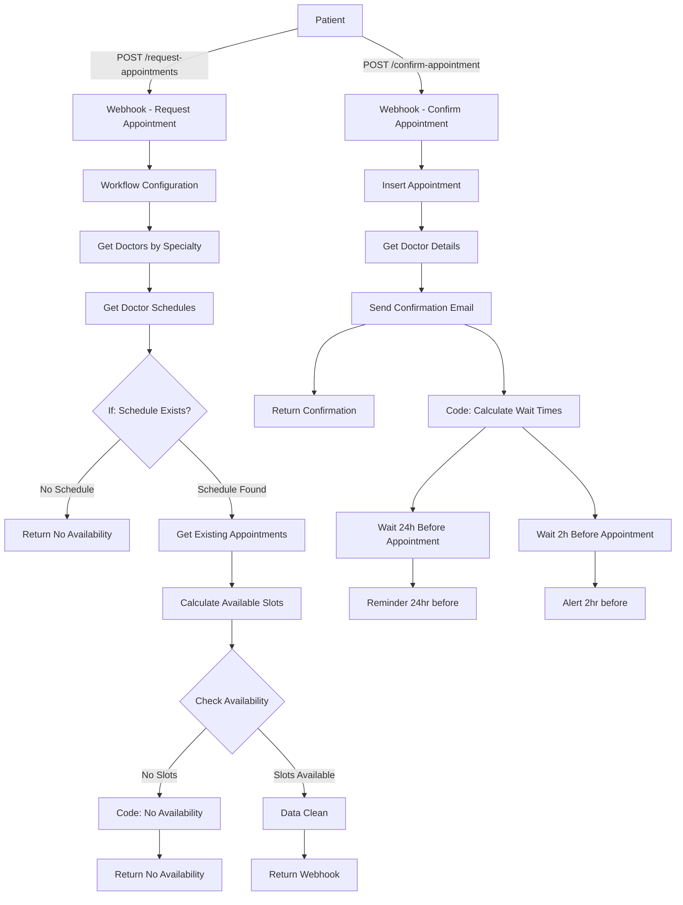
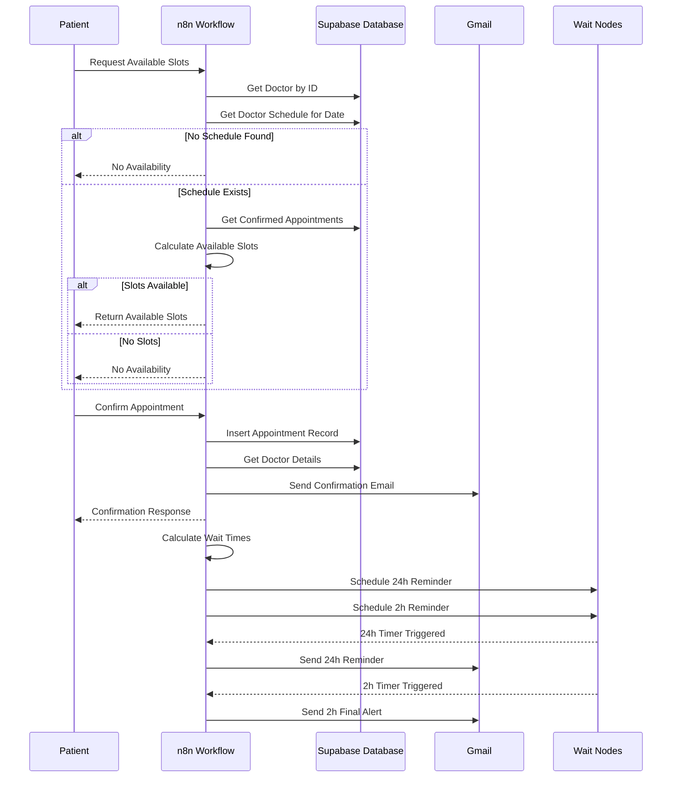

# Hospital Appointment Booking System with Automated Reminders

A fully automated, end-to-end hospital appointment management system built on **n8n**, **Supabase**, and **Gmail**.

This project consists of a **single comprehensive n8n workflow** that automates:

- Real-time appointment availability checking
- Doctor schedule management
- Conflict-free slot calculation
- Appointment booking and confirmation
- Database-driven appointment tracking
- Time-based automated email reminders (24h and 2h before appointments)
- Professional HTML email notifications
- Multi-stage patient communication workflow

This repository documents the complete architecture, database schema, workflow logic, and technical details required for developers to understand, maintain, extend, or deploy the system.

---

## 📑 Table of Contents

1. [Introduction](#-introduction)
2. [System Architecture](#️-system-architecture)
3. [Sequence Diagrams](#-workflow-interaction-diagram)
4. [Environment Variables](#️-environment-variables)
5. [API Endpoints](#-api-endpoints)
6. [Database Schema](#️-database-schema)
7. [Folder Structure](#-folder-structure)
8. [Workflow Overview](#-workflow-overview)
9. [Node-Level Documentation](#-node-level-documentation)
10. [Setup Instructions](#️-setup-instructions)
11. [Deployment Guide](#-deployment-guide)
12. [Scalability & Limitations](#-scalability--limitations)
13. [Future Improvements](#-future-improvements)

---

## 🧩 Introduction

The **Hospital Appointment Booking System with Automated Reminders** is designed as a no-code/low-code automation pipeline that allows healthcare facilities to:

- Provide real-time appointment availability to patients
- Check doctor schedules and prevent double-booking
- Calculate available time slots based on existing appointments
- Book appointments with instant confirmation
- Send professional HTML confirmation emails
- Automatically remind patients 24 hours before appointments
- Send final reminders 2 hours before appointments
- Maintain appointment status tracking in Supabase database
- Handle patient-doctor-appointment relationships

The system runs without human intervention and uses Supabase as a robust, scalable database backend with Gmail for HIPAA-compliant email communications.

---

## 🗂️ System Architecture

### High-Level Architecture Diagram



---

## 📄 Workflow Interaction Diagram



---

## ⚙️ Environment Variables

Although n8n stores credentials separately, the following variables are required:

| Variable | Description |
|----------|-------------|
| `N8N_PORT` | n8n instance port (default: 5678) |
| `N8N_ENCRYPTION_KEY` | Required for credential encryption |
| `SUPABASE_URL` | Supabase project URL |
| `SUPABASE_API_KEY` | Supabase service role key |
| `GMAIL_CLIENT_ID` | Gmail OAuth credentials for sending |
| `GMAIL_CLIENT_SECRET` | Gmail OAuth credentials for sending |
| `N8N_WEBHOOK_URL` | Base URL for webhook endpoints |

---

## 🌐 API Endpoints

| Endpoint | Method | Workflow Node | Purpose |
|----------|--------|---------------|---------|
| `/request-appointments` | POST | Webhook - Request Appointment1 | Get available appointment slots for a doctor on a specific date |
| `/confirm-appointment` | POST | Webhook - Confirm Appointment | Book an appointment and trigger confirmation emails |

### Request Appointments Payload

```json
{
  "doctor_id": 1,
  "date": "2025-12-16"
}
```

**Response (Success):**
```json
{
  "status": "success",
  "total_slots": 8,
  "available_slots": [
    {
      "doctor_id": 1,
      "doctor_name": "Dr. Sarah Ahmed",
      "specialty": "Cardiology",
      "day_of_week": "Monday",
      "start_time": "09:00",
      "end_time": "09:30",
      "date": "2025-12-16"
    }
  ]
}
```

**Response (No Availability):**
```json
{
  "status": "no_availability",
  "message": "No available slots."
}
```

### Confirm Appointment Payload

```json
{
  "patient_name": "John Doe",
  "email": "patient@example.com",
  "phone": "1234567890",
  "doctor": "Dr. Sarah Ahmed",
  "doctor_id": 1,
  "date": "2025-12-16",
  "appointment_time": "09:00 - 09:30"
}
```

**Response:**
```json
{
  "status": "confirmed",
  "appointment_id": 42,
  "message": "Appointment confirmed successfully"
}
```

---

## 🗄️ Database Schema

### Tables

#### **appointments**
| Column | Type | Description |
|--------|------|-------------|
| `id` | integer | Primary key (auto-increment) |
| `patient_name` | varchar | Patient full name |
| `phone` | varchar | Patient contact number |
| `doctor_id` | integer | Foreign key to doctors table |
| `date` | date | Appointment date |
| `appointment_time` | varchar | Time slot (e.g., "09:00 - 09:30") |
| `status` | varchar | Status: "Confirmed", "Cancelled", "Completed" |
| `created_at` | timestamp | Record creation timestamp |
| `day_of_week` | varchar | Day name (e.g., "Monday") |

#### **doctors**
| Column | Type | Description |
|--------|------|-------------|
| `id` | integer | Primary key |
| `name` | varchar | Doctor full name |
| `specialty` | varchar | Medical specialty |
| `email` | varchar | Doctor email |
| `phone` | varchar | Doctor contact |

#### **doctor_schedules**
| Column | Type | Description |
|--------|------|-------------|
| `id` | integer | Primary key |
| `doctor_id` | integer | Foreign key to doctors table |
| `date` | date | Schedule date |
| `day_of_week` | varchar | Day name |
| `start_time` | time | Shift start time |
| `end_time` | time | Shift end time |

---

## 📁 Folder Structure

```
root/
│  README.md
│
├── workflows/
│     └── hospital-appointment-system.json
│
├── database/
│     ├── schema.sql
│     └── seed-data.sql
│
└── examples/
      ├── request-slots-example.json
      └── confirm-appointment-example.json
```

---

## 🧠 Workflow Overview

### Single Workflow: Complete Appointment Management System

**Handles:**

**Appointment Availability Flow:**
- Receives slot availability requests via webhook
- Fetches doctor information by ID
- Retrieves doctor schedules for requested date
- Validates schedule existence
- Fetches all confirmed appointments
- Calculates available slots with conflict detection
- Returns formatted availability response

**Appointment Booking Flow:**
- Receives appointment confirmation requests
- Inserts appointment record into Supabase
- Fetches doctor details for personalization
- Sends HTML confirmation email
- Calculates reminder trigger times
- Schedules time-based wait nodes
- Sends 24-hour reminder email
- Sends 2-hour final alert email

**Key Features:**
- **Conflict-Free Scheduling:** Prevents double-booking through intelligent slot calculation
- **Time-Based Automation:** Uses n8n Wait nodes for scheduled reminders
- **Professional Communications:** HTML email templates with gradient designs
- **Data Persistence:** Supabase database for reliable appointment tracking
- **Real-Time Validation:** Checks schedules and availability before booking
- **Multi-Stage Reminders:** 24h and 2h notification system

---

## 🧱 Node-Level Documentation

Below is a detailed breakdown of all nodes exactly as named in the workflow.

### 🔹 Webhook - Request Appointment1

**Type:** `n8n-nodes-base.webhook`  
**Method:** POST  
**Path:** `/request-appointments`

Receives slot availability requests from patients or frontend systems. Expects:
- `doctor_id`: Integer ID of the doctor
- `date`: Date in YYYY-MM-DD format

Triggers the availability checking flow.

### 🔹 Workflow Configuration

**Type:** `n8n-nodes-base.set`  
**Purpose:** Global workflow configuration

Sets placeholder configuration variables:
- `supabaseUrl`: Supabase project URL
- `messagingApiUrl`: SMS/WhatsApp API endpoint (placeholder for future integration)

**Note:** These are placeholder values and should be configured during deployment.

### 🔹 Get Doctors by Specialty

**Type:** `n8n-nodes-base.supabase`  
**Operation:** Get All  
**Table:** `doctors`

Fetches doctor record by ID from the webhook request. Uses filter:
```
id = {{ $json.body.doctor_id }}
```

Returns doctor information including name, specialty, and contact details.

### 🔹 Get Doctor Schedules

**Type:** `n8n-nodes-base.supabase`  
**Operation:** Get All  
**Table:** `doctor_schedules`

Retrieves doctor's schedule for the requested date. Uses two filters:
1. `doctor_id = {{ $json.id }}`
2. `date = {{ $('Webhook - Request Appointment1').item.json.body.date }}`

Returns schedule with `start_time`, `end_time`, and `day_of_week`.

### 🔹 If

**Type:** `n8n-nodes-base.if`  
**Condition:** Check if schedule exists

Validates whether the doctor has a schedule for the requested date:
```
$('Get Doctor Schedules').all().length == 0
```

- **True path:** Returns "No Availability"
- **False path:** Continues to slot calculation

### 🔹 Get Existing Appointments

**Type:** `n8n-nodes-base.supabase`  
**Operation:** Get All  
**Table:** `appointments`

Fetches all confirmed appointments to check for conflicts. Uses filter:
```
status = "Confirmed"
```

Returns all existing appointments for slot conflict detection.

### 🔹 Calculate Available Slots

**Type:** `n8n-nodes-base.code`  
**Language:** JavaScript

**Purpose:** Core scheduling algorithm that calculates available time slots

**Logic:**
1. Retrieves doctors, schedules, and existing appointments
2. Defines slot duration (30 minutes)
3. Converts time strings to numeric minutes for calculation
4. For each schedule:
   - Iterates through time range in 30-minute increments
   - Filters confirmed bookings for the same doctor/date
   - Parses existing appointment time slots
   - Checks for conflicts with existing bookings
   - Adds non-conflicting slots to available list
5. Returns formatted available slots with doctor details

**Key Functions:**
- `parseSlotRange()`: Converts "09:00 - 09:30" to numeric range
- `timeToMinutes()`: Converts "09:00" to 540 minutes
- `minutesToTime()`: Converts 540 to "09:00"

**Output:**
```json
{
  "availableSlots": [...],
  "totalSlots": 8
}
```

### 🔹 Check Availability

**Type:** `n8n-nodes-base.if`  
**Condition:** Slots available?

Checks if any slots were found:
```
$json.availableSlots.length > 0
```

Routes to appropriate response based on availability.

### 🔹 Data clean

**Type:** `n8n-nodes-base.code`  
**Purpose:** Format successful response

Transforms data into clean API response:
```json
{
  "status": "success",
  "total_slots": 8,
  "available_slots": [...]
}
```

### 🔹 Code in JavaScript1

**Type:** `n8n-nodes-base.code`  
**Purpose:** Format no-availability response

Returns standardized error response:
```json
{
  "status": "no_availability",
  "message": "No available slots."
}
```

### 🔹 Return Webhook / Return No Availability

**Type:** `n8n-nodes-base.respondToWebhook`  

Returns formatted JSON response to the webhook caller. Closes the webhook request-response cycle.

---

### 🔹 Webhook - Confirm Appointment

**Type:** `n8n-nodes-base.webhook`  
**Method:** POST  
**Path:** `/confirm-appointment`

Receives appointment booking requests. Expects:
- `patient_name`: Full name
- `email`: Patient email
- `phone`: Contact number
- `doctor`: Doctor name
- `doctor_id`: Doctor ID
- `date`: Appointment date
- `appointment_time`: Time slot (e.g., "09:00 - 09:30")

### 🔹 Insert Appointment

**Type:** `n8n-nodes-base.supabase`  
**Operation:** Create  
**Table:** `appointments`

Inserts new appointment record with:
- All patient and doctor information from webhook
- `status`: "Confirmed"
- `created_at`: Current timestamp
- `day_of_week`: Calculated from date

Returns the created appointment with auto-generated ID.

### 🔹 Get Doctor Details

**Type:** `n8n-nodes-base.supabase`  
**Operation:** Get  
**Table:** `doctors`

Fetches complete doctor information for email personalization:
```
id = {{ $('Insert Appointment').item.json.doctor_id }}
```

### 🔹 Send Confirmation

**Type:** `n8n-nodes-base.gmail`  
**Operation:** Send email

Sends professional HTML confirmation email with:
- Blue gradient theme
- Appointment details (doctor, date, time, status)
- Instructions to arrive early
- SmartCare Hospital branding

**Subject:** "Appointment Book"

### 🔹 Return Confirmation

**Type:** `n8n-nodes-base.respondToWebhook`

Returns success response to webhook:
```json
{
  "status": "confirmed",
  "appointment_id": 42,
  "message": "Appointment confirmed successfully"
}
```

### 🔹 Code in JavaScript

**Type:** `n8n-nodes-base.code`  
**Purpose:** Calculate reminder trigger times

**Logic:**
1. Extracts appointment date and time
2. Parses appointment datetime
3. Calculates two wait times:
   - `waitUntil24h`: 24 hours before appointment
   - `waitUntil2h`: 2 hours before appointment
4. Returns ISO timestamp strings for Wait nodes

**Error Handling:** Throws error if date/time missing

### 🔹 Wait 24h Before Appointment

**Type:** `n8n-nodes-base.wait`  
**Mode:** Specific Time  
**Resume At:** `{{ $json.waitUntil24h }}`

Pauses workflow execution until 24 hours before appointment. This is a persistent wait that survives n8n restarts.

### 🔹 Wait 2h Before Appointment

**Type:** `n8n-nodes-base.wait`  
**Mode:** Specific Time  
**Resume At:** `{{ $json.waitUntil2h }}`

Pauses workflow execution until 2 hours before appointment. Runs in parallel with 24h wait.

### 🔹 Reminder 24hr before

**Type:** `n8n-nodes-base.gmail`  
**Operation:** Send email

Sends HTML reminder email with:
- Orange gradient theme
- "24-Hour Appointment Reminder" heading
- Appointment details
- Instruction to arrive early

**Triggered:** After Wait 24h node completes

### 🔹 Alert 2hr before

**Type:** `n8n-nodes-base.gmail`  
**Operation:** Send email

Sends final HTML alert email with:
- Green gradient theme
- "2-Hour Final Reminder" heading
- Abbreviated appointment details
- "We look forward to seeing you soon" message

**Triggered:** After Wait 2h node completes

---

## 🛠️ Setup Instructions

### 1. Install n8n

**Option A: Docker (Recommended)**
```bash
docker pull n8nio/n8n
docker run -it --rm \
  -p 5678:5678 \
  -v ~/.n8n:/home/node/.n8n \
  n8nio/n8n
```

**Option B: npm**
```bash
npm install n8n -g
n8n start
```

**Option C: n8n Cloud**
Sign up at [n8n.cloud](https://n8n.cloud)

### 2. Set Up Supabase Database

**Create New Project:**
1. Go to [supabase.com](https://supabase.com)
2. Create new project
3. Note your project URL and API key

**Create Database Schema:**

```sql
-- Doctors Table
CREATE TABLE doctors (
  id SERIAL PRIMARY KEY,
  name VARCHAR(255) NOT NULL,
  specialty VARCHAR(100),
  email VARCHAR(255),
  phone VARCHAR(50)
);

-- Doctor Schedules Table
CREATE TABLE doctor_schedules (
  id SERIAL PRIMARY KEY,
  doctor_id INTEGER REFERENCES doctors(id),
  date DATE NOT NULL,
  day_of_week VARCHAR(20),
  start_time TIME NOT NULL,
  end_time TIME NOT NULL
);

-- Appointments Table
CREATE TABLE appointments (
  id SERIAL PRIMARY KEY,
  patient_name VARCHAR(255) NOT NULL,
  phone VARCHAR(50),
  doctor_id INTEGER REFERENCES doctors(id),
  date DATE NOT NULL,
  appointment_time VARCHAR(50),
  status VARCHAR(50) DEFAULT 'Confirmed',
  created_at TIMESTAMP DEFAULT NOW(),
  day_of_week VARCHAR(20)
);
```

**Seed Sample Data:**

```sql
-- Insert sample doctors
INSERT INTO doctors (name, specialty, email, phone) VALUES
('Dr. Sarah Ahmed', 'Cardiology', 'sarah@hospital.com', '1234567890'),
('Dr. Michael Chen', 'Pediatrics', 'michael@hospital.com', '0987654321'),
('Dr. Noor Ali', 'Orthopedics', 'noor@hospital.com', '5555555555');

-- Insert sample schedules
INSERT INTO doctor_schedules (doctor_id, date, day_of_week, start_time, end_time) VALUES
(1, '2025-12-16', 'Monday', '09:00:00', '17:00:00'),
(2, '2025-12-16', 'Monday', '10:00:00', '16:00:00'),
(3, '2025-12-16', 'Monday', '08:00:00', '14:00:00');
```

### 3. Configure n8n Credentials

**Supabase Credentials:**
1. In n8n: Settings → Credentials → Add Credential
2. Select "Supabase"
3. Enter:
   - Host: Your Supabase URL
   - Service Role Secret: Your API key

**Gmail OAuth2:**
1. Create OAuth credentials in Google Cloud Console
2. Enable Gmail API
3. Add redirect URI: `http://localhost:5678/rest/oauth2-credential/callback`
4. In n8n: Add Gmail OAuth2 credential
5. Complete OAuth flow

### 4. Import Workflow

1. Download `hospital-appointment-system.json`
2. In n8n: Workflows → Import from File
3. Update credential references
4. Activate workflow

### 5. Update Configuration

In "Workflow Configuration" node:
- Replace `<__PLACEHOLDER_VALUE__Supabase Project URL__>` with actual Supabase URL
- Replace `<__PLACEHOLDER_VALUE__SMS/WhatsApp API Endpoint__>` if using SMS

### 6. Test the System

**Test Availability Request:**
```bash
curl -X POST http://localhost:5678/webhook/request-appointments \
  -H "Content-Type: application/json" \
  -d '{
    "doctor_id": 1,
    "date": "2025-12-16"
  }'
```

**Test Appointment Booking:**
```bash
curl -X POST http://localhost:5678/webhook/confirm-appointment \
  -H "Content-Type: application/json" \
  -d '{
    "patient_name": "John Doe",
    "email": "john@example.com",
    "phone": "1234567890",
    "doctor": "Dr. Sarah Ahmed",
    "doctor_id": 1,
    "date": "2025-12-16",
    "appointment_time": "09:00 - 09:30"
  }'
```

---

## 🚀 Deployment Guide

### Option 1: n8n Cloud

**Recommended for production:**
1. Sign up at [n8n.cloud](https://n8n.cloud)
2. Import workflow
3. Configure Supabase and Gmail credentials
4. Use production webhook URLs
5. Enable automatic backups

**Benefits:**
- Persistent wait nodes across restarts
- Automatic scaling
- Built-in monitoring
- HTTPS by default

### Option 2: Docker Production Deployment

**docker-compose.yml:**
```yaml
version: '3.8'

services:
  n8n:
    image: n8nio/n8n:latest
    restart: always
    ports:
      - "5678:5678"
    environment:
      - N8N_ENCRYPTION_KEY=${N8N_ENCRYPTION_KEY}
      - N8N_PROTOCOL=https
      - N8N_HOST=${N8N_HOST}
      - WEBHOOK_URL=https://${N8N_HOST}/
      - EXECUTIONS_DATA_PRUNE=true
      - EXECUTIONS_DATA_MAX_AGE=168
    volumes:
      - n8n_data:/home/node/.n8n
    depends_on:
      - postgres

  postgres:
    image: postgres:15
    restart: always
    environment:
      - POSTGRES_DB=n8n
      - POSTGRES_USER=n8n
      - POSTGRES_PASSWORD=${POSTGRES_PASSWORD}
    volumes:
      - postgres_data:/var/lib/postgresql/data

volumes:
  n8n_data:
  postgres_data:
```

### Option 3: Self-Hosted with Nginx

**Nginx Configuration:**
```nginx
server {
    listen 443 ssl http2;
    server_name appointments.yourhospital.com;

    ssl_certificate /etc/letsencrypt/live/appointments.yourhospital.com/fullchain.pem;
    ssl_certificate_key /etc/letsencrypt/live/appointments.yourhospital.com/privkey.pem;

    location / {
        proxy_pass http://localhost:5678;
        proxy_http_version 1.1;
        proxy_set_header Upgrade $http_upgrade;
        proxy_set_header Connection 'upgrade';
        proxy_set_header Host $host;
        proxy_set_header X-Real-IP $remote_addr;
        proxy_set_header X-Forwarded-For $proxy_add_x_forwarded_for;
        proxy_set_header X-Forwarded-Proto $scheme;
        proxy_cache_bypass $http_upgrade;
    }
}
```

### Option 4: Kubernetes Deployment

For high-scale hospital networks:
- Use n8n Helm chart
- Configure persistent volumes for wait nodes
- Set up Redis for queue management
- Implement horizontal pod autoscaling
- Use cloud-managed Postgres (AWS RDS, Google Cloud SQL)

---

## 📈 Scalability & Limitations

### Strengths

- **Database-Backed Persistence:** Supabase ensures data reliability
- **Intelligent Scheduling:** Conflict-free slot calculation algorithm
- **Time-Based Automation:** Wait nodes enable precise reminder timing
- **Parallel Processing:** 24h and 2h reminders scheduled simultaneously
- **Professional Communication:** Medical-grade HTML email templates
- **Extensible Architecture:** Easy to add SMS, push notifications
- **Real-Time Validation:** Prevents double-booking at reservation time
- **Stateful Wait Nodes:** Reminders persist across n8n restarts

### Limitations

- **Gmail Sending Limits:**
  - Free Gmail: 100-500 emails/day
  - Google Workspace: 2,000 emails/day
  - Solution: Integrate SendGrid or AWS SES for volume
- **Wait Node Persistence:** Requires database-backed n8n deployment
- **Timezone Handling:** Assumes all times in server timezone
- **No Cancellation Flow:** Patients cannot cancel appointments via API
- **Single Slot Duration:** Fixed at 30 minutes (requires code change)
- **No Overbooking:** Cannot handle walk-in or emergency slots
- **Email-Only Notifications:** No SMS/WhatsApp integration active

### Cost Considerations

**Supabase:**
- Free tier: Up to 500MB database
- Pro: $25/month for 8GB

**Gmail:**
- Free for low volume
- Google Workspace: $6-18/user/month

**n8n:**
- Self-hosted: Free (infrastructure only)
- n8n Cloud: Starting at $20/month

**Estimated Monthly Cost:**
- Small clinic (50 appointments/day): $25-45
- Medium hospital (200 appointments/day): $70-120

---

## 🚀 Future Improvements

### Short-Term Enhancements

- **SMS Integration:** Add Twilio for text message reminders
- **WhatsApp Notifications:** Integrate WhatsApp Business API
- **Cancellation Flow:** Allow patients to cancel appointments
- **Rescheduling:** Enable appointment time changes
- **Multi-Language Support:** Translate emails based on patient preference
- **Patient Portal:** Web dashboard for appointment management
- **Doctor Dashboard:** View daily appointments and availability

### Medium-Term Features

- **Waitlist System:** Automatically fill cancelled slots
- **Recurring Appointments:** Support for weekly/monthly bookings
- **Insurance Verification:** Integrate insurance API checks
- **Virtual Appointments:** Add telemedicine support
- **Payment Integration:** Collect appointment fees via Stripe
- **Analytics Dashboard:** Track booking rates, no-shows, utilization
- **Custom Slot Durations:** Allow different appointment lengths per specialty

### Long-Term Vision

- **AI-Powered Scheduling:** Optimize doctor schedules using ML
- **Predictive No-Show Detection:** Send additional reminders to high-risk patients
- **Multi-Location Support:** Manage appointments across hospital branches
- **EHR Integration:** Sync with Epic, Cerner, or other systems
- **Mobile App:** Native iOS/Android appointment booking
- **Voice Booking:** Integrate with Alexa/Google Assistant
- **FHIR Compliance:** Full interoperability standard support

### Technical Improvements

- **Timezone Support:** Handle multiple timezones for international hospitals
- **Queue System:** Bull or BullMQ for high-volume processing
- **Caching Layer:** Redis caching for schedule lookups
- **Rate Limiting:** Protect webhooks from abuse
- **Audit Logging:** Track all appointment changes
- **Backup Notifications:** Send SMS if email fails
- **Load Testing:** Validate performance at 1000+ appointments/day
- **Monitoring:** Datadog/New Relic integration
- **Error Alerts:** Slack notifications for failed workflows

---

## 📋 Appendix

### Sample Email Templates

**Confirmation Email (Blue Theme):**
- Header: Blue gradient (#0b69ff to #4da3ff)
- Background: Light blue (#f0f6ff)
- Purpose: Immediate booking confirmation

**24-Hour Reminder (Orange Theme):**
- Header: Orange gradient (#ff9f43 to #ff6f3c)
- Background: Light orange (#fff5e6)
- Purpose: Advance notice for preparation

**2-Hour Alert (Green Theme):**
- Header: Green gradient (#28c76f to #20a95d)
- Background: Light green (#e8fff2)
- Purpose: Final reminder before departure

### Slot Calculation Algorithm

**Pseudocode:**
```
FOR each doctor_schedule:
  start = schedule.start_time (in minutes)
  end = schedule.end_time (in minutes)
  slot_duration = 30 minutes
  
  booked_slots = GET confirmed appointments for (doctor, date)
  
  FOR time = start TO end STEP slot_duration:
    slot_start = time
    slot_end = time + slot_duration
    
    has_conflict = CHECK if slot overlaps with any booked_slot
    
    IF NOT has_conflict:
      ADD slot to available_slots
    END IF
  END FOR
END FOR

RETURN available_slots
```

### Database Indexes (Performance Optimization)

```sql
-- Speed up appointment lookups
CREATE INDEX idx_appointments_doctor_date 
ON appointments(doctor_id, date, status);

-- Speed up schedule queries
CREATE INDEX idx_schedules_doctor_date 
ON doctor_schedules(doctor_id, date);

-- Speed up doctor lookups
CREATE INDEX idx_doctors_specialty 
ON doctors(specialty);
```

---

## 📄 License

MIT License - See LICENSE file for details

---

## 🤝 Contributing

Contributions welcome! Please:
1. Fork the repository
2. Create feature branch
3. Test with sample hospital data
4. Ensure email templates render correctly
5. Submit pull request with clear description

---

## 📞 Support

For issues or questions:
- GitHub Issues: [Repository Issues Page]
- n8n Community: [community.n8n.io](https://community.n8n.io)
- Supabase Docs: [supabase.com/docs](https://supabase.com/docs)

---
