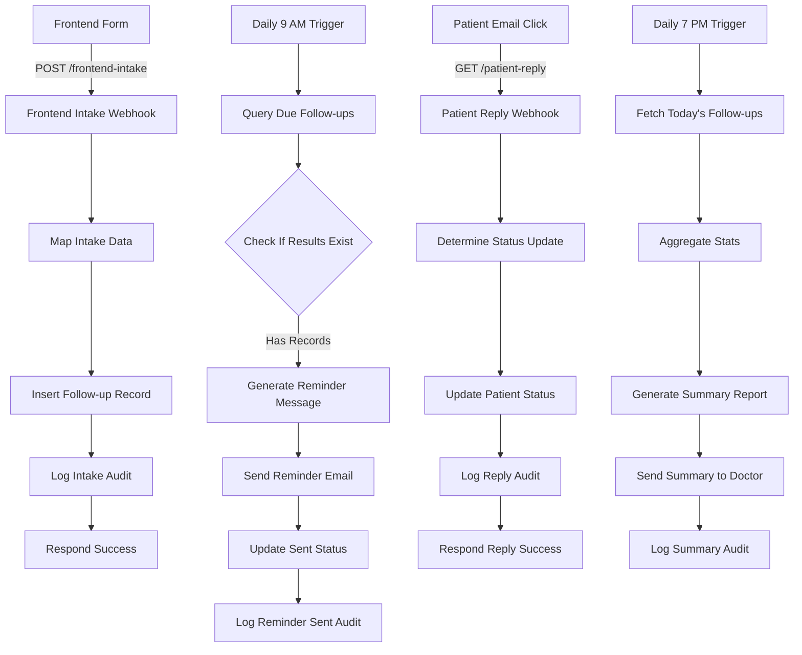
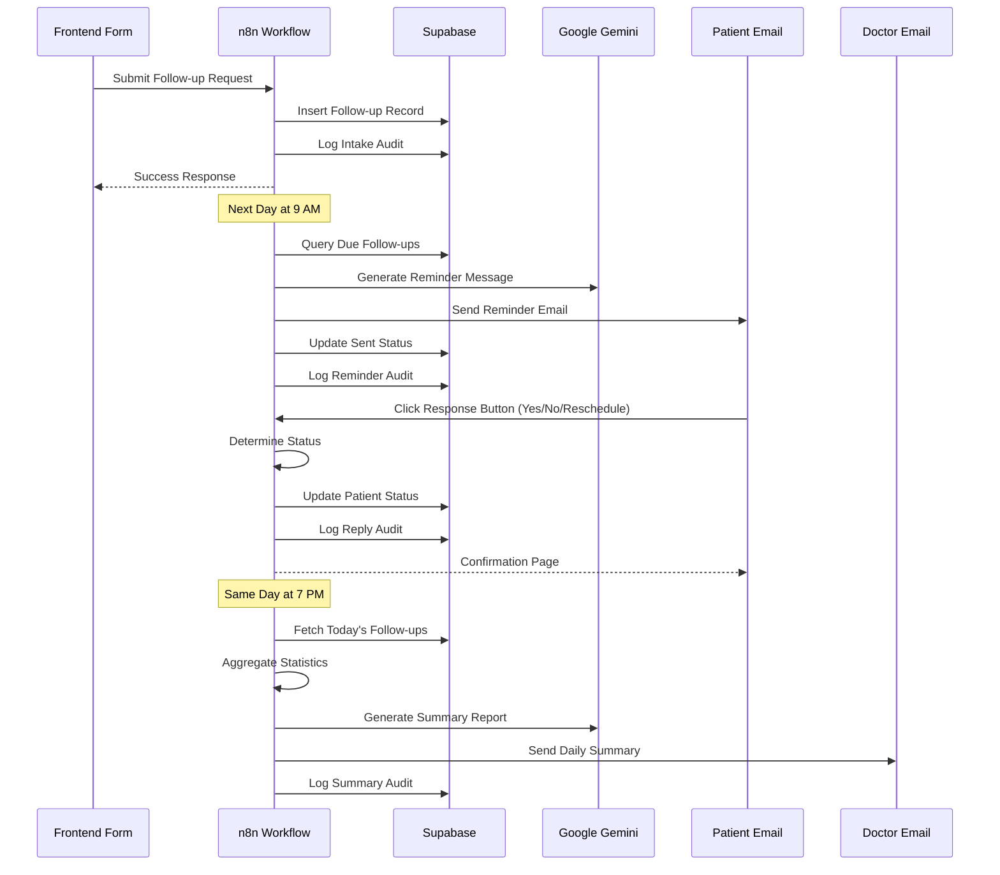

# Medical Clinic Patient Follow-Up Automation Engine (Gmail Only)

A fully automated, end-to-end patient follow-up management system built on **n8n**, **Supabase**, **Google Gemini AI**, and **Gmail**.

This project consists of a **comprehensive n8n workflow** that automates:

- Patient follow-up appointment scheduling via webhook
- Automated daily reminder emails at 9 AM
- AI-generated personalized reminder messages
- One-click patient response handling (Confirm/Cancel/Reschedule)
- Real-time status tracking and updates
- Daily summary reports to doctors at 7 PM
- Complete audit trail for compliance
- Interactive email with clickable response buttons

This repository documents the complete architecture, AI integration, database schema, workflow logic, and technical details required for developers to understand, maintain, extend, or deploy the system.

---

## 📑 Table of Contents

1. [Introduction](#-introduction)
2. [System Architecture](#️-system-architecture)
3. [Sequence Diagrams](#-workflow-interaction-diagram)
4. [Environment Variables](#️-environment-variables)
5. [API Endpoints](#-api-endpoints)
6. [Database Schema](#️-database-schema)
7. [Folder Structure](#-folder-structure)
8. [Workflow Overview](#-workflow-overview)
9. [Node-Level Documentation](#-node-level-documentation)
10. [Setup Instructions](#️-setup-instructions)
11. [Deployment Guide](#-deployment-guide)
12. [Scalability & Limitations](#-scalability--limitations)
13. [Future Improvements](#-future-improvements)

---

## 🧩 Introduction

The **Medical Clinic Patient Follow-Up Automation Engine** is designed as a no-code/low-code automation pipeline that allows healthcare facilities to:

- Schedule patient follow-up appointments through a web form
- Automatically send reminder emails every morning at 9 AM
- Generate personalized reminder messages using AI
- Allow patients to confirm, cancel, or reschedule with one click
- Track appointment statuses in real-time (pending/done/missed/rescheduled)
- Send daily summary reports to doctors every evening
- Maintain complete audit logs for all system actions
- Reduce no-show rates through automated communication

The system runs without human intervention and uses Google Gemini 2.5 Flash for intelligent message generation, Supabase as a scalable database backend, and Gmail for HIPAA-compliant email communications.

---

## 🗂️ System Architecture

### High-Level Architecture Diagram



---

## 📄 Workflow Interaction Diagram



---

## ⚙️ Environment Variables

Although n8n stores credentials separately, the following variables are required:

| Variable | Description |
|----------|-------------|
| `N8N_PORT` | n8n instance port (default: 5678) |
| `N8N_ENCRYPTION_KEY` | Required for credential encryption |
| `SUPABASE_URL` | Supabase project URL |
| `SUPABASE_API_KEY` | Supabase service role key |
| `GEMINI_API_KEY` | Google Gemini API key for AI generation |
| `GMAIL_CLIENT_ID` | Gmail OAuth credentials for sending |
| `GMAIL_CLIENT_SECRET` | Gmail OAuth credentials for sending |
| `N8N_WEBHOOK_URL` | Base URL for webhook endpoints |

---

## 🌐 API Endpoints

| Endpoint | Method | Workflow Node | Purpose |
|----------|--------|---------------|---------|
| `/frontend-intake` | POST | Frontend Intake Webhook | Submit new follow-up appointments |
| `/patient-reply` | GET | Patient Reply Webhook | Handle patient response from email |

### Frontend Intake Payload

**Request:**
```json
{
  "fullName": "John Doe",
  "phone": "+1234567890",
  "email": "patient@example.com",
  "specialty": "Cardiology",
  "doctor": "Dr. Sarah Ahmed",
  "preferredDate": "2025-12-20"
}
```

**Response:**
```json
{
  "success": true,
  "message": "Follow-up scheduled successfully"
}
```

### Patient Reply Query Parameters

**Request:**
```
GET /patient-reply?phone=+1234567890&reply=yes
```

**Query Parameters:**
- `phone`: Patient phone number
- `reply`: Patient response (`yes`, `no`, or `reschedule`)

**Response:**
```json
{
  "success": true,
  "message": "Reply processed successfully"
}
```

---

## 🗄️ Database Schema

### Tables

#### **followups**
| Column | Type | Description |
|--------|------|-------------|
| `id` | integer | Primary key (auto-increment) |
| `patient_name` | varchar | Patient full name |
| `phone` | varchar | Patient contact number |
| `email` | varchar | Patient email address |
| `doctor_name` | varchar | Assigned doctor name |
| `specialty` | varchar | Medical specialty |
| `due_date` | date | Follow-up appointment date |
| `status` | varchar | Status: "pending", "done", "missed", "rescheduled" |
| `sent` | boolean | Whether reminder email was sent |
| `response` | varchar | Patient response: "yes", "no", "reschedule" |
| `created_at` | timestamp | Record creation timestamp |

#### **audit_log**
| Column | Type | Description |
|--------|------|-------------|
| `id` | integer | Primary key |
| `action` | varchar | Action type |
| `actor` | varchar | Who performed action (usually "system") |
| `timestamp` | timestamp | When action occurred (auto) |

**Audit Actions:**
- `intake_received` - New follow-up scheduled
- `reminder_sent` - Reminder email sent to patient
- `patient_reply_processed` - Patient responded to reminder
- `daily_summary_sent` - Summary report sent to doctor

---

## 📁 Folder Structure

```
root/
│  README.md
│
├── workflows/
│     └── patient-followup-automation.json
│
├── database/
│     ├── schema.sql
│     └── seed-data.sql
│
├── frontend/
│     ├── index.html
│     └── form-handler.js
│
└── examples/
      ├── sample-intake-request.json
      └── sample-patient-reply.sh
```

---

## 🧠 Workflow Overview

### Single Workflow: Complete Patient Follow-Up Automation

**Handles:**

**Follow-Up Scheduling Flow:**
- Receives patient follow-up requests via webhook
- Maps and validates intake data
- Inserts follow-up record into Supabase
- Logs intake action to audit trail
- Returns success response to frontend

**Daily Reminder Flow (9 AM):**
- Triggers automatically every day at 9:00 AM
- Queries follow-ups due today that haven't been sent
- Generates AI-powered personalized reminder messages
- Sends HTML emails with clickable response buttons
- Updates sent status to prevent duplicate reminders
- Logs reminder action to audit trail

**Patient Response Flow:**
- Receives patient clicks from email buttons
- Parses response type (yes/no/reschedule)
- Normalizes phone number format
- Updates follow-up status in database
- Logs reply action to audit trail
- Returns confirmation to patient

**Daily Summary Flow (7 PM):**
- Triggers automatically every day at 7:00 PM
- Fetches all follow-ups scheduled for today
- Aggregates statistics (total, completed, missed, pending, rescheduled)
- Generates AI-powered summary report
- Sends email report to doctor
- Logs summary action to audit trail

**Key Features:**
- **AI-Powered Communication:** Gemini 2.5 Flash generates natural, personalized messages
- **One-Click Responses:** Patients respond via email buttons (no app needed)
- **Automated Scheduling:** Time-based triggers eliminate manual work
- **Real-Time Tracking:** Instant status updates on patient responses
- **Daily Reporting:** Doctors receive end-of-day summaries automatically
- **Complete Audit Trail:** All actions logged for compliance
- **Phone Number Normalization:** Handles various phone formats correctly

---

## 🧱 Node-Level Documentation

Below is a detailed breakdown of all nodes exactly as named in the workflow.

### 📋 Follow-Up Scheduling Flow

### 🔹 Frontend Intake Webhook

**Type:** `n8n-nodes-base.webhook`  
**Method:** POST  
**Path:** `/frontend-intake`  
**Response Mode:** Response Node

Receives patient follow-up appointment requests from frontend forms or external systems.

**Expected Payload:**
```json
{
  "fullName": "John Doe",
  "phone": "+1234567890",
  "email": "patient@example.com",
  "specialty": "Cardiology",
  "doctor": "Dr. Sarah Ahmed",
  "preferredDate": "2025-12-20"
}
```

### 🔹 Map Intake Data

**Type:** `n8n-nodes-base.set`  
**Purpose:** Transform frontend data to database schema

**Field Mappings:**

| Output Field | Source | Default Value |
|-------------|---------|---------------|
| `patient_name` | `$json.body.fullName` | - |
| `phone` | `$json.body.phone` | - |
| `email` | `$json.body.email` | - |
| `doctor_name` | `$json.body.doctor` | - |
| `specialty` | `$json.body.specialty` | - |
| `due_date` | `$json.body.preferredDate` | - |
| `status` | - | `"pending"` |
| `sent` | - | `false` |

**Purpose:** Standardizes incoming data and adds default status values.

### 🔹 Insert Follow-up Record

**Type:** `n8n-nodes-base.supabase`  
**Operation:** Create  
**Table:** `followups`

Inserts the mapped follow-up record into the Supabase database.

**Fields Inserted:**
- Patient information (name, phone, email)
- Doctor and specialty
- Due date
- Initial status: "pending"
- Sent flag: false

**Returns:** Complete record with auto-generated ID

### 🔹 Log Intake Audit

**Type:** `n8n-nodes-base.supabase`  
**Operation:** Create  
**Table:** `audit_log`

Creates audit log entry for intake action.

**Audit Entry:**
```json
{
  "action": "intake_received",
  "actor": "system"
}
```

### 🔹 Respond Success

**Type:** `n8n-nodes-base.respondToWebhook`  
**Response Type:** JSON

Returns success response to the webhook caller.

**Response:**
```json
{
  "success": true,
  "message": "Follow-up scheduled successfully"
}
```

---

### 📧 Daily Reminder Flow (9 AM)

### 🔹 Daily 9 AM Reminder Trigger

**Type:** `n8n-nodes-base.scheduleTrigger`  
**Schedule:** Daily at 9:00 AM

Triggers the reminder flow automatically every morning.

**Configuration:**
- **Interval:** Daily
- **Hour:** 9
- **Timezone:** Server timezone

### 🔹 Query Due Follow-ups

**Type:** `n8n-nodes-base.supabase`  
**Operation:** Get All  
**Table:** `followups`

Fetches all follow-ups that meet the criteria:

**Filters:**
1. `due_date = today` (formatted as YYYY-MM-DD)
2. `sent = false` (not yet reminded)
3. `status = "pending"` (not completed/cancelled)

**Logic:**
```javascript
due_date = $now.toFormat('yyyy-MM-dd')
sent = false
status = "pending"
```

**Returns:** Array of follow-up records needing reminders

### 🔹 Check If Results Exist

**Type:** `n8n-nodes-base.if`  
**Condition:** Results array not empty

Validates that there are follow-ups to process:

```javascript
$items("Query Due Follow-ups").length > 0
```

**Routing:**
- **True:** Continues to reminder generation
- **False:** Workflow ends (no reminders needed)

### 🔹 Generate Reminder Message

**Type:** `@n8n/n8n-nodes-langchain.googleGemini`  
**Model:** Gemini 2.5 Flash

**Purpose:** Generate personalized appointment reminder using AI

**Prompt Template:**
```
Generate a professional and caring appointment reminder email for:

Patient Name: {{ $json.patient_name }}
Doctor: {{ $json.doctor_name }}
Specialty: {{ $json.specialty }}
Appointment Date: {{ $json.due_date }}

The message should:
- Be warm and professional
- Remind them of their upcoming appointment
- Ask them to reply with YES to confirm, NO to cancel, or RESCHEDULE if they need a different time
- Keep it concise and friendly

Return only the email body text.
```

**AI Configuration:**
- **Temperature:** Default (balanced creativity)
- **Max Tokens:** Default
- **Model:** Gemini 2.5 Flash (fast, cost-effective)

**Output:** Natural language reminder message

### 🔹 Send Reminder Email

**Type:** `n8n-nodes-base.gmail`  
**Operation:** Send email

Sends interactive HTML reminder email to patient.

**Email Configuration:**
- **To:** `{{ $('Check If Results Exist').item.json.email }}`
- **Subject:** `"Appointment Reminder - " + $json.specialty`
- **Format:** HTML

**Email Template Structure:**
```html
<p>Hello {{ patient_name }},</p>
<p>This is a reminder for your upcoming appointment.</p>

<p>
<b>Doctor:</b> {{ doctor_name }}<br/>
<b>Specialty:</b> {{ specialty }}<br/>
<b>Date:</b> {{ due_date }}
</p>

<p>Please confirm your availability by clicking one option below:</p>

<!-- Green button for YES -->
<a href="...webhook/patient-reply?phone={phone}&reply=yes" 
   style="padding:10px 15px;background:#16a34a;color:#fff;...">
   ✅ YES, I'm coming
</a>

<!-- Red button for NO -->
<a href="...webhook/patient-reply?phone={phone}&reply=no"
   style="padding:10px 15px;background:#dc2626;color:#fff;...">
   ❌ NO, I can't come
</a>

<!-- Blue button for RESCHEDULE -->
<a href="...webhook/patient-reply?phone={phone}&reply=reschedule"
   style="padding:10px 15px;background:#2563eb;color:#fff;...">
   🔄 RESCHEDULE
</a>

<p>Thank you.</p>
```

**Button Colors:**
- ✅ YES: Green (#16a34a)
- ❌ NO: Red (#dc2626)
- 🔄 RESCHEDULE: Blue (#2563eb)

### 🔹 Update Sent Status

**Type:** `n8n-nodes-base.supabase`  
**Operation:** Update  
**Table:** `followups`

Updates the follow-up record to mark reminder as sent.

**Filter:**
```javascript
id = $('Query Due Follow-ups').item.json.id
```

**Update:**
```json
{
  "sent": true
}
```

**Purpose:** Prevents duplicate reminders for the same follow-up.

### 🔹 Log Reminder Sent Audit

**Type:** `n8n-nodes-base.supabase`  
**Operation:** Create  
**Table:** `audit_log`

Logs reminder action to audit trail.

**Audit Entry:**
```json
{
  "action": "reminder_sent",
  "actor": "system"
}
```

---

### 🔄 Patient Response Flow

### 🔹 Patient Reply Webhook

**Type:** `n8n-nodes-base.webhook`  
**Method:** GET  
**Path:** `/patient-reply`

Receives patient responses when they click email buttons.

**Query Parameters:**
- `phone`: Patient phone number
- `reply`: Response type (`yes`, `no`, `reschedule`)

**Example URLs:**
- YES: `/patient-reply?phone=+1234567890&reply=yes`
- NO: `/patient-reply?phone=+1234567890&reply=no`
- RESCHEDULE: `/patient-reply?phone=+1234567890&reply=reschedule`

### 🔹 Determine Status Update

**Type:** `n8n-nodes-base.code`  
**Language:** JavaScript

**Purpose:** Parse patient response and map to database status

**Logic:**
```javascript
// Get raw values from webhook
let phone = ($json.query.phone || "").trim();
const reply = ($json.query.reply || "").toLowerCase();

// Normalize phone number - ensure it starts with +
if (!phone.startsWith("+")) {
  phone = "+" + phone;
}

let status;

if (reply === "yes") {
  status = "done";
} else if (reply === "no") {
  status = "missed";
} else if (reply === "reschedule") {
  status = "rescheduled";
} else {
  throw new Error("Invalid reply value");
}

return [{
  json: {
    phone,
    status,
    response: reply
  }
}];
```

**Phone Normalization:**
- Trims whitespace
- Ensures phone starts with `+`
- Handles various input formats

**Status Mapping:**
- `yes` → `"done"` (confirmed)
- `no` → `"missed"` (cancelled)
- `reschedule` → `"rescheduled"` (needs new date)

### 🔹 Update Patient Status

**Type:** `n8n-nodes-base.supabase`  
**Operation:** Update  
**Table:** `followups`

Updates follow-up record with patient response.

**Filter:**
```javascript
phone = $json.phone
```

**Updates:**
```json
{
  "status": "done|missed|rescheduled",
  "response": "yes|no|reschedule"
}
```

**Note:** Matches by phone number to find the correct follow-up.

### 🔹 Log Reply Audit

**Type:** `n8n-nodes-base.supabase`  
**Operation:** Create  
**Table:** `audit_log`

Logs patient response action.

**Audit Entry:**
```json
{
  "action": "patient_reply_processed",
  "actor": "system"
}
```

### 🔹 Respond Reply Success

**Type:** `n8n-nodes-base.respondToWebhook`  
**Response Type:** JSON

Returns confirmation to patient browser.

**Response:**
```json
{
  "success": true,
  "message": "Reply processed successfully"
}
```

**Purpose:** Shows confirmation page in patient's browser after clicking.

---

### 📊 Daily Summary Flow (7 PM)

### 🔹 Daily 7 PM Summary Trigger

**Type:** `n8n-nodes-base.scheduleTrigger`  
**Schedule:** Daily at 7:00 PM

Triggers the summary report flow automatically every evening.

**Configuration:**
- **Interval:** Daily
- **Hour:** 19 (7 PM)

### 🔹 Fetch Today's Follow-ups

**Type:** `n8n-nodes-base.supabase`  
**Operation:** Get All  
**Table:** `followups`

Fetches all follow-ups scheduled for today (regardless of status).

**Filter:**
```javascript
due_date = $now.toFormat('yyyy-MM-dd')
```

**Purpose:** Get complete picture of today's appointments for summary.

### 🔹 Aggregate Stats

**Type:** `n8n-nodes-base.code`  
**Language:** JavaScript

**Purpose:** Calculate summary statistics from follow-up records

**Code:**
```javascript
const items = $input.all();

const stats = {
  total: items.length,
  completed: items.filter(i => i.json.status === 'done').length,
  missed: items.filter(i => i.json.status === 'missed').length,
  pending: items.filter(i => i.json.status === 'pending').length,
  rescheduled: items.filter(i => i.json.status === 'rescheduled').length
};

return [{ json: stats }];
```

**Output:**
```json
{
  "total": 15,
  "completed": 10,
  "missed": 2,
  "pending": 1,
  "rescheduled": 2
}
```

**Statistics:**
- **Total:** All follow-ups today
- **Completed:** Patients who confirmed (status=done)
- **Missed:** Patients who cancelled (status=missed)
- **Pending:** No response yet (status=pending)
- **Rescheduled:** Requested new date (status=rescheduled)

### 🔹 Generate Summary Report

**Type:** `@n8n/n8n-nodes-langchain.googleGemini`  
**Model:** Gemini 2.5 Flash

**Purpose:** Generate professional daily summary report for doctor

**Prompt Template:**
```
Generate a professional daily summary report for the doctor with the following statistics:

Date: {{ current_date }}
Total Follow-ups Today: {{ $json.total }}
Completed: {{ $json.completed }}
Missed: {{ $json.missed }}
Pending: {{ $json.pending }}
Rescheduled: {{ $json.rescheduled }}

Format this as a clear, professional email summary that highlights key metrics and any areas needing attention.

At the end after sincerely use Hafiz Ahmad Adil
Administrator Hospital
```

**AI Output:** Professional email report with:
- Opening greeting
- Statistics summary
- Key insights
- Areas needing attention
- Professional closing

### 🔹 Send Summary to Doctor

**Type:** `n8n-nodes-base.gmail`  
**Operation:** Send email

Sends daily summary report to doctor.

**Email Configuration:**
- **To:** `ahmad.adil.gudgk@gmail.com` (hardcoded doctor email)
- **Subject:** `"Daily Follow-up Summary - " + current_date`
- **Format:** Plain text
- **Body:** `{{ $json.content.parts[0].text }}` (Gemini AI output)

**Purpose:** Keep doctor informed of daily follow-up completion rates.

### 🔹 Log Summary Audit

**Type:** `n8n-nodes-base.supabase`  
**Operation:** Create  
**Table:** `audit_log`

Logs summary report action.

**Audit Entry:**
```json
{
  "action": "daily_summary_sent",
  "actor": "system"
}
```

---

## 🛠️ Setup Instructions

### 1. Install n8n

**Option A: Docker (Recommended)**
```bash
docker pull n8nio/n8n
docker run -it --rm \
  -p 5678:5678 \
  -v ~/.n8n:/home/node/.n8n \
  n8nio/n8n
```

**Option B: npm**
```bash
npm install n8n -g
n8n start
```

**Option C: n8n Cloud**
Sign up at [n8n.cloud](https://n8n.cloud)

### 2. Set Up Supabase Database

**Create New Project:**
1. Go to [supabase.com](https://supabase.com)
2. Create new project
3. Note your project URL and API key

**Create Database Schema:**

```sql
-- Enable UUID extension
CREATE EXTENSION IF NOT EXISTS "uuid-ossp";

-- Follow-ups Table
CREATE TABLE followups (
  id SERIAL PRIMARY KEY,
  patient_name VARCHAR(255) NOT NULL,
  phone VARCHAR(50) NOT NULL,
  email VARCHAR(255) NOT NULL,
  doctor_name VARCHAR(255),
  specialty VARCHAR(100),
  due_date DATE NOT NULL,
  status VARCHAR(50) DEFAULT 'pending',
  sent BOOLEAN DEFAULT FALSE,
  response VARCHAR(50),
  created_at TIMESTAMP DEFAULT NOW()
);

-- Audit Log Table
CREATE TABLE audit_log (
  id SERIAL PRIMARY KEY,
  action VARCHAR(100) NOT NULL,
  actor VARCHAR(100) NOT NULL,
  timestamp TIMESTAMP DEFAULT NOW()
);

-- Indexes for Performance
CREATE INDEX idx_followups_due_date ON followups(due_date);
CREATE INDEX idx_followups_phone ON followups(phone);
CREATE INDEX idx_followups_status ON followups(status);
CREATE INDEX idx_followups_sent ON followups(sent);
CREATE INDEX idx_audit_timestamp ON audit_log(timestamp DESC);
```

**Sample Data:**
```sql
INSERT INTO followups (patient_name, phone, email, doctor_name, specialty, due_date, status, sent)
VALUES
('John Doe', '+1234567890', 'john@example.com', 'Dr. Sarah Ahmed', 'Cardiology', '2025-12-20', 'pending', false),
('Jane Smith', '+0987654321', 'jane@example.com', 'Dr. Michael Chen', 'Orthopedics', '2025-12-20', 'pending', false);
```

### 3. Configure Google Gemini API

**Get API Key:**
1. Go to [Google AI Studio](https://makersuite.google.com/app/apikey)
2. Create API key
3. Note the key for n8n configuration

**Model:** Gemini 2.5 Flash (fast, cost-effective)

### 4. Configure Gmail

**Set Up OAuth:**
1. Go to [Google Cloud Console](https://console.cloud.google.com)
2. Create new project or select existing
3. Enable Gmail API
4. Create OAuth 2.0 credentials
5. Add authorized redirect URI: `http://localhost:5678/rest/oauth2-credential/callback`
6. Download credentials JSON

**In n8n:**
1. Settings → Credentials → Add Credential
2. Select "Gmail OAuth2"
3. Enter Client ID and Client Secret
4. Complete OAuth flow

### 5. Import Workflow

1. Download `patient-followup-automation.json`
2. In n8n: Workflows → Import from File
3. Update all credential references
4. Update doctor email in "Send Summary to Doctor" node
5. Update webhook base URL in "Send Reminder Email" node

### 6. Configure Webhook URLs

**Update Email Button URLs:**

In the "Send Reminder Email" node, replace:
```
https://hafizahmad17.app.n8n.cloud
```

With your actual n8n instance URL:
```
https://your-instance.com
```

**Three button URLs to update:**
- YES button: `https://your-instance.com/webhook/patient-reply?phone={phone}&reply=yes`
- NO button: `https://your-instance.com/webhook/patient-reply?phone={phone}&reply=no`
- RESCHEDULE button: `https://your-instance.com/webhook/patient-reply?phone={phone}&reply=reschedule`

### 7. Test the System

**Test Follow-Up Scheduling:**
```bash
curl -X POST https://your-instance.com/webhook/frontend-intake \
  -H "Content-Type: application/json" \
  -d '{
    "fullName": "Test Patient",
    "phone": "+1234567890",
    "email": "test@example.com",
    "specialty": "Cardiology",
    "doctor": "Dr. Sarah Ahmed",
    "preferredDate": "2025-12-20"
  }'
```

**Test Patient Reply:**
```bash
# Simulate patient clicking YES button
curl "https://your-instance.com/webhook/patient-reply?phone=+1234567890&reply=yes"
```

**Test Triggers Manually:**
- For 9 AM trigger: Click "Execute Workflow" on "Daily 9 AM Reminder Trigger"
- For 7 PM trigger: Click "Execute Workflow" on "Daily 7 PM Summary Trigger"

**Verify Results:**
- Check `followups` table for new record
- Check `audit_log` table for logged actions
- Check patient email inbox for reminder
- Check doctor email for summary report

---

## 🚀 Deployment Guide

### Option 1: n8n Cloud (Recommended)

**Advantages:**
- Reliable scheduled triggers (9 AM, 7 PM)
- No server management
- Automatic backups
- HTTPS by default
- High availability

**Setup:**
1. Sign up at [n8n.cloud](https://n8n.cloud)
2. Import workflow
3. Configure credentials (Supabase, Gmail, Gemini)
4. Update webhook URLs with your n8n.cloud subdomain
5. Activate workflow

**Cost:** Starting at $20/month

### Option 2: Docker Production Deployment

**docker-compose.yml:**
```yaml
version: '3.8'

services:
  n8n:
    image: n8nio/n8n:latest
    restart: always
    ports:
      - "5678:5678"
    environment:
      - N8N_ENCRYPTION_KEY=${N8N_ENCRYPTION_KEY}
      - N8N_PROTOCOL=https
      - N8N_HOST=${N8N_HOST}
      - WEBHOOK_URL=https://${N8N_HOST}/
      - EXECUTIONS_DATA_PRUNE=true
      - EXECUTIONS_DATA_MAX_AGE=168
      - GENERIC_TIMEZONE=America/New_York
      - DB_TYPE=postgresdb
      - DB_POSTGRESDB_HOST=postgres
      - DB_POSTGRESDB_DATABASE=n8n
      - DB_POSTGRESDB_USER=n8n
      - DB_POSTGRESDB_PASSWORD=${POSTGRES_PASSWORD}
    volumes:
      - n8n_data:/home/node/.n8n
    depends_on:
      - postgres

  postgres:
    image: postgres:15
    restart: always
    environment:
      - POSTGRES_DB=n8n
      - POSTGRES_USER=n8n
      - POSTGRES_PASSWORD=${POSTGRES_PASSWORD}
    volumes:
      - postgres_data:/var/lib/postgresql/data

volumes:
  n8n_data:
  postgres_data:
```

**Environment Variables (.env):**
```env
N8N_ENCRYPTION_KEY=your_secure_encryption_key
N8N_HOST=followup.yourhospital.com
POSTGRES_PASSWORD=secure_postgres_password
```

**Important:** Set `GENERIC_TIMEZONE` to match your clinic's timezone for accurate 9 AM and 7 PM triggers.

### Option 3: Self-Hosted with Nginx

**Nginx Configuration:**
```nginx
server {
    listen 443 ssl http2;
    server_name followup.yourhospital.com;

    ssl_certificate /etc/letsencrypt/live/followup.yourhospital.com/fullchain.pem;
    ssl_certificate_key /etc/letsencrypt/live/followup.yourhospital.com/privkey.pem;

    # Security headers
    add_header Strict-Transport-Security "max-age=31536000" always;
    add_header X-Frame-Options "SAMEORIGIN" always;
    add_header X-Content-Type-Options "nosniff" always;

    location / {
        proxy_pass http://localhost:5678;
        proxy_http_version 1.1;
        proxy_set_header Upgrade $http_upgrade;
        proxy_set_header Connection 'upgrade';
        proxy_set_header Host $host;
        proxy_set_header X-Real-IP $remote_addr;
        proxy_set_header X-Forwarded-For $proxy_add_x_forwarded_for;
        proxy_set_header X-Forwarded-Proto $scheme;
        proxy_cache_bypass $http_upgrade;
    }
}
```

### Option 4: Systemd Service (Linux)

**Create service file:**
```bash
sudo nano /etc/systemd/system/n8n.service
```

**Service configuration:**
```ini
[Unit]
Description=n8n - Workflow Automation
After=network.target

[Service]
Type=simple
User=n8n
WorkingDirectory=/home/n8n
Environment="N8N_PORT=5678"
Environment="N8N_PROTOCOL=https"
Environment="N8N_HOST=followup.yourhospital.com"
Environment="GENERIC_TIMEZONE=America/New_York"
ExecStart=/usr/bin/n8n start
Restart=always

[Install]
WantedBy=multi-user.target
```

**Enable and start:**
```bash
sudo systemctl enable n8n
sudo systemctl start n8n
sudo systemctl status n8n
```

---

## 📈 Scalability & Limitations

### Strengths

- **Zero Manual Intervention:** Fully automated reminder and reporting system
- **AI-Powered Personalization:** Natural, caring messages generated by Gemini
- **One-Click Patient Responses:** No app installation required
- **Scheduled Automation:** Reliable time-based triggers (9 AM, 7 PM)
- **Real-Time Status Tracking:** Instant updates when patients respond
- **Complete Audit Trail:** All actions logged for compliance
- **Scalable Architecture:** Handles growing patient volumes easily
- **Phone Number Normalization:** Robust handling of various formats
- **Daily Doctor Insights:** Automatic summary reports

### Limitations

- **Gmail Sending Limits:**
  - Free Gmail: 100-500 emails/day
  - Google Workspace: 2,000 emails/day
  - **Solution:** Use SendGrid, AWS SES, or Mailgun for higher volumes
- **Timezone Dependency:** All triggers based on server timezone
  - **Solution:** Configure `GENERIC_TIMEZONE` environment variable
- **Single Doctor Email:** Hardcoded doctor email address
  - **Solution:** Create doctor management table and dynamic routing
- **No Multi-Language Support:** All messages in English
  - **Solution:** Add language field and conditional AI prompts
- **Email-Only Communication:** No SMS/WhatsApp support
  - **Solution:** Integrate Twilio or similar services
- **No Reminder Escalation:** Single reminder only
  - **Solution:** Add follow-up reminders for pending statuses
- **Static Response Options:** Only Yes/No/Reschedule
  - **Solution:** Add custom reason fields or free-text responses

### Cost Considerations

**Monthly Cost Breakdown (500 follow-ups/month):**

| Service | Cost |
|---------|------|
| Supabase Free Tier | $0 |
| Google Gemini API | $2-5 (AI message generation) |
| Gmail (Google Workspace) | $6-18/user |
| n8n Cloud (Starter) | $20 |
| **Total** | **$28-43/month** |

**Scaling to 5,000 follow-ups/month:**

| Service | Cost |
|---------|------|
| Supabase Pro | $25 |
| Google Gemini API | $20-50 |
| SendGrid (Email Service) | $20-80 |
| n8n Cloud (Pro) | $50 |
| **Total** | **$115-205/month** |

**Cost per Patient Contact:** $0.02-0.06 per follow-up

---

## 🚀 Future Improvements

### Short-Term Enhancements

- **SMS Reminders:** Add Twilio integration for text message reminders
- **WhatsApp Support:** Send reminders via WhatsApp Business API
- **Multi-Doctor Support:** Dynamic doctor routing based on specialty
- **Reminder Escalation:** Send second reminder if no response after 24h
- **Custom Reasons:** Allow patients to provide cancellation/reschedule reasons
- **Mobile-Responsive Emails:** Optimize email layout for mobile devices
- **Timezone Selection:** Per-patient timezone configuration

### Medium-Term Features

- **Patient Portal:** Web dashboard for patients to manage appointments
- **Doctor Dashboard:** Real-time view of today's follow-ups and responses
- **Analytics Dashboard:** Historical trends, no-show rates, response times
- **Automated Rescheduling:** AI suggests alternative dates for rescheduled appointments
- **Calendar Integration:** Sync with Google Calendar, Outlook
- **Multi-Language Support:** Detect patient language preference
- **Voice Reminders:** Automated phone call reminders for critical appointments
- **Follow-Up Chains:** Automatically schedule post-appointment follow-ups

### Long-Term Vision

- **Predictive No-Show Detection:** ML model to identify high-risk patients
- **Smart Scheduling:** AI optimizes appointment times based on patient preferences
- **EHR Integration:** Connect to Epic, Cerner, or other health records systems
- **Patient Segmentation:** Customized reminder strategies by patient type
- **Feedback Loop:** Post-appointment surveys and quality tracking
- **Multi-Clinic Support:** Separate databases and configurations per location
- **FHIR Compliance:** Full interoperability with healthcare systems
- **Advanced Reporting:** Custom report generation for hospital administration

### Technical Improvements

- **Queue System:** Redis-based queue for high-volume email sending
  ```
  Trigger → Queue → Workers → Email Service
  ```
- **Retry Logic:** Automatic retry for failed email deliveries
- **Rate Limiting:** Protect webhooks from abuse
- **Database Partitioning:** Partition by date for better performance
- **Caching Layer:** Redis cache for frequently accessed data
- **Monitoring Dashboard:** Grafana + Prometheus for system health
- **Error Alerting:** Slack/PagerDuty notifications for failures
- **Load Balancing:** Horizontal scaling for high-volume clinics
- **Backup Strategy:** Automated daily backups to S3/GCS
- **Security Hardening:** API authentication, rate limiting, input validation

---

## 📋 Appendix

### Sample Frontend Form (HTML)

```html
<!DOCTYPE html>
<html lang="en">
<head>
    <meta charset="UTF-8">
    <meta name="viewport" content="width=device-width, initial-scale=1.0">
    <title>Schedule Follow-Up Appointment</title>
    <style>
        body {
            font-family: Arial, sans-serif;
            max-width: 600px;
            margin: 50px auto;
            padding: 20px;
        }
        .form-group {
            margin-bottom: 15px;
        }
        label {
            display: block;
            margin-bottom: 5px;
            font-weight: bold;
        }
        input, select {
            width: 100%;
            padding: 8px;
            border: 1px solid #ddd;
            border-radius: 4px;
        }
        button {
            background: #2563eb;
            color: white;
            padding: 10px 20px;
            border: none;
            border-radius: 4px;
            cursor: pointer;
            font-size: 16px;
        }
        button:hover {
            background: #1d4ed8;
        }
        .success {
            color: green;
            margin-top: 10px;
        }
        .error {
            color: red;
            margin-top: 10px;
        }
    </style>
</head>
<body>
    <h1>Schedule Follow-Up Appointment</h1>
    
    <form id="followupForm">
        <div class="form-group">
            <label for="fullName">Full Name:</label>
            <input type="text" id="fullName" name="fullName" required>
        </div>
        
        <div class="form-group">
            <label for="phone">Phone Number:</label>
            <input type="tel" id="phone" name="phone" placeholder="+1234567890" required>
        </div>
        
        <div class="form-group">
            <label for="email">Email Address:</label>
            <input type="email" id="email" name="email" required>
        </div>
        
        <div class="form-group">
            <label for="specialty">Specialty:</label>
            <select id="specialty" name="specialty" required>
                <option value="">Select Specialty</option>
                <option value="Cardiology">Cardiology</option>
                <option value="Orthopedics">Orthopedics</option>
                <option value="Pediatrics">Pediatrics</option>
                <option value="Neurology">Neurology</option>
                <option value="General Medicine">General Medicine</option>
            </select>
        </div>
        
        <div class="form-group">
            <label for="doctor">Doctor Name:</label>
            <input type="text" id="doctor" name="doctor" placeholder="Dr. Sarah Ahmed" required>
        </div>
        
        <div class="form-group">
            <label for="preferredDate">Preferred Date:</label>
            <input type="date" id="preferredDate" name="preferredDate" required>
        </div>
        
        <button type="submit">Schedule Follow-Up</button>
        
        <div id="message"></div>
    </form>

    <script>
        document.getElementById('followupForm').addEventListener('submit', async (e) => {
            e.preventDefault();
            
            const formData = {
                fullName: document.getElementById('fullName').value,
                phone: document.getElementById('phone').value,
                email: document.getElementById('email').value,
                specialty: document.getElementById('specialty').value,
                doctor: document.getElementById('doctor').value,
                preferredDate: document.getElementById('preferredDate').value
            };
            
            const messageDiv = document.getElementById('message');
            messageDiv.textContent = 'Submitting...';
            
            try {
                const response = await fetch('https://your-instance.com/webhook/frontend-intake', {
                    method: 'POST',
                    headers: {
                        'Content-Type': 'application/json'
                    },
                    body: JSON.stringify(formData)
                });
                
                const result = await response.json();
                
                if (result.success) {
                    messageDiv.className = 'success';
                    messageDiv.textContent = 'Follow-up scheduled successfully! You will receive a reminder email on the appointment date.';
                    document.getElementById('followupForm').reset();
                } else {
                    messageDiv.className = 'error';
                    messageDiv.textContent = 'Error: ' + result.message;
                }
            } catch (error) {
                messageDiv.className = 'error';
                messageDiv.textContent = 'Network error. Please try again.';
            }
        });
    </script>
</body>
</html>
```

### Database Query Examples

**Find all pending follow-ups:**
```sql
SELECT *
FROM followups
WHERE status = 'pending'
ORDER BY due_date ASC;
```

**Daily statistics for a specific date:**
```sql
SELECT 
  COUNT(*) as total,
  SUM(CASE WHEN status = 'done' THEN 1 ELSE 0 END) as completed,
  SUM(CASE WHEN status = 'missed' THEN 1 ELSE 0 END) as missed,
  SUM(CASE WHEN status = 'pending' THEN 1 ELSE 0 END) as pending,
  SUM(CASE WHEN status = 'rescheduled' THEN 1 ELSE 0 END) as rescheduled
FROM followups
WHERE due_date = '2025-12-20';
```

**Audit trail for a specific patient:**
```sql
SELECT al.*
FROM audit_log al
JOIN followups f ON al.timestamp BETWEEN f.created_at AND NOW()
WHERE f.phone = '+1234567890'
ORDER BY al.timestamp DESC;
```

**Follow-ups by doctor:**
```sql
SELECT doctor_name, COUNT(*) as total_followups
FROM followups
WHERE due_date >= CURRENT_DATE - INTERVAL '30 days'
GROUP BY doctor_name
ORDER BY total_followups DESC;
```

**Response rate analysis:**
```sql
SELECT 
  COUNT(*) as total_sent,
  SUM(CASE WHEN response IS NOT NULL THEN 1 ELSE 0 END) as responded,
  ROUND(100.0 * SUM(CASE WHEN response IS NOT NULL THEN 1 ELSE 0 END) / COUNT(*), 2) as response_rate
FROM followups
WHERE sent = true
  AND due_date >= CURRENT_DATE - INTERVAL '7 days';
```

### Email Deliverability Best Practices

**SPF, DKIM, DMARC Configuration:**

For production use with custom domain:

1. **SPF Record:**
```
v=spf1 include:_spf.google.com ~all
```

2. **DKIM Setup:**
- Enable in Google Workspace Admin
- Add TXT record provided by Google

3. **DMARC Record:**
```
v=DMARC1; p=quarantine; rua=mailto:dmarc@yourhospital.com
```

**Email Content Guidelines:**
- Use clear, professional language
- Include unsubscribe link (if required by jurisdiction)
- Avoid spam trigger words
- Test emails before launch
- Monitor bounce and complaint rates

### Troubleshooting Guide

**Problem: Reminders not sending at 9 AM**
- **Cause:** Timezone mismatch or trigger not activated
- **Solution:** 
  - Check `GENERIC_TIMEZONE` environment variable
  - Verify workflow is activated
  - Check execution history for errors

**Problem: Patient clicks button but status doesn't update**
- **Cause:** Phone number format mismatch
- **Solution:**
  - Check phone normalization in "Determine Status Update" node
  - Verify phone format in database matches email format
  - Add logging to debug phone matching

**Problem: Daily summary email not received**
- **Cause:** No follow-ups scheduled for today or email filter
- **Solution:**
  - Verify follow-ups exist for today in database
  - Check spam folder
  - Verify doctor email address in "Send Summary to Doctor" node

**Problem: Duplicate reminders sent**
- **Cause:** Sent status not updating correctly
- **Solution:**
  - Check "Update Sent Status" node execution
  - Verify database connection
  - Add unique constraint on (phone, due_date) if needed

**Problem: AI-generated messages look unprofessional**
- **Cause:** Gemini prompt needs refinement
- **Solution:**
  - Enhance prompt with more specific instructions
  - Add example messages to prompt
  - Adjust temperature parameter

---

## 📄 License

MIT License - See LICENSE file for details

---

## 🤝 Contributing

Contributions welcome! Please:
1. Fork the repository
2. Create feature branch
3. Test with sample patient data
4. Ensure email templates render correctly across email clients
5. Submit pull request with detailed description

**Areas Needing Contribution:**
- Multi-language support
- SMS/WhatsApp integration
- Advanced analytics dashboard
- Mobile app integration
- EHR system connectors

---

## 📞 Support

For issues or questions:
- GitHub Issues: [Repository Issues Page]
- n8n Community: [community.n8n.io](https://community.n8n.io)
- Supabase Docs: [supabase.com/docs](https://supabase.com/docs)
- Google Gemini Docs: [ai.google.dev/docs](https://ai.google.dev/docs)

---

## 🏥 Healthcare Compliance Notes

### HIPAA Considerations

**This workflow handles Protected Health Information (PHI). Ensure:**

1. **Data Encryption:**
   - Use HTTPS for all communications
   - Enable at-rest encryption in Supabase
   - Encrypt email content in transit (TLS)

2. **Access Controls:**
   - Limit database access to authorized personnel
   - Use service accounts with minimum permissions
   - Implement role-based access control

3. **Audit Logging:**
   - Complete audit trail is maintained automatically
   - Retain logs for required period (typically 6 years)
   - Regular audit log reviews

4. **Email Security:**
   - Use encrypted email when possible
   - Minimize PHI in email content
   - Consider patient portals for sensitive information

5. **Business Associate Agreements (BAA):**
   - n8n Cloud: Verify BAA coverage (Enterprise tier)
   - Supabase: Confirm BAA for healthcare use
   - Google Workspace: Ensure BAA is signed

**Disclaimer:** This is a technical implementation guide. Consult with healthcare compliance officers and legal counsel before deploying in production medical environments.

---

## 🔐 Security Recommendations

1. **Webhook Security:**
   - Add authentication tokens to webhook URLs
   - Implement rate limiting
   - Use HTTPS only

2. **Phone Number Validation:**
   - Implement libphonenumber for validation
   - Prevent phone number enumeration attacks
   - Hash phone numbers for privacy

3. **Email Template Security:**
   - Sanitize all user input in emails
   - Prevent XSS in dynamic content
   - Use CSP headers

4. **Database Security:**
   - Use Row Level Security (RLS) in Supabase
   - Implement prepared statements
   - Regular security audits

5. **API Key Management:**
   - Rotate keys every 90 days
   - Use environment variables
   - Never commit keys to version control

---

## 📊 Performance Metrics

**Typical Processing Times:**

| Stage | Duration |
|-------|----------|
| Intake Processing | <1 second |
| AI Message Generation | 2-5 seconds |
| Email Delivery | 1-3 seconds |
| Database Query | <500ms |
| Patient Response Processing | <1 second |
| Daily Summary Generation | 3-8 seconds |

**System Capacity:**

| Metric | Value |
|--------|-------|
| Max Follow-ups/Day | 2,000 (Gmail limit) |
| Concurrent Processing | 1 workflow execution |
| Database Records | Unlimited (Supabase Pro) |
| Email Response Time | <5 seconds |

**Success Metrics:**

| Metric | Target |
|--------|--------|
| Email Delivery Rate | >99% |
| Patient Response Rate | >60% |
| System Uptime | >99.9% |
| No-Show Reduction | 30-50% |

---

